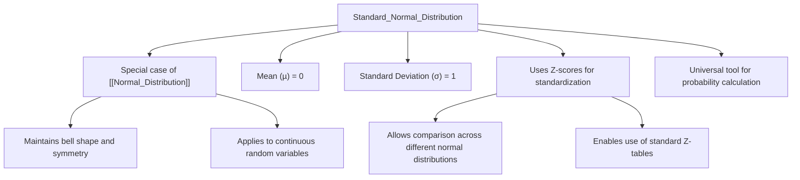

# Definition
Before proceeding, ensure you master [[Normal_Distribution]] because the standard normal distribution is a special, standardized form of any normal distribution.
The Standard Normal Distribution is a **special case of the normal distribution** where the mean ($\mu$) is equal to **0** and the standard deviation ($\sigma$) is equal to **1**. It is also known as the Z-distribution. Any value from a general normal distribution can be transformed into a Z-score, effectively converting it to a value on the standard normal distribution. This standardization allows for comparison of data from different normal distributions and simplifies probability calculations using standard Z-tables. A simpler way to think about it: imagine you have many different bell curves (e.g., one for heights, one for weights). The standard normal distribution is like a universal "measuring stick" that lets you convert any of those bell curves into a single, common curve, making it easy to compare values and find probabilities.

# The Mental Model
Imagine you have different rulers (different normal distributions with different means and spreads). The Standard Normal Distribution is like a universal "master ruler" that is always centered at zero and has units of one. Any measurement from your specific ruler can be translated into a "Z-score" on the master ruler, telling you how many "standard units" away from the center it is. This way, a "tall person" from one population can be directly compared to a "heavy person" from another population by looking at their Z-scores.


```text
// Scenario 1: Conceptual understanding of the Standard Normal Distribution.
// Output:
// (A visual graph diagram illustrating the characteristics and purpose of the Standard Normal Distribution.)
// The diagram shows "Standard_Normal_Distribution" branching to "Special case of Normal_Distribution", "Mean (µ) = 0", "Standard Deviation (σ) = 1", "Uses Z-scores for standardization", and "Universal tool for probability calculation".
// Further branches elaborate on "Z-scores for standardization": "Allows comparison across different normal distributions", "Enables use of standard Z-tables".
// And on "Special case": "Maintains bell shape and symmetry", "Applies to continuous random variables".
```
*Note: This `graph TD` illustrates the defining characteristics and utility of the Standard Normal Distribution as a specialized form of the normal distribution.*

# Context & Framework
### The Universal Bell Curve: Z-Scores for Standardization
The standard normal distribution is crucial because it provides a single, universal curve that can be used to calculate probabilities for *any* normally distributed variable, regardless of its original mean or standard deviation. This is achieved through the process of **standardization**, where an observed value $x$ from a normal distribution is converted into a **Z-score**.
A **Z-score** represents the number of standard deviations an element is from the mean. A positive Z-score indicates the value is above the mean, while a negative Z-score indicates it's below the mean.
The standard normal distribution table (often called a Z-table) lists the area under the standard normal curve, which corresponds to probabilities. This area can be used to find the probability of a value falling within a certain range, or above/below a certain point. It's important to remember that while Z-values can be negative (representing values below the mean), the area (probability) under the curve is always positive.

# The Mastery Deep Dive
### The Axiom: The Z-Score Formula
The formula to convert any normally distributed random variable $X$ with mean $\mu$ and standard deviation $\sigma$ into a Z-score is:
$$ \boxed{\displaystyle Z = \frac{x - \mu}{\sigma}} $$
Where:
*   $Z$ is the Z-score, the value on the standard normal distribution.
*   $x$ is the observed value from the original normal distribution.
*   $\mu$ (mu) is the mean of the original normal distribution.
*   $\sigma$ (sigma) is the standard deviation of the original normal distribution.

This formula essentially shifts the distribution so its mean is at 0 and scales it so its standard deviation is 1. The result is a standard normal variable, $Z \sim N(0, 1)$, meaning it has a normal distribution with mean 0 and variance 1 (and thus standard deviation 1).

| Symbol      | Name                     | Unit/Description | Analogy                                   |
| :
---------- | :
----------------------- | :
--------------- | :
---------------------------------------- |
| $Z$         | Z-score                  | Standard Deviations | How many "steps" away from the average.   |
| $x$         | Observed Value           | Unit of $x$      | The specific data point you're interested in. |
| $\mu$       | Population Mean          | Unit of $x$      | The average of the entire population.     |
| $\sigma$    | Population Std. Deviation | Unit of $x$      | The typical spread of the population.     |

# Constraints & Limitations
### The "Oops!" List: Non-Normal Data
A critical error is to apply Z-score transformations and use the standard normal distribution for data that is *not* normally distributed. The Z-score transformation itself is purely mathematical, but interpreting the resulting Z-score's probability using the standard normal table is only valid if the original data follows a normal (or approximately normal) distribution. Misapplication to skewed or non-bell-shaped data will lead to inaccurate probability estimations. Always verify normality assumptions before relying on the standard normal distribution for inferential purposes.

# Significance & Application
The standard normal distribution is indispensable for statistical analysis due to its power in standardizing and comparing diverse datasets. In academic settings, it's fundamental for hypothesis testing (e.g., Z-tests), constructing confidence intervals, and understanding the sampling distribution of means. In practical applications:
*   **Education:** Comparing student test scores from different exams that have varying means and standard deviations.
*   **Quality Control:** Monitoring product consistency by converting measurements to Z-scores to identify outliers.
*   **Healthcare:** Analyzing health indicators relative to population averages.
*   **Finance:** Assessing the risk of an investment's return relative to its historical performance.
It provides a universal framework for measuring relative standing and calculating probabilities, making complex statistical problems manageable.

# The Worked Example
Let $X$ be a normal random variable that has a mean ($\mu$) of 50 and a standard deviation ($\sigma$) of 10. Convert the following $x$ values into Z-scores:
a) $x = 55$
b) $x = 35$

**a) Convert $x=55$ to a Z-score:**
Given: $x=55$, $\mu=50$, $\sigma=10$.
Using the Z-score formula:
$$ \boxed{\displaystyle Z = \frac{x - \mu}{\sigma}} $$
$$ Z_{55} = \frac{55 - 50}{10} = \frac{5}{10} = 0.5 $$
An $x$ value of 55 corresponds to a Z-score of 0.5. This means 55 is 0.5 standard deviations above the mean.

**b) Convert $x=35$ to a Z-score:**
Given: $x=35$, $\mu=50$, $\sigma=10$.
Using the Z-score formula:
$$ \boxed{\displaystyle Z = \frac{x - \mu}{\sigma}} $$
$$ Z_{35} = \frac{35 - 50}{10} = \frac{-15}{10} = -1.5 $$
An $x$ value of 35 corresponds to a Z-score of -1.5. This means 35 is 1.5 standard deviations below the mean.

# The Proving Ground
*Test your mastery. Cover the solutions below to test yourself first.*

### Level 1: The Sanity Check (Verification)
**The Question:** If a data point has a Z-score of 0, what does that imply about its relationship to the mean?
> **Solution:** A Z-score of 0 means the data point is exactly equal to the mean ($\mu$).

### Level 2: The Crucible (Mastery & Edge Cases)
**The Scenario:** Suppose a normal random variable $x$ has a mean of 40 and a standard deviation of 5. Find the probability $P(x > 55)$.
> **Solution:**
> 1. Convert $x=55$ to a Z-score:
>    $Z_{55} = \frac{55 - 40}{5} = \frac{15}{5} = 3$.
> 2. Find $P(Z > 3)$ using a standard normal table. The area between $Z=0$ and $Z=3$ is approximately 0.4987.
> 3. Since the total area to the right of the mean is 0.5, $P(Z > 3) = 0.5 - P(0 < Z < 3) = 0.5 - 0.4987 = 0.0013$.
> So, $P(x > 55) = 0.0013$ (0.13%).

### Level 3: Mastery (The Crucible)
**The Scenario:** Consider a normal random variable $x$ with a mean of 40 and a standard deviation of 5. Find the probability $P(x < 30)$.
> **Solution:**
> 1. Convert $x=30$ to a Z-score:
>    $Z_{30} = \frac{30 - 40}{5} = \frac{-10}{5} = -2$.
> 2. Find $P(Z < -2)$ using a standard normal table. Since the normal distribution is symmetric, $P(Z < -2) = P(Z > 2)$.
> 3. The area between $Z=0$ and $Z=2$ is approximately 0.4772.
> 4. So, $P(Z < -2) = 0.5 - P(-2 < Z < 0) = 0.5 - P(0 < Z < 2) = 0.5 - 0.4772 = 0.0228$.
> Therefore, $P(x < 30) = 0.0228$ (2.28%). This "crucible" scenario requires interpreting negative Z-scores and using symmetry to find the probability in the left tail.

# Key Takeaways
*   The Standard Normal Distribution has a mean of 0 and a standard deviation of 1.
*   Any normal value ($x$) can be converted to a Z-score ($Z = \frac{x - \mu}{\sigma}$), indicating how many standard deviations $x$ is from the mean.
*   Z-tables are used to find probabilities (areas) under the standard normal curve.

# Knowledge Graph Connections
| Concept                     | Connection / Relationship                                                                   |
| :
-------------------------- | :
------------------------------------------------------------------------------------------ |
| [[Normal_Distribution]]     | Is a special, standardized instance of the general normal distribution.                     |
| [[Empirical_Rule_and_Z_Score_Conversion]] | The Z-score formula is the core mechanism for converting values to the standard normal scale, enabling the application of the Empirical Rule. |
| [[Continuous_Random_Variables]] | This distribution specifically models continuous random variables, providing a standardized framework. |
---