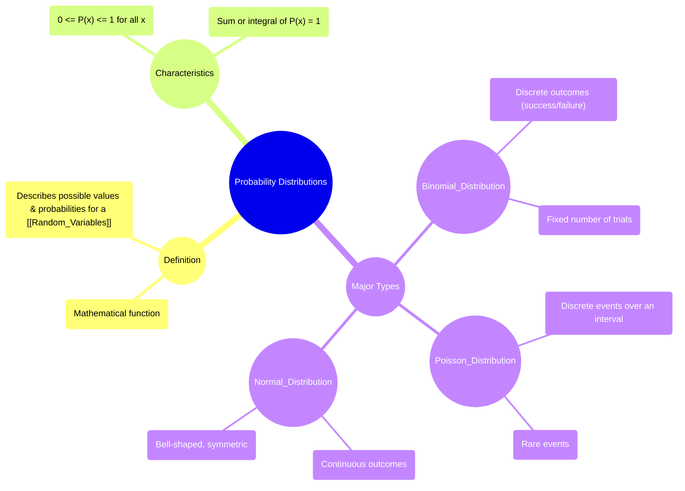

# Definition
Before proceeding, ensure you master [[Random_Variables]] because probability distributions describe the behavior and likelihood of different values of random variables.
A probability distribution is a **mathematical function that describes all the possible values and probabilities for a random variable in a given range**. It provides a comprehensive summary of all possible outcomes of a random experiment and their associated likelihoods. Think of it as a "map" that tells you how likely each value or range of values of a random variable is to occur. There are many different types of probability distributions, each suited to model different kinds of random phenomena. A simpler way to think about it: it's like a recipe that tells you exactly how much of each ingredient (outcome) you're going to get when you "cook" (perform) a random experiment.

# The Mental Model
Imagine you're tracking the results of a game where you spin a pointer on a numbered wheel. A probability distribution is like a detailed graph that shows you every possible score you could get and how frequently you'd expect to get each score if you spun the wheel many, many times. It visually or mathematically lays out the entire spectrum of possibilities, rather than just telling you about one specific outcome.


```text
// Scenario 1: Conceptual overview of probability distributions and their types.
// Output:
// (A visual mindmap illustrating the core concepts and types of Probability Distributions.)
// The mindmap shows "Probability Distributions" as the central theme.
// Branches extend to "Definition" (mathematical function, describes values/probabilities for Random_Variables).
// "Characteristics" (probabilities between 0 and 1, sum/integral is 1).
// "Major Types" (Binomial_Distribution with discrete/fixed trials; Poisson_Distribution with discrete/rare events; Normal_Distribution with continuous/bell-shaped characteristics).
```
*Note: This `mindmap` visually organizes the definition, characteristics, and major types of probability distributions, highlighting their key features.*

# Context & Framework
### The Universe of Chance: Mapping Probable Outcomes
Probability distributions provide the foundational framework for understanding the behavior of random variables. They describe how the probabilities are "distributed" across all the possible values that a random variable can take. The type of distribution used depends fundamentally on whether the random variable is discrete or continuous, and the specific nature of the random experiment.
Two key characteristics universally apply to all probability distributions:
1.  **Probability Range:** For any given value $x$ of a random variable, its probability $P(X=x)$ or probability density $f(x)$ must be between 0 and 1, inclusive: $0 \le P(x) \le 1$.
2.  **Total Probability:** The sum of all probabilities for a discrete random variable, or the integral of the probability density function for a continuous random variable, must equal 1. This signifies that the total probability of all possible outcomes is 100%.
    *   For discrete: $\Sigma P(x) = 1$
    *   For continuous: $\int f(x) dx = 1$
These characteristics ensure that the distribution is a valid and complete model of uncertainty.

# The Mastery Deep Dive
### Taxonomist: Categorizing the Models of Uncertainty
Understanding the major types of probability distributions is key to selecting the correct model for a given real-world scenario. They are broadly categorized based on the nature of the random variable they describe:
*   **Binomial Distribution:** This is a **discrete** probability distribution that models the number of successes in a fixed number of independent trials, where each trial has only two possible outcomes (success or failure). It's applicable to discrete random variables only. (e.g., number of heads in 10 coin flips).
*   **Poisson Distribution:** This is also a **discrete** probability distribution. It models the number of events occurring in a fixed interval of time or space, given that these events occur with a known average rate and independently of the time since the last event. It's often used for rare events. (e.g., number of customer calls per hour).
*   **Normal Distribution:** This is a **continuous** probability distribution, characterized by its symmetric, bell-shaped curve. It's one of the most important distributions in statistics, as many natural phenomena are approximately normally distributed. It's applicable to continuous random variables. (e.g., heights of people, measurement errors).

Each of these distributions has unique parameters that define its specific shape and location (e.g., mean, standard deviation, number of trials, success probability), allowing for precise modeling of various types of random behavior.

# Constraints & Limitations
### The "Oops!" List: Mismatching Variable Type
A common error is attempting to use a discrete probability distribution (like binomial or Poisson) to model a continuous random variable, or vice-versa. For example, trying to apply the binomial distribution to model the exact height of students is a fundamental mismatch. Discrete distributions are for countable outcomes, while continuous distributions are for measurable outcomes over a range. This mismatch leads to incorrect probabilistic models and flawed conclusions. Always ensure the chosen distribution's properties align with the type of random variable and the nature of the experiment.

# Significance & Application
The ability to identify and apply the correct probability distribution is paramount in both academic and practical settings. In academic research, selecting the appropriate distribution (e.g., Normal for hypothesis testing of means, Binomial for analyzing proportions) is critical for valid statistical analysis. In the real world:
*   **Engineering:** Normal distribution is used for quality control (e.g., part dimensions), while Poisson might model machine failures over time.
*   **Medicine:** Binomial distribution can model the success rate of a treatment.
*   **Finance:** Normal distribution (or variants) often model asset returns.
*   **Social Sciences:** Understanding these distributions allows for modeling survey responses, demographic trends, and more.
This foundational knowledge empowers analysts and researchers to quantify uncertainty, make predictions, and drive evidence-based decisions in a wide array of domains.

# The Worked Example
**Scenario 1: Identifying a Binomial Distribution**
You are performing an experiment where you flip a fair coin 10 times and count the number of heads.
*   **Random Variable Type:** Discrete (number of heads is countable).
*   **Characteristics:** Fixed number of trials (10 flips), two outcomes per trial (heads/tails), trials are independent, probability of success (0.5 for heads) is constant.
*   **Conclusion:** This scenario can be modeled by a [[Binomial_Distribution]].

**Scenario 2: Identifying a Poisson Distribution**
You are observing the number of emails received by a customer service department in a 1-hour period. Historically, they receive an average of 15 emails per hour.
*   **Random Variable Type:** Discrete (number of emails is countable).
*   **Characteristics:** Events occur over a fixed interval (1 hour), at a known average rate (15/hour), and independently.
*   **Conclusion:** This scenario can be modeled by a [[Poisson_Distribution]].

**Scenario 3: Identifying a Normal Distribution**
You are measuring the heights of adult males in a large population.
*   **Random Variable Type:** Continuous (height is a measurement, infinite values possible within a range).
*   **Characteristics:** Measurements tend to cluster around a mean, with fewer values further away, forming a symmetric, bell-shaped curve.
*   **Conclusion:** This scenario can be modeled by a [[Normal_Distribution]].

# The Proving Ground
*Test your mastery. Cover the solutions below to test yourself first.*

### Level 1: The Sanity Check (Verification)
**The Question:** What are the two universal characteristics that apply to all probability distributions?
> **Solution:** 1. All probabilities (or probability densities) must be between 0 and 1. 2. The sum (for discrete) or integral (for continuous) of all probabilities must equal 1.

### Level 2: The Crucible (Mastery & Edge Cases)
**The Scenario:** A continuous probability distribution is defined over the interval. A student attempts to assign a probability of 0.5 to the exact value $X=0.5$. Why is this approach fundamentally flawed for a continuous distribution?
> **Solution:** For a continuous probability distribution, the probability of any *exact single value* (like $X=0.5$) is theoretically zero. Probabilities are defined over intervals, representing the area under the probability density function. Assigning a non-zero probability to a single point contradicts the nature of continuous random variables.

# Key Takeaways
*   Probability distributions map all possible values of a random variable to their probabilities.
*   All probabilities must be between 0 and 1, and their sum/integral must equal 1.
*   Key types include Binomial (discrete, fixed trials), Poisson (discrete, events over interval), and Normal (continuous, bell-shaped).

# Knowledge Graph Connections
| Concept                     | Connection / Relationship                                                                   |
| :
-------------------------- | :
------------------------------------------------------------------------------------------ |
| [[Random_Variables]]        | Probability distributions describe the behavior and likelihood of the values taken by random variables. |
| [[Discrete_Random_Variables]] | Is a type of random variable modeled by discrete probability distributions like Binomial and Poisson. |
| [[Continuous_Random_Variables]] | Is a type of random variable modeled by continuous probability distributions like the Normal Distribution. |
| [[Binomial_Distribution]]   | Is a specific type of discrete probability distribution outlined in this overview.        |
| [[Poisson_Distribution]]    | Is a specific type of discrete probability distribution outlined in this overview.        |
| [[Normal_Distribution]]     | Is a specific type of continuous probability distribution outlined in this overview.      |
---