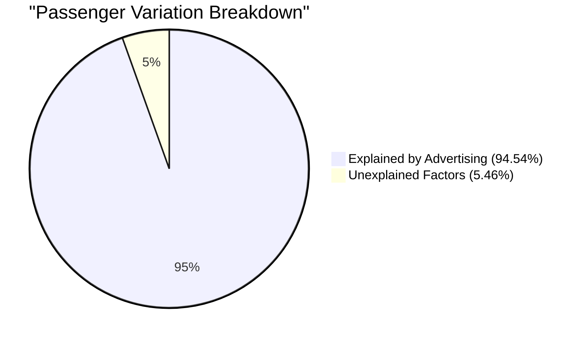

# Definition
Before proceeding, ensure you master [[Coefficient_of_Determination]] and Data_Variability because explained and unexplained variation are the components that make up the total variability in the dependent variable, quantified by the coefficient of determination.
In regression analysis, the **total variation** in the dependent variable ($Y$) is decomposed into two parts:
1.  **Explained variation:** The portion of the total variation in the dependent variable that is accounted for by the regression model, i.e., by the relationship with the independent variable(s).
2.  **Unexplained variation (or residual variation):** The portion of the total variation in the dependent variable that is *not* accounted for by the regression model. This variation is due to chance, measurement error, or other variables not included in the model.
A simpler way to think about it is that "explained variation" is what your model "gets right" about the changes in Y, and "unexplained variation" is what your model "misses" or can't account for.

# The Mental Model
Imagine you're trying to predict how popular a new song will be (Y). You think a famous singer (X) makes a difference. "Explained variation" is how much of the song's popularity can be attributed to having a famous singer. "Unexplained variation" is all the other stuff – maybe the catchy tune, good marketing, or just luck – that your "famous singer" model doesn't account for. The total popularity is made up of both.

# Context & Framework
### The Problem: Deconstructing the "Mystery" of Data Movement
When observing a dependent variable (like sales, student scores, or patient recovery), its values often vary. This variability is a "mystery" that researchers aim to understand. Early statistical analysis could only describe this total variability. The advent of regression analysis, and specifically the decomposition of total variation into explained and unexplained components, provided a powerful framework for unraveling this mystery. It allowed statisticians to quantify precisely how much of the dependent variable's movement could be attributed to known independent factors, and how much remained unknown or random. This breakdown is crucial for evaluating model effectiveness, identifying areas for further research (to explain the "unexplained"), and building a more nuanced understanding of complex phenomena.

# The Mastery Deep Dive
### The "Kill Sheet": Explained vs. Unexplained Variation
| Feature              | Explained Variation (SSR)                                | Unexplained Variation (SSE)                                     | The "Gotcha" Difference                                    |
| :
------------------- | :
------------------------------------------------------- | :
-------------------------------------------------------------- | :
--------------------------------------------------------- |
| **Source**           | Due to the relationship with the independent variable(s) | Due to other factors, error, or chance not in the model       | Explained is the "signal" captured by the model; unexplained is the "noise" or missing information. |
| **Mathematical Basis** | Sum of squares of differences between predicted Y and mean Y ($\sum(\hat{Y}_i - \bar{Y})^2$) | Sum of squares of differences between observed Y and predicted Y ($\sum(Y_i - \hat{Y}_i)^2$) | Explained relates to the model's predictions; unexplained relates to the model's errors. |
| **Proportion**       | Represented by $R^2$                                     | Represented by $(1 - R^2)$                                  | $R^2$ quantifies the explained portion; $1-R^2$ quantifies the unexplained. |
| **Goal**             | Maximize explained variation                           | Minimize unexplained variation                                | A good model maximizes what it explains and minimizes what it doesn't. |

### The "Kill Sheet": Explained vs. Unexplained Variation
**Formulas:**
*   **Proportion of Explained Variation:**
    $$ \boxed{\displaystyle \text{Proportion of Explained Variation} = R^2 \times 100\%} \quad \text{(Formula for Explained Proportion)} $$
*   **Proportion of Unexplained Variation:**
    $$ \boxed{\displaystyle \text{Proportion of Unexplained Variation} = (1 - R^2) \times 100\%} \quad \text{(Formula for Unexplained Proportion)} $$

**Example Calculation (using advertising expense and passenger numbers):**
From the [[Coefficient_of_Determination]] note (and lecture slide 64-66/76), we found $R^2 \approx 0.9454$.

1.  **Proportion of Explained Variation:**
    $$ \displaystyle 0.9454 \times 100\% = 94.54\% \quad \text{(Calculated Explained Variation)} $$
    **Interpretation:** Approximately **94.54%** of the change in the number of passengers is explained by changes in the amount of money spent on advertising.

2.  **Proportion of Unexplained Variation:**
    $$ \displaystyle (1 - 0.9454) \times 100\% = 0.0546 \times 100\% = 5.46\% \quad \text{(Calculated Unexplained Variation)} $$
    **Interpretation:** Approximately **5.46%** of the change in the number of passengers is due to factors other than advertising expense, such as chance, other economic factors, or competitor actions.

# Constraints & Limitations
### The "Oops!" List: Unexplained Doesn't Mean Unimportant
A common trap is to dismiss "unexplained variation" as unimportant or simply "random noise." This is a "trap" because:
1.  **Missing Variables:** A large proportion of unexplained variation often indicates that important independent variables are missing from the model. This is an opportunity for further research, not a dead end. For instance, if a model for academic performance explains only 30% of the variation, the remaining 70% points to other significant factors like socioeconomic status, teacher quality, or individual motivation that should be investigated.
2.  **Model Misspecification:** High unexplained variation can also signal that the chosen model form (e.g., linear) is incorrect, and a non-linear relationship or a more complex interaction might be at play.
Therefore, a large unexplained variation should be viewed as a signal that the model is incomplete or mispecified, guiding future efforts to improve understanding rather than being ignored.

# Significance & Application
The breakdown of total variation into its explained and unexplained components is critical for deeply evaluating a regression model. It moves beyond just knowing *if* a relationship exists to quantifying *how much* of the observed changes are predictable versus how much remains mysterious. This has significant implications: in **public policy**, if a program's funding (independent variable) explains only a small portion of its success (dependent variable), it suggests other, unmeasured factors are at play, prompting a re-evaluation of the program design. In **scientific research**, a high proportion of unexplained variation encourages further investigation to identify new variables or refine theoretical models. It's the mechanism by which we gauge the completeness of our understanding and identify avenues for future discovery.

# The Worked Example
Let's consider the same example of advertising expense and number of passengers, and explicitly demonstrate the calculation and interpretation of explained and unexplained variation using the $R^2$ value.

From previous calculations (and lecture slide 64-66/76), we have:
*   Coefficient of Determination ($R^2$) $\approx 0.9454$

**Step 1: Calculate the proportion of explained variation.**
$$ \boxed{\displaystyle \text{Explained Variation} = R^2 \times 100\%} $$
$$ \displaystyle \text{Explained Variation} = 0.9454 \times 100\% = 94.54\% \quad \text{(Calculate percentage)} $$
**Interpretation:** This means that **94.54%** of the total variability observed in the number of passengers is directly accounted for or "explained" by the changes in advertising expense. This indicates a very high degree of predictive power of advertising on passenger numbers.

**Step 2: Calculate the proportion of unexplained variation.**
$$ \boxed{\displaystyle \text{Unexplained Variation} = (1 - R^2) \times 100\%} $$
$$ \displaystyle \text{Unexplained Variation} = (1 - 0.9454) \times 100\% \quad \text{(Subtract R-squared from 1)} $$
$$ \displaystyle \text{Unexplained Variation} = 0.0546 \times 100\% = 5.46\% \quad \text{(Calculate percentage)} $$
**Interpretation:** This means that **5.46%** of the total variability in the number of passengers is *not* explained by advertising expense. This portion represents the influence of other factors not included in the model (e.g., season, competitor pricing, airline reputation, economic conditions, random fluctuations, measurement error). This also points to potential areas for future research to identify and include these missing variables for an even more comprehensive model.


```text
// Scenario 1: Explained variation is very high
// Input: Explained variation = 94.54%, Unexplained variation = 5.46%
// Output: The model linking advertising expense to passenger numbers is highly effective, with only a small portion of passenger variability due to other factors.
//
// Scenario 2: Explained variation is moderate (Hypothetical)
// Input: Explained variation = 40%, Unexplained variation = 60%
// Output: The model only explains 40% of the variability. A substantial 60% remains unexplained, suggesting other significant factors are at play and the model needs improvement or expansion.
```
*Note: This `pie` chart visually breaks down the total variation, clearly illustrating the proportions of explained and unexplained components.*

# The Proving Ground
*Test your mastery. Cover the solutions below to test yourself first.*

### Level 1: The Sanity Check (Verification)
**The Component Check:** If a regression model has an $R^2$ value of 0.70, what percentage of the total variation in the dependent variable is explained by the model?
> **Solution:** 70% of the total variation in the dependent variable is explained by the model.

### Level 2: The Crucible (Mastery & Edge Cases)
**The Impostor:** A researcher studies the relationship between hours spent exercising per week (X) and weight loss (Y). Her model yields an $R^2$ of 0.25. She argues that because 25% of the variation in weight loss is "explained," her model is valuable. However, critics point out that 75% of the variation is "unexplained." Explain how this situation illustrates the "Unexplained Doesn't Mean Unimportant" trap (as discussed in `# Constraints & Limitations`). What opportunity does this large unexplained variation present for the researcher, rather than being simply dismissed?
> **Solution:** This situation perfectly illustrates the "Unexplained Doesn't Mean Unimportant" trap. The researcher is focusing on the 25% explained variation as validation, while the significant **75% unexplained variation** is being overlooked or potentially dismissed. The "impossible case" is that the researcher's interpretation might prematurely close off avenues for deeper understanding. This large unexplained portion is not simply "noise"; it presents a substantial opportunity for the researcher to:
> 1.  **Identify missing variables:** Investigate other crucial factors influencing weight loss, such as diet, metabolism, genetics, sleep quality, stress levels, or pre-existing medical conditions, and incorporate them into a more comprehensive Multiple_Regression model.
> 2.  **Refine model specification:** Re-evaluate if the relationship between exercise and weight loss is truly linear, or if a [[Non_Linear_Regression]] model might be more appropriate.
> Therefore, instead of dismissing the unexplained variation, it should serve as a powerful signal guiding further scientific inquiry and model refinement to gain a more complete and accurate understanding of weight loss drivers.

# Key Takeaways
*   Total variation in the dependent variable is split into explained and unexplained components.
*   Explained variation is accounted for by the regression model; unexplained variation is not.
*   A high proportion of unexplained variation highlights limitations of the current model and opportunities for further research.

# Knowledge Graph Connections
| Concept                     | Connection / Relationship                                          |
| :
-------------------------- | :
----------------------------------------------------------------- |
| [[Coefficient_of_Determination]]| The coefficient of determination ($R^2$) is the proportion of explained variation. |
| Data_Variability        | Explained and unexplained variation decompose the total variability observed in data. |
| [[Regression_Analysis]]     | Regression analysis aims to maximize explained variation and minimize unexplained variation. |
| Model_Evaluation        | The balance between explained and unexplained variation is crucial for evaluating a model's effectiveness. |
| Prediction_Error        | Unexplained variation represents the portion of prediction error not systematic to the model's predictors. |
---