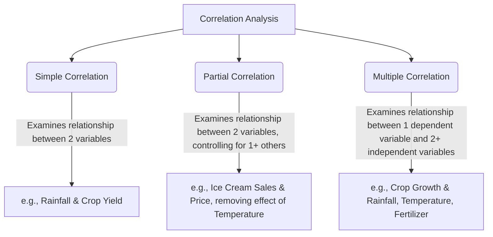
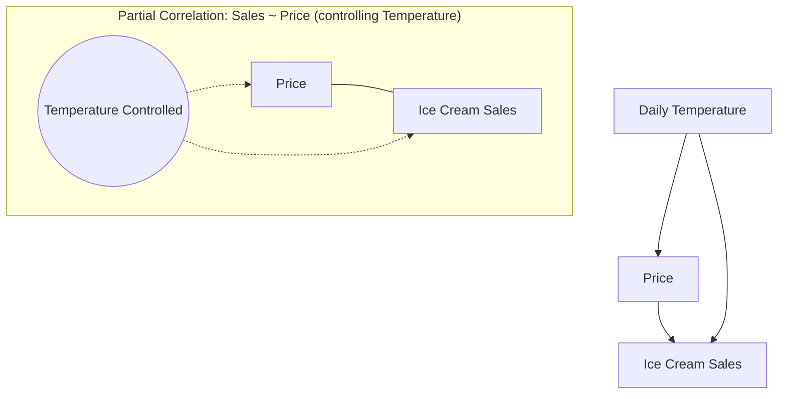

# Definition
Before proceeding, ensure you master [[Correlation_Analysis]] and [[Dependent_and_Independent_Variables]] because these classifications of correlation are based on the number of variables considered in an association.
Correlation can also be classified by the **number of variables** being studied:
1.  **Simple correlation:** When only two variables are studied, examining the direct relationship between them.
2.  **Partial correlation:** When three or more variables are studied, but the relationship between two variables is examined while the effect of one or more other variables (control variables) is held constant or removed.
3.  **Multiple correlation:** When three or more variables are studied, examining the combined relationship between one dependent variable and two or more independent variables simultaneously.
A simpler way to think about it: "Simple" is just two things. "Partial" is two things, *but we're ignoring a third's influence*. "Multiple" is one thing being influenced by *many other things at once*.

# The Mental Model
Imagine you're judging a baking competition.
*   **Simple Correlation:** You're just looking at how much sugar (one variable) affects the sweetness (another variable) of the cake.
*   **Partial Correlation:** You're still interested in sugar and sweetness, but you know the baking temperature also plays a role. So, you try to mentally "hold the temperature constant" and just see the sugar-sweetness link.
*   **Multiple Correlation:** You're trying to see how a cake's "deliciousness" (one outcome) is affected by the amount of sugar, the baking temperature, *and* the type of flour all at the same time.

# Context & Framework
### The Problem: Isolating and Combining Influences
In simple scenarios, the relationship between two variables might seem straightforward. However, the real world is complex; many outcomes are influenced by multiple factors. The development of partial and multiple correlation methods arose from the need to manage this complexity. Simple correlation, while useful, often fails to account for confounding variables. Partial correlation allowed statisticians to isolate the relationship between two variables, stripping away the influence of others, while multiple correlation enabled the assessment of the combined explanatory power of several predictors on a single outcome. This framework was critical for moving beyond simplistic bivariate analyses to more nuanced, multivariate understandings, providing a more accurate reflection of multi-faceted relationships in various scientific disciplines.

# The Mastery Deep Dive
### The Family Tree: Correlation by Number of Variables
These classifications build on the complexity of the relationships being analyzed.


```text
// Scenario 1: Overview of Correlation Types by Number of Variables
// Output:
// (A visual representation of the graph TD diagram showing the classification of correlation analysis.)
// Correlation analysis is divided into Simple, Partial, and Multiple types based on the number of variables studied.
// Simple correlation involves two variables.
// Partial correlation examines two variables while holding others constant.
// Multiple correlation assesses one dependent variable against multiple independent variables simultaneously.
```
*Note: This `graph TD` diagram visually categorizes correlation types based on the number of variables involved in the analysis.*

### Component Interactions
The choice among simple, partial, and multiple correlation depends on the research question and the complexity of the phenomena being studied:
*   **Simple correlation** is typically the first step, providing a quick assessment of a direct, bivariate relationship.
*   **Partial correlation** is used when a researcher suspects that the apparent relationship between two variables is actually influenced or confounded by a third variable. By statistically "controlling" for the third variable, one can see the "true" unique association between the primary two.
*   **Multiple correlation** is used when an outcome is likely influenced by a combination of several independent factors. It measures the overall strength of the entire set of independent variables in explaining the dependent variable.

Each type offers a different lens through which to view the complexity of data relationships.

# Constraints & Limitations
### The "Oops!" List: Misinterpreting Partial Correlation
A common trap with partial correlation is misinterpreting what "controlling for" a variable actually means. This is a "trap" because:
1.  **Statistical Control, Not Experimental Control:** Partial correlation performs *statistical control*, not actual experimental control. It mathematically removes the *linear* effect of the control variable(s). It does not mean the control variable was physically held constant during data collection, nor does it necessarily remove all confounding if the confounding relationship itself is non-linear or involves complex interactions.
2.  **Order of Control Matters (Sometimes):** While conceptually, partial correlation aims to isolate, the interpretation can become tricky if the control variable is itself causally influenced by one of the primary variables, or if the causal model is misspecified.
Therefore, a partial correlation should be interpreted as the linear association between two variables *after statistically accounting for* the linear influence of other specified variables, not as proof of an isolated causal link under laboratory conditions.

# Significance & Application
These different types of correlation analysis are crucial for navigating the complexity of real-world data, enabling more accurate insights than simple bivariate analysis alone.
*   **Simple correlation** is used in initial explorations, like finding if there's an association between study time and grades.
*   **Partial correlation** is invaluable in **social sciences** or **epidemiology** to disentangle relationships. For example, studying the correlation between exercise and heart disease risk while statistically controlling for age and smoking status helps isolate the unique effect of exercise.
*   **Multiple correlation** is widely used in **business analytics** to understand how various marketing efforts (e.g., social media ads, TV commercials, email campaigns) collectively impact sales, or in **engineering** to see how multiple design parameters jointly affect product performance. It quantifies the overall predictive power of a set of predictors. These distinctions enable researchers to ask and answer more precise questions about multivariate relationships.

# The Worked Example
Let's use the ice cream sales example from the lecture slides to illustrate partial correlation.

**Scenario:** We want to understand if there is a linear relationship between **ice cream sales (dependent variable)** and **price (independent variable)**, *whilst controlling for daily temperature*.

**Step 1: Understand the variables involved.**
*   Dependent Variable (Y): Ice Cream Sales (measured in USD)
*   Independent Variable 1 (X1): Price (measured in USD)
*   Control Variable (X2): Daily Temperature (measured in °C)

**Step 2: Conceptualize the simple correlations.**
*   We'd expect a simple correlation between Sales and Price (likely negative: higher price, lower sales).
*   We'd expect a simple correlation between Sales and Temperature (likely positive: higher temperature, higher sales).
*   We'd expect a simple correlation between Price and Temperature (perhaps complex, but let's assume they are somewhat related, e.g., prices might be adjusted based on expected demand on hot days).

**Step 3: Apply the concept of partial correlation.**
The goal of partial correlation here is to isolate the direct linear relationship between `Ice Cream Sales` and `Price`, removing any influence that `Daily Temperature` might have on both of them. For instance, if on hot days (high temperature) sales are high *regardless of price*, and on cold days (low temperature) sales are low *regardless of price*, then a simple correlation between sales and price might be misleading.

A hypothetical result for the partial correlation between Ice Cream Sales and Price, after controlling for Temperature, might be $r_{Sales, Price \cdot Temp} = -0.6$.

**Interpretation of Partial Correlation:**
*   This means that, after statistically removing the linear effect of daily temperature, there is still a **moderately strong negative linear relationship** between ice cream sales and price.
*   In practical terms, even when comparing days with similar temperatures, if the price of ice cream goes up, sales still tend to go down. This suggests that price has a significant impact on sales independent of the weather.


```text
// Scenario 1: Simple Correlation vs. Partial Correlation
// Input: Simple correlation between Sales and Price might be -0.2 (weak).
// Output: Partial correlation between Sales and Price, controlling for Temperature, is -0.6 (moderately strong).
// Interpretation: This indicates that Temperature was masking the true, stronger inverse relationship between Price and Sales. Once the influence of Temperature is removed, the pricing strategy's impact becomes much clearer.
```
*Note: This `graph TD` diagram visually illustrates how partial correlation isolates the relationship between two variables by statistically controlling for a third, here depicting the relationship between Sales and Price with Temperature's effect accounted for.*

# The Proving Ground
*Test your mastery. Cover the solutions below to test yourself first.*

### Level 1: The Sanity Check (Verification)
**The Neighbor Check:** When is simple correlation typically used?
> **Solution:** Simple correlation is typically used when only two variables are being studied to examine the direct relationship between them.

### Level 2: The Crucible (Mastery & Edge Cases)
**The Impostor:** A health researcher investigates the relationship between coffee consumption (X) and risk of heart disease (Y). They find a simple correlation of $r = 0.4$, suggesting a moderate positive link. They then perform a partial correlation, controlling for age (Z), and the partial correlation between coffee and heart disease becomes $r_{XY \cdot Z} = 0.1$. The researcher concludes that "age completely eliminates the effect of coffee on heart disease." Explain how this conclusion might fall into the "Misinterpreting Partial Correlation" trap (as discussed in `# Constraints & Limitations`). What specific nuance about statistical control is the researcher potentially overlooking, and what does the partial correlation *actually* signify?
> **Solution:** The researcher's conclusion falls into the "Misinterpreting Partial Correlation" trap by overstating the causal implication of statistical control. The phrase "age completely eliminates the effect" is an "impostor" because partial correlation performs **statistical control**, not *experimental or causal elimination*. What the partial correlation of $r_{XY \cdot Z} = 0.1$ *actually* signifies is that **after statistically accounting for the linear influence of age, the *remaining linear association* between coffee consumption and heart disease risk is very weak**. It means that a significant portion of the original positive simple correlation ($r=0.4$) was actually due to age confounding the relationship (e.g., older people tend to drink more coffee and are also at higher risk for heart disease, making it seem like coffee causes heart disease when age is the common factor). The nuance overlooked is that statistical control doesn't prove an absence of *any* effect, nor does it account for non-linear effects or complex interactions. It merely isolates the remaining *linear* association after removing the linear influence of the control variable. It suggests that the relationship is largely explained by shared variance with age, rather than coffee having a direct, independent linear effect once age is considered.

# Key Takeaways
*   Simple correlation studies two variables directly.
*   Partial correlation examines the relationship between two variables while holding others constant.
*   Multiple correlation assesses the combined effect of several independent variables on a dependent variable.

# Knowledge Graph Connections
| Concept                     | Connection / Relationship                                          |
| :
-------------------------- | :
----------------------------------------------------------------- |
| [[Correlation_Analysis]]    | These are categorizations of correlation based on the number of variables involved. |
| [[Dependent_and_Independent_Variables]] | All three types involve analyzing the relationships between these variable types. |
| Confounding_Variables   | Partial correlation is particularly useful for addressing the influence of confounding variables. |
| Statistical_Control     | Partial correlation employs statistical control to isolate relationships. |
---