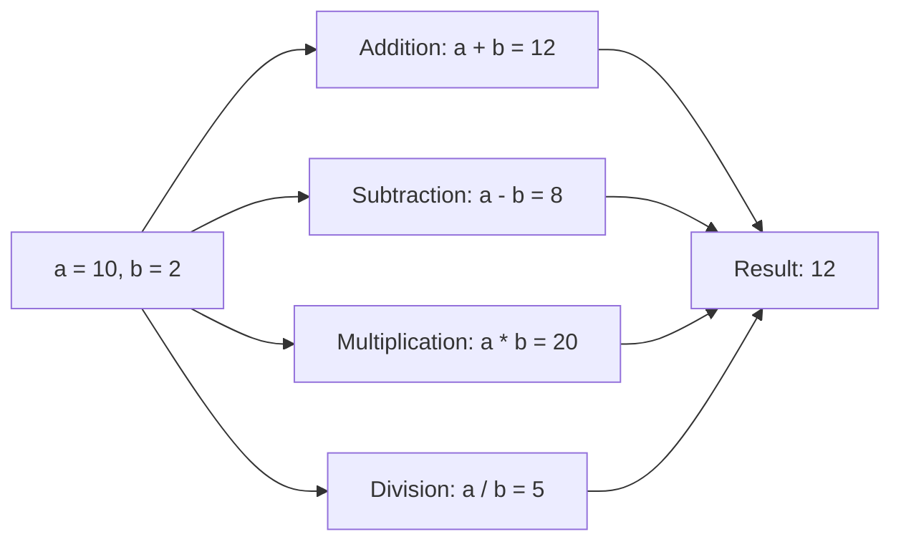

# 1. Mental Model

The concept of arithmetic operators can be likened to a car's control system, where the accelerator, brake, and gearshift can be seen as analogous to arithmetic operators. Just as the accelerator and brake pedals control the car's speed by adding or subtracting force, arithmetic operators such as addition and subtraction modify numerical values. Similarly, the gearshift can be compared to the operator precedence, where the gearshift determines the order in which the car's systems respond to the accelerator and brake, just as operator precedence determines the order in which arithmetic operations are performed.

# 2. Execution Logic & Data Flow

The expression `m*x + b` is evaluated using the [[Arithmetic_Operators]] in a specific order determined by [[Operator_Precedence]]. The [[Compiler_Directives]] and [[Preprocessor_Directives]] are processed before the expression is evaluated. The [[Main_Function]] is where the program starts executing, and the expression is evaluated using the [[Stream_Insertion_Operator]] or [[Stream_Extraction_Operator]] to input or output values. The [[Variables_In_C++]] `m`, `x`, and `b` are declared and initialized before the expression is evaluated. The expression is a combination of [[Literals_In_C++]], [[Identifiers_In_C++]], and [[Arithmetic_Operators]], which are evaluated using [[Precedence_Rules]].

# 3. Edge Cases & Failure States

When evaluating the expression `m*x + b`, boundary conditions such as overflow or underflow can occur if the result exceeds the maximum or minimum limit of the data type. Failure states can also occur if the variables `m`, `x`, or `b` are not initialized or are assigned invalid values. Additionally, the expression may not be equivalent to the intended mathematical expression if the [[Operator_Precedence]] is not considered, leading to incorrect results. If the [[Type_Conversion]] is not performed correctly, it can also lead to incorrect results or errors.

# 4. Implementation Mechanics

```python

# Define a simple function to demonstrate arithmetic operators

def calculate_values(a, b):
    addition = a + b
    subtraction = a - b
    multiplication = a * b
    division = a / b if b != 0 else 0

    return addition, subtraction, multiplication, division

# Example usage

a = 10
b = 2
addition, subtraction, multiplication, division = calculate_values(a, b)

print(f"Addition: {addition}")
print(f"Subtraction: {subtraction}")
print(f"Multiplication: {multiplication}")
print(f"Division: {division}")

```



The code block demonstrates the use of basic arithmetic operators in Python, including addition, subtraction, multiplication, and division. The Mermaid flowchart illustrates the state changes that occur when applying these operators to two input values, `a` and `b`, and how they produce the corresponding results.

## 5. Walkthrough

1. In a telecommunications network, a routing table is updated with new values for packet forwarding; the current routing cost is `a = 10` and the updated cost is `b = 2`. 
2. The network router applies the addition operator to calculate the new total cost: `10 + 2 = 12`, reflecting the updated routing information.
3. The router then applies the subtraction operator to determine the cost difference: `10 - 2 = 8`, which helps in making routing decisions.
4. Next, the router uses the multiplication operator to calculate the product of the costs: `10 * 2 = 20`, used for traffic engineering purposes.
5. The division operator is applied to compute the ratio of the costs: `10 / 2 = 5`, aiding in network resource allocation.
6. Finally, the router updates its routing table with the calculated values, ensuring efficient packet forwarding and network optimization.

---

## 6. The Proving Grounds

```interactive-quiz

[
  {
    "id": "q1",
    "type": "fill_in",
    "difficulty": "L1",
    "question": "What is the term for the process of combining two or more numbers to get a total or a sum?",
    "textWithBlanks": "The [[Blank1]] is a mathematical operation that combines two or more numbers.",
    "answer": ["addition"],
    "explanation": "The term for the process of combining two or more numbers to get a total or a sum is addition."
  },
  {
    "id": "q2",
    "type": "true_false",
    "difficulty": "L2",
    "question": "Is the expression 2 + 3 * 4 evaluated to 20 when following the order of operations?",
    "answer": false,
    "explanation": "The expression 2 + 3 * 4 is evaluated to 2 + 12 = 14, not 20, when following the order of operations."
  },
  {
    "id": "q3",
    "type": "debug",
    "difficulty": "L3",
    "question": "Find the error.",
    "content": "int x = 5; int y = 2; int result = x / y * (y + 1);",
    "answer": "The bug is integer division. The fix is to cast one of the operands to a floating-point number.",
    "explanation": "The division operator / performs integer division when both operands are integers, resulting in truncation of the decimal part. To get a decimal result, one of the operands should be cast to a floating-point number, e.g., (double)x / y."
  }
]

```