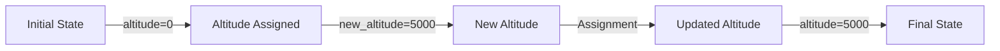

# 1. Mental Model

The assignment operator can be thought of as a balance scale, where the value on the right-hand side is weighed against the variable on the left-hand side, and then the value is transferred to the variable, effectively balancing the scale. The variable on the left-hand side acts as a receptacle, much like a bucket, that can hold the value on the right-hand side. Just as a bucket can only hold a certain amount of water, a variable can only hold a certain type and amount of value.

# 2. Execution Logic & Data Flow

The [[Assignment_Operator]] in C++ is used to assign a value to a variable. The [[Main_Function]] typically uses the [[Assignment_Operator]] to initialize variables. When the [[Assignment_Operator]] is used, the [[Compiler_Directives]] and [[Preprocessor_Directives]] ensure that the correct [[Type_Conversion]] occurs. The [[Stream_Insertion_Operator]] and [[Stream_Extraction_Operator]] can be used in conjunction with the [[Assignment_Operator]] to input and output values. The [[Return_Statement]] in a function may also utilize the [[Assignment_Operator]] to return a value.

# 3. Edge Cases & Failure States

When using the [[Assignment_Operator]], boundary conditions such as assigning a value of the wrong type can cause errors. For example, assigning a floating-point number to an integer variable will truncate the decimal part. Failure states can occur when trying to assign a value to a variable that has not been declared or has been declared as a constant. Additionally, assigning a value that is outside the range of the variable's type can also cause errors, such as overflow or underflow.

## Implementation Mechanics

```cpp

int main() {
    int altitude = 0;  // Initialize altitude to 0
    int new_altitude = 5000;  // New altitude value

    // Assignment operator usage
    altitude = new_altitude;  // Assign new_altitude to altitude

    return 0;
}

```



The code block represents the usage of the assignment operator in C++ to update the value of a variable, in this case, `altitude`. The Mermaid flowchart illustrates the state changes that occur during the execution of the code, from the initial state to the final state where `altitude` has been updated to `5000`.

## Walkthrough

1. In the aerospace engineering domain, an aircraft's initial altitude is recorded as 0 feet, represented by the variable `altitude` in the code.
2. The aircraft ascends to a new altitude of 5000 feet, which is stored in the variable `new_altitude`.
3. The assignment operator is used to update the value of `altitude` to the new altitude value of 5000 feet.
4. After the assignment, the value of `altitude` changes from 0 to 5000, reflecting the aircraft's updated altitude.
5. The updated altitude value is crucial for avionics systems to ensure safe flight operations and navigation.
6. The final state of the `altitude` variable is 5000 feet, which is used for further calculations and monitoring of the aircraft's flight trajectory.

---

## 6. The Proving Grounds

```interactive-quiz

[
  {
    "id": "q1",
    "type": "fill_in",
    "difficulty": "L1",
    "question": "What is the primary function of the assignment operator?",
    "textWithBlanks": "The [[Blank1]] operator is used to assign a value to a variable.",
    "answer": ["assignment"],
    "explanation": "The assignment operator is used to assign a value to a variable, effectively storing the value in the variable's memory location."
  },
  {
    "id": "q2",
    "type": "true_false",
    "difficulty": "L2",
    "question": "Consider a scenario where a variable 'x' is assigned the value of an expression 'y + z'. If 'y' and 'z' are both integers, but the result of 'y + z' exceeds the maximum limit of an integer, what happens to the assignment 'x = y + z'?",
    "answer": false,
    "explanation": "In most programming languages, if the result of 'y + z' exceeds the maximum limit of an integer, it will cause an integer overflow, and the assignment 'x = y + z' will not behave as expected. Therefore, the statement that the assignment will work correctly is false."
  },
  {
    "id": "q3",
    "type": "debug",
    "difficulty": "L3",
    "question": "Find the error.",
    "content": "var x = 5;\nvar y = '10';\nvar result = x + y;",
    "answer": "The bug is type coercion. The '+' operator will concatenate the string '10' with the number 5, resulting in the string '510' instead of the expected numeric result 15. To fix this, ensure that both operands are numbers: var result = x + parseInt(y);",
    "explanation": "The code provided will not produce the expected numeric result due to type coercion. The '+' operator will treat the number as a string and concatenate them instead of performing arithmetic addition."
  }
]

```