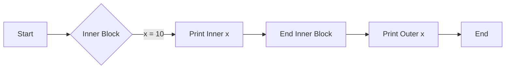

---

title: Braces_In_C++
type: Atomic Note
course: Computer Programming
semester: Autumn 2025
unit: '2'
hub: '[[2_C++_Programming_Fundamentals_Hub]]'
source: '[[Chapter_2.pdf]]'
source_pages:
- 8
mode: CS-SOFTWARE
read: false
generated: true
prerequisites:
- '[[Main_Function]]'
- '[[Statements_In_C++]]'
- '[[Compiler_Directives]]'
- '[[Preprocessor_Directives]]'
- '[[Stream_Insertion_Operator]]'

---


# 1. Mental Model

The concept of Braces In C++ can be likened to the structure of a building, where the braces represent the framework that holds the building's components together. Just as a building's framework defines the boundaries and organization of its rooms and floors, the braces in C++ define the scope and organization of the code blocks. The opening and closing braces serve as the "walls" that enclose a block of code, making it a cohesive unit.

# 2. Execution Logic & Data Flow

The [[Main_Function]] in a C++ program uses [[Braces_In_C++]] to define its block of code, which contains [[Statements_In_C++]]. The [[Compiler_Directives]] and [[Preprocessor_Directives]] are processed before the code within the braces is executed. The [[Stream_Insertion_Operator]] and [[Stream_Extraction_Operator]] are used within the code block to interact with the user. A [[Return_Statement]] within the block will exit the function and return control to the caller. The code within the braces must be syntactically correct, including proper use of [[Comments_In_C++]].

# 3. Edge Cases & Failure States

If the opening and closing [[Braces_In_C++]] do not match, the program will not compile, resulting in a syntax error. An unclosed brace can cause the compiler to misinterpret the code, leading to unexpected behavior or errors. A mismatched brace can also cause a program to fail at runtime if the error is not caught during compilation. In a case where a block of code is intended to be executed conditionally, but the [[Braces_In_C++]] are missing, the program may not behave as intended.

## Implementation Mechanics

```cpp

#include <iostream>

int main() {
    int x = 5;
    {
        int x = 10;
        std::cout << "Inner block x: " << x << std::endl;
    }
    std::cout << "Outer block x: " << x << std::endl;
    return 0;
}

```



The code block represents a C++ program demonstrating the use of braces to define inner and outer blocks, showcasing how variables can be redefined within an inner block. The Mermaid flowchart illustrates the state changes as the program executes, transitioning from the start to the inner block, printing the inner block's variable, and then back to the outer block to print its variable.

## Walkthrough

1. The program starts in the `main` function, where an integer `x` is initialized to 5, representing the outer block's scope.
2. An inner block is defined using an opening brace, allowing for a new scope where a local variable `x` can be declared and initialized to 10.
3. Within the inner block, the program prints the value of `x`, which outputs "Inner block x: 10".
4. The inner block ends, and the program control returns to the outer block, where the value of `x` from the outer block's scope is still accessible and prints "Outer block x: 5".
5. The program then continues to execute any remaining statements in the `main` function, but there are none in this example.
6. The `main` function ends, and the program terminates, having demonstrated how braces in C++ define block scopes and affect variable accessibility.

---

## 6. The Proving Grounds

```interactive-quiz

[
  {
    "id": "q1",
    "type": "fill_in",
    "difficulty": "L1",
    "question": "What is the primary function of braces in C++?",
    "textWithBlanks": "The primary function of braces in C++ is to define the [[Blank1]] of a block of code.",
    "answer": ["scope"],
    "explanation": "Braces in C++ are used to define the scope of a block of code, which determines the visibility and accessibility of variables and functions within that block."
  },
  {
    "id": "q2",
    "type": "true_false",
    "difficulty": "L2",
    "question": "Consider a C++ function with a local variable declared inside a nested block. Is the variable accessible outside the nested block but still within the function?",
    "answer": false,
    "explanation": "In C++, a variable declared inside a block (including a nested block) is only accessible within that block and any inner blocks. Once the block is exited, the variable is no longer accessible."
  },
  {
    "id": "q3",
    "type": "debug",
    "difficulty": "L3",
    "question": "Find the error in the given C++ code snippet.",
    "content": "int x = 5; int y = 10; if (x = y) { cout << \"x equals y\"; }",
    "answer": "The bug is assignment instead of comparison. The correct code should use '==' for comparison: if (x == y)",
    "explanation": "The code contains a logical error where the assignment operator (=) is used instead of the comparison operator (==) in the if statement condition. This will always assign the value of y to x and evaluate to true if y is non-zero."
  }
]

```