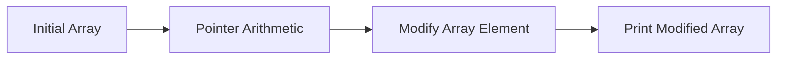

---

title: C++_Programming_Language
type: Atomic Note
course: Computer Programming
semester: Autumn 2025
unit: '2'
hub: '[[2_C++_Programming_Fundamentals_Hub]]'
source: '[[Chapter_2.pdf]]'
source_pages:
- 2
mode: CS-SOFTWARE
read: false
generated: true
prerequisites:
- '[[General_Structure_Of_A_C++_Program]]'
- '[[Compiler_Directives]]'
- '[[Preprocessor_Directives]]'
- '[[Comments_In_C++]]'
- '[[Tokens_In_C++]]'

---


# 1. Mental Model

The C++ programming language can be thought of as a complex city infrastructure, where the city's foundation and roads represent the [[General_Structure_Of_A_C++_Program]] and the various districts represent different programming paradigms such as object-oriented programming. Just as a city's infrastructure relies on the organization of its roads and districts to facilitate smooth traffic flow, a C++ program relies on the organization of its code and data structures to facilitate efficient execution. The city's building codes and zoning regulations can be compared to the [[Compiler_Directives]] and [[Preprocessor_Directives]] that govern the compilation and execution of C++ code.

# 2. Execution Logic & Data Flow

The C++ programming language is compiled into machine code using a [[Compiler_Directives]]-controlled process, which involves the [[Preprocessor_Directives]] stage to handle [[Comments_In_C++]] and [[Tokens_In_C++]]. The compiled code is then executed by the computer's processor, with the [[Main_Function]] serving as the entry point for the program. The program's control flow is determined by [[Statements_In_C++]], which can include [[Variable_Declaration]] and [[Assignment_Operator]] operations. The [[Stream_Insertion_Operator]] and [[Stream_Extraction_Operator]] are used for input/output operations, and the program's data is stored in [[Variables_In_C++]]. The program's execution can be influenced by [[Operator_Precedence]] and [[Type_Conversion]] rules.

# 3. Edge Cases & Failure States

When writing C++ code, programmers must be aware of potential edge cases such as [[C++_Is_Case_Sensitive]] and [[White_Space_In_C++]], which can affect the compilation and execution of the code. Failure to properly handle [[Escape_Characters]] can lead to unexpected behavior or errors. Additionally, incorrect use of [[Implicit_Type_Casting]] and [[Explicit_Type_Casting]] can result in data corruption or loss of precision. If a program encounters an error during execution, it may terminate abruptly or produce unexpected results, highlighting the importance of proper error handling and debugging techniques.

# 4. Implementation Mechanics

```cpp

#include <iostream>

int main() {
    int array[5] = {1, 2, 3, 4, 5};
    int* ptr = array;
    std::cout << "Initial array: ";
    for (int i = 0; i < 5; i++) {
        std::cout << array[i] << " ";
    }
    std::cout << std::endl;

    // Pointer arithmetic
    ptr += 2;
    *ptr = 10;

    std::cout << "Array after modification: ";
    for (int i = 0; i < 5; i++) {
        std::cout << array[i] << " ";
    }
    std::cout << std::endl;

    return 0;
}

```



The code block represents a C++ program demonstrating pointer arithmetic, where a pointer `ptr` is used to modify an element in an array. The Mermaid flowchart illustrates the state changes in the program, from the initial array to the modification of an element and finally printing the modified array.

## 5. Walkthrough

1. In the field of bioinformatics, suppose we have a sequence of DNA nucleotides represented as an array of characters `{'A', 'C', 'G', 'T', 'A'}`. We can think of this array as a contig, a continuous sequence of DNA.
2. We create a pointer `ptr` to point to the beginning of this contig array, similar to how a geneticist might reference a specific location on a chromosome.
3. We then perform pointer arithmetic to move the `ptr` 2 positions forward, effectively "zooming in" on a specific region of interest within the contig, such as a gene.
4. At this new position, we modify the nucleotide value to `'X'`, simulating a genetic mutation.
5. The modified contig array now represents the updated DNA sequence with the mutation, which can be used for further analysis, such as BLAST (Basic Local Alignment Search Tool) searches.
6. Finally, we print the modified contig array to verify the changes, much like verifying the results of a genetic experiment through sequencing.

---

## 6. The Proving Grounds

```interactive-quiz

[
  {
    "id": "q1",
    "type": "fill_in",
    "difficulty": "L1",
    "question": "What represents the foundation and roads of a C++ program?",
    "textWithBlanks": "The [[General_Structure_Of_A_C++_Program]] is...",
    "answer": ["General Structure Of A C++ Program"],
    "explanation": "The general structure of a C++ program represents the foundation and roads, similar to a city's infrastructure."
  },
  {
    "id": "q2",
    "type": "true_false",
    "difficulty": "L2",
    "question": "In C++, an empty class definition will result in an instance of the class having a size of 0 bytes.",
    "answer": false,
    "explanation": "In C++, an empty class definition will result in an instance of the class having a size of at least 1 byte due to the need for a unique address."
  },
  {
    "id": "q3",
    "type": "debug",
    "difficulty": "L3",
    "question": "Find the error.",
    "content": "int x = 5; int y = 0; if (y = 0) { x = 10; }",
    "answer": "The bug is assignment instead of comparison. The correct code should use '==' for comparison: if (y == 0) { x = 10; }",
    "explanation": "The bug is a logic inversion due to using the assignment operator '=' instead of the comparison operator '=='. This will always set 'y' to 0 and evaluate to true, potentially changing 'x' unintentionally."
  }
]

```