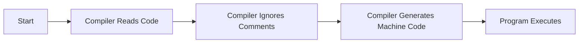

---

title: Comments_In_C++
type: Atomic Note
course: Computer Programming
semester: Autumn 2025
unit: '2'
hub: '[[2_C++_Programming_Fundamentals_Hub]]'
source: '[[Chapter_2.pdf]]'
source_pages:
- 6
mode: CS-SOFTWARE
read: false
generated: true
prerequisites:
- '[[C++_Programming_Language]]'
- '[[Compiler_Directives]]'
- '[[Preprocessor_Directives]]'
- '[[Statements_In_C++]]'

---


# 1. Mental Model

The concept of comments in C++ can be likened to a historian's annotations in a historical manuscript, where the annotations provide context and explanations without altering the original text. Just as the historian's notes are separate from the main narrative, comments in C++ are segregated from the executable code, allowing programmers to add explanatory remarks without affecting the program's functionality. The compiler ignores comments, much like a reader might skip over annotations, enabling the program to run without being influenced by these supplementary notes.

# 2. Execution Logic & Data Flow

The C++ compiler [[C++_Programming_Language]] processes source code and treats comments as non-executable text, effectively ignoring them during compilation. When a programmer writes a comment, it is enclosed in specific delimiters, such as `//` for a single-line comment or `/* */` for a multi-line comment, signaling to the compiler to disregard the text within. The [[Comments_In_C++]] are essential for documenting code and explaining complex logic, but they do not contribute to the program's execution. The [[Compiler_Directives]] and [[Preprocessor_Directives]] are distinct from comments and are evaluated before the compilation process. As the compiler reads the source code, it skips over comments, ensuring that only the actual code is translated into machine-readable instructions.

# 3. Edge Cases & Failure States

When comments are not properly closed, such as a multi-line comment that is missing a closing `*/`, the compiler may interpret the rest of the code as part of the comment, leading to unexpected behavior or errors. Similarly, if a comment is started but not finished within a [[Statements_In_C++]], the compiler may misinterpret the code, resulting in compilation errors. In cases where comments are used to comment out large sections of code, it is crucial to ensure that the comments are properly nested to avoid inadvertently commenting out critical parts of the program. If a programmer accidentally uses a comment delimiter within a [[String_Literal]], it can lead to a syntax error or unexpected behavior.

## Implementation Mechanics

```cpp

// This is a single-line comment in C++
int main() {
  // Print a message to the console
  std::cout << "Hello, World!" << std::endl;
  return 0; // This is a comment at the end of a line
}

```



The code block represents a simple C++ program with comments, demonstrating how comments are included in the code but do not affect its execution. The Mermaid flowchart illustrates the process of how the compiler handles comments, from reading the code to generating and executing the machine code.

## Walkthrough

1. A telecommunications engineer is configuring a core network router and needs to explain the configuration process to a colleague, so they write a C++ program to simulate the routing process, including comments to clarify each step.
2. The engineer starts by writing a single-line comment to explain the purpose of the program, `// Routing Simulation Program`, which the compiler will ignore.
3. The program then uses `std::cout` to print a message indicating the start of the routing process, with a comment at the end of the line, `std::cout << "Starting routing process..." << std::endl; // Print start message`.
4. As the program continues, the engineer adds a multi-line comment to describe the complex routing logic, `/* The routing logic is as follows: ... */`, ensuring that the compiler skips over this commentary.
5. The compiler reads the program, including the comments, but generates machine code that only includes the executable parts of the program, effectively ignoring the comments.
6. When the program executes, it performs the routing simulation without being influenced by the comments, demonstrating how comments can be used to clarify complex code without affecting its functionality.

---

## 6. The Proving Grounds

```interactive-quiz

[
  {
    "id": "q1",
    "type": "fill_in",
    "difficulty": "L1",
    "question": "What is the primary purpose of comments in C++?",
    "textWithBlanks": "The primary purpose of comments in C++ is to [[Provide_Context_And_Explanations]]",
    "answer": ["provide context and explanations"],
    "explanation": "Comments in C++ are used to add explanatory remarks to the code, which are ignored by the compiler."
  },
  {
    "id": "q2",
    "type": "true_false",
    "difficulty": "L2",
    "question": "Can a C++ comment be used to temporarily disable a line of code?",
    "answer": true,
    "explanation": "A C++ comment can be used to temporarily disable a line of code by commenting it out."
  },
  {
    "id": "q3",
    "type": "debug",
    "difficulty": "L3",
    "question": "Find the error.",
    "content": "int x = 5;\nif (x = 10) {\n  cout << \"x is 10\";\n}",
    "answer": "The bug is assignment instead of comparison. The correct code should use '==' for comparison: 'if (x == 10)'.",
    "explanation": "The bug is a logic inversion due to the use of the assignment operator '=' instead of the comparison operator '=='."
  }
]

```