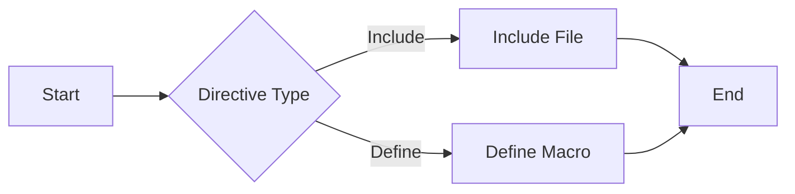

---

title: Compiler_Directives
type: Atomic Note
course: Computer Programming
semester: Autumn 2025
unit: '2'
hub: '[[2_C++_Programming_Fundamentals_Hub]]'
source: '[[Chapter_2.pdf]]'
source_pages:
- 7
mode: CS-SOFTWARE
read: false
generated: true
prerequisites:
- '[[Preprocessor_Directives]]'
- '[[Stream_Insertion_Operator]]'
- '[[Main_Function]]'

---


# 1. Mental Model

The concept of compiler directives can be likened to a restaurant's special requests. Just as a restaurant may have specific requests for food preparation, such as "no gluten" or "extra sauce," compiler directives are special requests to the compiler, such as [[Compiler_Directives]] telling it to include a specific file or define a macro. The directive acts as a messenger, conveying instructions to the compiler, much like a server takes a customer's request to the kitchen staff.

# 2. Execution Logic & Data Flow

The compiler directives are processed before the compilation of the C++ code, and they can affect how the code is compiled. The [[Preprocessor_Directives]] are a type of compiler directive that start with the "#" symbol and are used to give instructions to the compiler. For example, the [[Preprocessor_Directives]] can be used to include header files using the [[Stream_Insertion_Operator]] or to define macros. The [[Main_Function]] is where the program execution begins, but the compiler directives are processed before the [[Main_Function]] is reached. The [[Compiler_Directives]] can also be used to control the compilation process, such as with [[Conditional_Compilation]], which is not in the list but is related to [[Preprocessor_Directives]].

# 3. Edge Cases & Failure States

If a compiler directive is misplaced or incorrectly formatted, it can cause the compiler to behave unexpectedly or produce errors. For instance, a missing "#" symbol at the beginning of a [[Preprocessor_Directives]] can cause the compiler to interpret it as a regular C++ statement, leading to a compilation error. Additionally, if a [[Preprocessor_Directives]] attempts to include a non-existent file, the compiler will report an error. Furthermore, incorrect use of [[Preprocessor_Directives]] can lead to multiple inclusions of the same header file, causing duplicate definition errors.

## Implementation Mechanics

```python

# compiler_directives.py

def process_directive(directive):
    if directive.startswith("#include"):
        file_name = directive.split('"')[1]
        print(f"Including file: {file_name}")
    elif directive.startswith("#define"):
        macro_name = directive.split()[1]
        print(f"Defining macro: {macro_name}")

directives = [
    '#include "file1.h"',
    '#define DEBUG',
    '#include "file2.h"'
]

for directive in directives:
    process_directive(directive)

```



The Python code represents the processing of compiler directives. It defines a function `process_directive` that takes a directive as input and performs the corresponding action. The Mermaid flowchart illustrates the state changes that occur during the processing of a directive. It shows the start state, the decision node for the directive type, and the end state.

## Walkthrough

1. **Initial State**: We have a list of compiler directives that need to be processed. These directives are `#include "file1.h"`, `#define DEBUG`, and `#include "file2.h"`.
2. **Processing First Directive**: The first directive `#include "file1.h"` is passed to the `process_directive` function. The function checks the directive type and includes the file `file1.h`.
3. **Output for First Directive**: The output for the first directive is `Including file: file1.h`, indicating that the file `file1.h` has been included.
4. **Processing Second Directive**: The second directive `#define DEBUG` is passed to the `process_directive` function. The function checks the directive type and defines the macro `DEBUG`.
5. **Output for Second Directive**: The output for the second directive is `Defining macro: DEBUG`, indicating that the macro `DEBUG` has been defined.
6. **Processing Third Directive**: The third directive `#include "file2.h"` is passed to the `process_directive` function. The function checks the directive type and includes the file `file2.h`, producing the output `Including file: file2.h`.

---

## 6. The Proving Grounds

```interactive-quiz

[
  {
    "id": "q1",
    "type": "fill_in",
    "difficulty": "L1",
    "question": "What is the primary function of a compiler directive?",
    "textWithBlanks": "The primary function of a compiler directive is to [[Give_Instructions]] to the compiler.",
    "answer": ["give instructions"],
    "explanation": "Compiler directives provide special requests to the compiler, such as including a specific file or defining a macro."
  },
  {
    "id": "q2",
    "type": "true_false",
    "difficulty": "L2",
    "question": "A compiler directive can change the compiler's default behavior of optimizing the code for a specific target platform.",
    "answer": true,
    "explanation": "Compiler directives can indeed influence the compiler's behavior, including optimization settings for specific targets."
  },
  {
    "id": "q3",
    "type": "debug",
    "difficulty": "L3",
    "question": "Find the error.",
    "content": "if (x > 5) {\n#define MAX 10\n  y = MAX;\n}",
    "answer": "The bug is incorrect placement of the #define directive. The #define directive should be outside the if statement. The fix is to move #define MAX 10 above the if statement.",
    "explanation": "The #define directive is a preprocessor directive and should not be placed inside a conditional statement. It should be placed at the top level of the file or in a header file."
  }
]

```