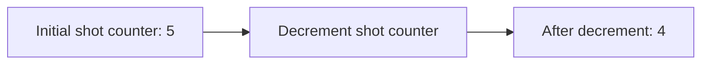

---

title: Decrement_Operator
type: Atomic Note
course: Computer Programming
semester: Autumn 2025
unit: '2'
hub: '[[2_C++_Programming_Fundamentals_Hub]]'
source: '[[Chapter_2.pdf]]'
source_pages:
- 43
mode: CS-SOFTWARE
read: false
generated: true
prerequisites:
- '[[C++_Programming_Language]]'
- '[[Main_Function]]'
- '[[Statements_In_C++]]'
- '[[Stream_Insertion_Operator]]'
- '[[Preprocessor_Directives]]'

---


# 1. Mental Model

The Decrement Operator can be thought of as a photographic camera's self-timer decrementing a shot counter. Just as the camera's counter decreases by one each time a picture is taken, the Decrement Operator decreases the value of a variable by 1. The variable's current value is structurally similar to the shot counter's current value, and the Decrement Operator's action is similar to taking a picture.

# 2. Execution Logic & Data Flow

The Decrement Operator [[Decrement_Operator]] is used to decrease the value of a variable by 1. In [[C++_Programming_Language]], this operator can be used in both prefix and postfix forms. The [[Main_Function]] is where the program starts execution, and it may contain [[Statements_In_C++]] that utilize the Decrement Operator. When the Decrement Operator is applied to a variable, it modifies the variable's value directly, and this change can be verified using [[Stream_Insertion_Operator]] to output the variable's new value. The [[Preprocessor_Directives]] and [[Compiler_Directives]] do not directly affect the Decrement Operator's behavior.

# 3. Edge Cases & Failure States

When using the Decrement Operator, boundary conditions such as attempting to decrement a variable that is already at its minimum value should be considered. For example, if a variable is of type [[C++_Programming_Language|unsigned_Int]] and is currently 0, decrementing it will result in a very large number, not an error. Additionally, if the Decrement Operator is used on a variable that is not properly [[Variable_Declaration|declared]], the program may not compile or may produce unexpected results. Furthermore, using the Decrement Operator on a variable that is being used in a [[Relational_Operators|comparison]] or [[Logical_Operators|logical_Operation]] may lead to unexpected behavior if not properly considered.

## Implementation Mechanics

```cpp

int main() {
    int shot_counter = 5;
    std::cout << "Initial shot counter: " << shot_counter << std::endl;
    shot_counter--;
    std::cout << "After decrement: " << shot_counter << std::endl;
    return 0;
}

```



The code block represents a simple C++ program that demonstrates the Decrement Operator. The Mermaid flowchart illustrates the state change of the shot counter from an initial value of 5 to a decremented value of 4.

## Walkthrough

1. In an epidemiology study, a researcher sets up a surveillance system with an initial alert counter set to 10, indicating the number of high-risk areas to monitor. The counter is initialized as `alert_counter = 10`.
2. The researcher uses the Decrement Operator to decrease the `alert_counter` by 1 each time a high-risk area is cleared, reflecting a reduction in the number of areas that require monitoring. This can be represented as `alert_counter--`.
3. Initially, the `alert_counter` is 10, and the researcher has not yet cleared any high-risk areas. The system displays: "Areas to monitor: 10".
4. After clearing one high-risk area, the researcher applies the Decrement Operator, changing the `alert_counter` to 9. The system updates to display: "Areas to monitor: 9".
5. As the researcher continues to clear high-risk areas, the Decrement Operator is applied repeatedly. For instance, after clearing another area, `alert_counter` becomes 8. The system updates again to: "Areas to monitor: 8".
6. By continuously applying the Decrement Operator, the researcher accurately tracks the decreasing number of high-risk areas, enabling efficient resource allocation and response strategies in public health modeling.

---

## 6. The Proving Grounds

```interactive-quiz

[
  {
    "id": "q1",
    "type": "fill_in",
    "difficulty": "L1",
    "question": "What is the effect of the Decrement Operator on a variable?",
    "textWithBlanks": "The Decrement Operator [[Decreases]] the value of a variable by [[1]].",
    "answer": ["decreases", "1"],
    "explanation": "The Decrement Operator decreases the value of a variable by 1."
  },
  {
    "id": "q2",
    "type": "true_false",
    "difficulty": "L2",
    "question": "If a variable x is 0, what happens when --x is executed in a conditional statement if (x)?",
    "answer": false,
    "explanation": "The conditional statement if (x) will evaluate to false if x is 0, but --x will set x to -1. However, the condition is evaluated before the decrement operation, so the condition will be false."
  },
  {
    "id": "q3",
    "type": "debug",
    "difficulty": "L3",
    "question": "Find the error.",
    "content": "var x = 5; var y = --x == 5 ? 10 : 20;",
    "answer": "The bug is using == instead of != or a similar operator to check for post-decrement value; it should be checking if the value of x after decrement is not equal to 5; fix: var y = --x != 5 ? 10 : 20; or simply use the value of x before decrement if that was the intention.",
    "explanation": "The code currently assigns 20 to y because --x equals 4, not 5."
  }
]

```