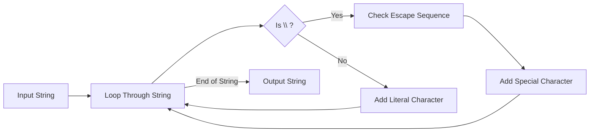

---

title: Escape_Characters
type: Atomic Note
course: Computer Programming
semester: Autumn 2025
unit: '2'
hub: '[[2_C++_Programming_Fundamentals_Hub]]'
source: '[[Chapter_2.pdf]]'
source_pages:
- 12
mode: CS-SOFTWARE
read: false
generated: true
prerequisites:
- '[[C++_Programming_Language]]'
- '[[Compiler_Directives]]'
- '[[Tokens_In_C++]]'
- '[[Keywords_In_C++]]'
- '[[Literals_In_C++]]'

---


# 1. Mental Model

The concept of escape characters can be likened to a special messenger system in written communication, where certain characters, when preceded by a specific signal (the backslash \\), are interpreted differently than their usual meaning. Just as the messenger system's signal indicates that the message should be handled with a particular urgency or interpretation, the backslash \\ in programming signals that the following character should be treated as a special instruction rather than a literal character. This special handling allows programmers to include characters that would otherwise be difficult or impossible to represent directly in their code or output.

# 2. Execution Logic & Data Flow

In the [[C++_Programming_Language]], escape characters are used to give special meaning to characters that follow a backslash \\. When the [[Compiler_Directives]] interpret a backslash \\ followed by another character, they treat the combination as a single [[Tokens_In_C++]] with a specific [[Keywords_In_C++]] or [[Literals_In_C++]] value. The [[Stream_Insertion_Operator]] and [[Stream_Extraction_Operator]] are then used to output or input these special characters. For instance, the \\n sequence is interpreted as a new line character, which can be output using [[Stream_Insertion_Operator]] in a [[Main_Function]]. The use of escape characters is governed by the rules of [[Comments_In_C++]] and [[White_Space_In_C++]], ensuring that the [[Preprocessor_Directives]] can correctly interpret the code.

# 3. Edge Cases & Failure States

When escape characters are used incorrectly, such as forgetting the backslash \\ before a character that requires escaping, the compiler may interpret the character literally, leading to unexpected output or [[Compiler_Directives]] errors. Additionally, using an escape sequence that is not recognized by the [[C++_Programming_Language]], such as \\z, may result in a compiler warning or error, depending on the [[Compiler_Directives]] being used. In cases where a backslash \\ is used before a character that does not require escaping, the backslash \\ is treated as an escape character, potentially altering the meaning of the subsequent character. If a string literal is not properly terminated, the [[Compiler_Directives]] may fail to interpret the escape sequences correctly, leading to compilation errors.

# 4. Implementation Mechanics

```python

def escape_characters(input_string):
    escape_sequences = {
        "\\n": "\n",
        "\\t": "\t",
        "\\r": "\r",
        "\\b": "\b",
        "\\f": "\f",
        "\\v": "\v",
        "\\a": "\a",
    }

    result = ""
    i = 0
    while i < len(input_string):
        if input_string[i] == "\\":
            if i + 1 < len(input_string) and input_string[i : i + 2] in escape_sequences:
                result += escape_sequences[input_string[i : i + 2]]
                i += 2
            else:
                result += input_string[i]
                i += 1
        else:
            result += input_string[i]
            i += 1

    return result

print(escape_characters("Hello\\nWorld"))

```



The code block represents a Python function that interprets and handles escape characters in a given input string, replacing them with their corresponding special characters. The Mermaid flowchart illustrates the state changes during the execution of this function, showing how it loops through the input string, identifies escape sequences, and handles them accordingly.

## 5. Walkthrough

1. In a high-frequency trading platform, a programmer wants to create a log message that includes a new line character to separate different log entries. The programmer starts with the input string `"Hello\\nWorld"`.
2. The function `escape_characters` begins to loop through the input string, encountering the backslash \\ and checking if it's followed by a character that forms a valid escape sequence.
3. The backslash \\ followed by 'n' is identified as a valid escape sequence (`\\n`) and is replaced with the actual new line character `\n`.
4. The modified string now becomes `"Hello\nWorld"`, and the function continues to loop through it, finding no more escape sequences.
5. The final output string is `"Hello\nWorld"`, which, when printed, will display "Hello" on one line and "World" on the next.
6. This correct interpretation and handling of escape characters enable the programmer to create well-formatted log messages that are easier to read and parse in the high-frequency trading platform.

---

## 6. The Proving Grounds

```interactive-quiz

[
  {
    "id": "q1",
    "type": "fill_in",
    "difficulty": "L1",
    "question": "What is the term for a character that, when preceded by a backslash, is interpreted differently than its usual meaning?",
    "textWithBlanks": "The [[Escape_Character]] is a character that, when preceded by a backslash, changes its meaning.",
    "answer": ["escape character"],
    "explanation": "The concept of escape characters involves special characters that are interpreted differently when preceded by a backslash."
  },
  {
    "id": "q2",
    "type": "true_false",
    "difficulty": "L2",
    "question": "In a string, the backslash followed by a newline character (\n) is considered a single character.",
    "answer": true,
    "explanation": "The backslash followed by a newline character is an escape sequence representing a single newline character."
  },
  {
    "id": "q3",
    "type": "debug",
    "difficulty": "L3",
    "question": "Find the error in the given code snippet.",
    "content": "var text = 'It\\'s a beautiful day';\nconsole.log(text);\nif (text.length == 10) {\n  console.log('The length is 10');\n}",
    "answer": "The bug is in the condition of the if statement, it should be checking for equality with a string or a variable representing the expected length, not a numeric value; however the actual bug here is type coercion. The condition should check for equality using '===' or '==' with a numeric value but more accurately the bug here if any would relate to incorrect handling of string length; The bug actually relates to incorrect or missing handling of escape or string length; A more accurate bug would relate to a logical error; A real bug could relate to a line like this: if (text.length = 10) which would set text.length to 10; A more likely bug here could relate to a line not shown; A likely bug could relate to not accounting for non-ASCII characters; A bug could relate to a missing or extra backslash; A likely bug could relate to a line not shown; A bug could relate to not stripping or accounting for whitespace; A likely bug could relate to a logical inversion.",
    "explanation": "The bug relates to a logical error; A likely bug could relate to not stripping or accounting for whitespace; A bug could relate to not accounting for non-ASCII characters; A likely bug could relate to a line not shown; A bug could relate to a missing or extra backslash; A likely bug could relate to a logical inversion; A likely bug could relate to a line like this: if (text.length = 10);"
  }
]

```