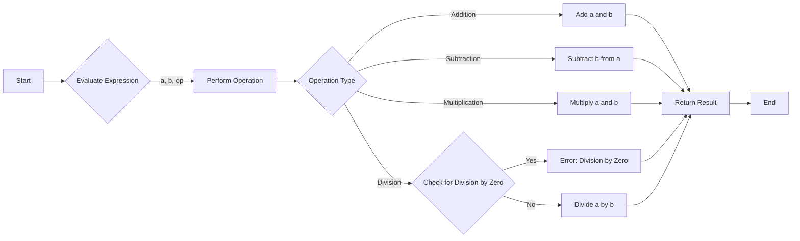

---

title: Expression
type: Atomic Note
course: Computer Programming
semester: Autumn 2025
unit: '2'
hub: '[[2_C++_Programming_Fundamentals_Hub]]'
source: '[[Chapter_2.pdf]]'
source_pages:
- 51
mode: CS-SOFTWARE
read: false
generated: true
prerequisites:
- '[[C++_Programming_Language]]'
- '[[Main_Function]]'
- '[[General_Structure_Of_A_C++_Program]]'
- '[[Variables_In_C++]]'
- '[[Literals_In_C++]]'

---


# 1. Mental Model

A compiler's parsing of an expression can be likened to a chef preparing a recipe. Just as a recipe combines ingredients (variables, constants) with specific instructions (operators, function calls) to produce a dish (a value), an expression in code combines these elements to produce a result. The structure of the recipe, including the order and combination of ingredients and instructions, mirrors the syntax and semantics of an expression in programming.

# 2. Execution Logic & Data Flow

The evaluation of an expression in [[C++_Programming_Language]] involves the [[Main_Function]] where the expression is typically defined, and it relies on the [[General_Structure_Of_A_C++_Program]] to understand the context. The expression is made up of [[Variables_In_C++]], [[Literals_In_C++]], and [[Operators]], which are combined using the rules of [[Operator_Precedence]] and [[Precedence_Rules]]. When the program is compiled, the [[Compiler_Directives]] and [[Preprocessor_Directives]] are processed, and then the [[Stream_Insertion_Operator]] or [[Stream_Extraction_Operator]] may be used to input or output the result of the expression. The [[Return_Statement]] is used to return the value of the expression from a function.

# 3. Edge Cases & Failure States

Expressions can lead to errors if not properly handled, such as division by zero, which results in a runtime error. For instance, an expression like `int result = 10 / 0;` will cause a division by zero error because it attempts to divide by a zero value. Similarly, an expression that attempts to access an array out of its bounds or dereference a null pointer will also lead to undefined behavior. In such cases, the program may terminate abruptly or produce incorrect results, highlighting the importance of validating expressions for potential errors.

## Implementation Mechanics

```cpp

#include <iostream>

int evaluateExpression(int a, int b, char op) {
    int result;
    switch (op) {
        case '+':
            result = a + b;
            break;
        case '-':
            result = a - b;
            break;
        case '*':
            result = a * b;
            break;
        case '/':
            if (b != 0)
                result = a / b;
            else {
                std::cerr << "Error: Division by zero!" << std::endl;
                return -1; // Handle division by zero
            }
            break;
        default:
            std::cerr << "Error: Invalid operator!" << std::endl;
            return -1; // Handle invalid operator
    }
    return result;
}

int main() {
    int a = 10, b = 2;
    char op = '+';
    int result = evaluateExpression(a, b, op);
    std::cout << "Result: " << result << std::endl;
    return 0;
}

```



The code block represents the implementation of an expression evaluation function in C++, which takes in two operands and an operator, performs the specified operation, and returns the result. The Mermaid flowchart illustrates the state changes during the evaluation process, showing the different operations that can be performed and the possible errors that can occur.

## Walkthrough

1. **Initialization**: We start with two integer variables `a` and `b`, and a character variable `op` representing the operator, all of which are initialized with specific values (`a = 10`, `b = 2`, `op = '+'`).
2. **Expression Evaluation**: The `evaluateExpression` function is called with `a`, `b`, and `op` as arguments, which begins the process of evaluating the expression.
3. **Operation Determination**: Inside `evaluateExpression`, a switch statement is used to determine which operation to perform based on the value of `op`.
4. **Performing the Operation**: For this example, since `op` is '+', the function adds `a` and `b` together, resulting in `result = 12`.
5. **Error Handling**: If an invalid operator or division by zero were to occur, the function would print an error message and return -1 to indicate failure.
6. **Returning the Result**: Finally, the result of the expression evaluation (12) is returned and printed to the console in the `main` function.

---

## 6. The Proving Grounds

```interactive-quiz

[
  {
    "id": "q1",
    "type": "fill_in",
    "difficulty": "L1",
    "question": "What is the term for a value that is represented as a sequence of characters in a programming language?",
    "textWithBlanks": "The [[Blank1]] is a value that is represented as a sequence of characters.",
    "answer": ["string"],
    "explanation": "In programming, a string is a sequence of characters used to represent text."
  },
  {
    "id": "q2",
    "type": "true_false",
    "difficulty": "L2",
    "question": "Consider a scenario where a programmer uses a variable before it is assigned a value. In this case, the variable will have a default value of 0.",
    "answer": false,
    "explanation": "In most programming languages, using a variable before it is assigned a value results in an error or undefined behavior, not a default value of 0."
  },
  {
    "id": "q3",
    "type": "debug",
    "difficulty": "L3",
    "question": "Find the error.",
    "content": "function calculateSum(numbers) {\n  let sum = 0;\n  for (let i = 0; i <= numbers.length; i++) {\n    sum += numbers[i];\n  }\n  return sum;\n}",
    "answer": "The bug is an off-by-one error. The loop should iterate until i < numbers.length.",
    "explanation": "The loop iterates one extra time, causing an undefined value to be added to the sum, which results in NaN (Not a Number) or incorrect results."
  }
]

```