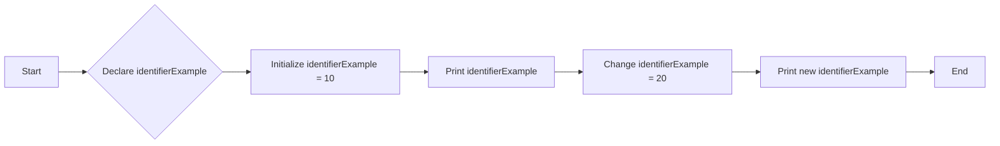

---

title: Identifiers_In_C++
type: Atomic Note
course: Computer Programming
semester: Autumn 2025
unit: '2'
hub: '[[2_C++_Programming_Fundamentals_Hub]]'
source: '[[Chapter_2.pdf]]'
source_pages:
- 19
mode: CS-SOFTWARE
read: false
generated: true
prerequisites:
- '[[General_Structure_Of_A_C++_Program]]'
- '[[Comments_In_C++]]'
- '[[Keywords_In_C++]]'
- '[[Compiler_Directives]]'
- '[[Preprocessor_Directives]]'

---


# 1. Mental Model

The concept of Identifiers in C++ can be likened to naming conventions in a library system. Just as books in a library are given unique titles and catalog numbers to distinguish them from one another, identifiers in C++ serve as unique names for variables, functions, and classes, allowing the compiler to differentiate between them. The structure of identifiers, which consists of letters, digits, and the underscore character, and must begin with a letter or underscore, parallels the systematic organization of books in a library, where each book's title and catalog number follow specific rules to ensure easy identification and retrieval.

# 2. Execution Logic & Data Flow

The process of defining and using identifiers in C++ involves several key steps, starting with the [[General_Structure_Of_A_C++_Program]] and the role of [[Comments_In_C++]] in documenting the code. When a programmer declares a variable or function, they must choose a unique identifier that adheres to the rules outlined in [[Identifiers_In_C++]], ensuring it does not conflict with [[Keywords_In_C++]] or [[Reserved_Words]]. The [[Compiler_Directives]] and [[Preprocessor_Directives]] play a crucial role in interpreting these identifiers during the compilation process. The [[Main_Function]] serves as the entry point for the program, where identifiers are used to reference variables and functions. Throughout the program, [[Statements_In_C++]] and [[Expressions]] utilize these identifiers to perform operations and store data.

# 3. Edge Cases & Failure States

When working with identifiers in C++, several edge cases and failure states can occur, such as attempting to use a reserved word as an identifier, which will result in a compilation error. Identifiers that start with a digit or contain special characters (other than the underscore) are also invalid. Furthermore, using the same identifier for different variables or functions within the same scope can lead to ambiguity and errors. Additionally, issues can arise from [[Type_Conversion]] and [[Implicit_Type_Casting]] when identifiers are used in expressions, highlighting the importance of careful identifier selection and type management.

# 4. Implementation Mechanics

```cpp

#include <iostream>
#include <string>

int main() {
    // Declare and initialize an integer variable
    int identifierExample = 10;
    
    // Print the value of the variable
    std::cout << "The value of identifierExample is: " << identifierExample << std::endl;
    
    // Change the value of the variable
    identifierExample = 20;
    
    // Print the new value of the variable
    std::cout << "The new value of identifierExample is: " << identifierExample << std::endl;
    
    return 0;
}

```



The code block demonstrates the use of an identifier `identifierExample` in C++, showcasing its declaration, initialization, and reassignment. The Mermaid flowchart illustrates the sequence of state changes for the `identifierExample` variable, from its declaration to its final reassignment.

## 5. Walkthrough

1. In a telecommunications network, a routing table is updated with a new path, which is assigned a unique identifier, `route_id_123`, to distinguish it from existing routes.
2. The network router's software uses this identifier to store and retrieve information about the path, such as its cost and next hop.
3. When a data packet arrives at the router, its destination address is matched against the routing table, and the corresponding `route_id_123` is used to determine the best path forward.
4. If the network topology changes, the router updates the `route_id_123` path, modifying its cost and next hop information to reflect the new conditions.
5. The updated routing table is then propagated to neighboring routers, ensuring that all routers have a consistent view of the network and can make informed decisions about packet forwarding.
6. As the network continues to evolve, new identifiers, such as `route_id_456`, are introduced to represent additional paths, and the routing table is updated to reflect the changing network topology.

---

## 6. The Proving Grounds

```interactive-quiz

[
  {
    "id": "q1",
    "type": "fill_in",
    "difficulty": "L1",
    "question": "What are the allowed characters in a C++ identifier?",
    "textWithBlanks": "The [[Blank1]] characters allowed in a C++ identifier are letters, digits, and the [[Blank2]] character.",
    "answer": ["letters, digits, and the underscore"],
    "explanation": "C++ identifiers can consist of letters (both uppercase and lowercase), digits, and the underscore character. They must begin with a letter or underscore."
  },
  {
    "id": "q2",
    "type": "true_false",
    "difficulty": "L2",
    "question": "Can a C++ identifier start with a digit?",
    "answer": false,
    "explanation": "According to C++ rules, an identifier must begin with a letter (a-z, A-Z) or an underscore (_), not a digit."
  },
  {
    "id": "q3",
    "type": "debug",
    "difficulty": "L3",
    "question": "Find the error.",
    "content": "int x = 5;\nint _x = x++;",
    "answer": "The bug is the post-increment operator. It should be int _x = x; x++; or int _x = ++x;",
    "explanation": "The post-increment operator (x++) first returns the current value of x and then increments x. So, _x is assigned the value 5, and then x is incremented to 6."
  }
]

```