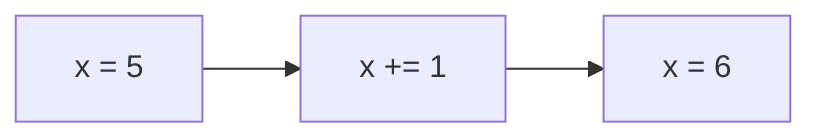

---

title: Increment_Operator
type: Atomic Note
course: Computer Programming
semester: Autumn 2025
unit: '2'
hub: '[[2_C++_Programming_Fundamentals_Hub]]'
source: '[[Chapter_2.pdf]]'
source_pages:
- 43
mode: CS-SOFTWARE
read: false
generated: true
prerequisites:
- '[[C++_Programming_Language]]'
- '[[Precedence_Rules]]'
- '[[Preprocessor_Directives]]'
- '[[Main_Function]]'
- '[[General_Structure_Of_A_C++_Program]]'

---


# 1. Mental Model

The increment operator can be thought of as a camera's self-timer mechanism, where the camera automatically takes a picture after a set delay, similar to how the increment operator automatically increments a variable's value by 1. Just as the camera's self-timer has two structural components - a delay and a capture mechanism - the increment operator has two key components: the variable being incremented and the increment operation itself. When the increment operator is applied, it adjusts the variable's value, much like the camera takes a picture.

# 2. Execution Logic & Data Flow

The increment operator [[Increment_Operator]] is a unary operator that increments the value of a variable by 1. In [[C++_Programming_Language]], the increment operator can be used in both prefix and postfix forms, with the prefix form [[Precedence_Rules]] typically having higher precedence than the postfix form. When the increment operator is applied to a variable, it either increments the variable before its value is used [[Preprocessor_Directives]] or after its value is used, depending on whether it's used as a prefix or postfix operator. The [[Main_Function]] often demonstrates the usage of the increment operator in a [[General_Structure_Of_A_C++_Program]]. The increment operator works in conjunction with [[Variables_In_C++]] and [[Arithmetic_Operators]].

# 3. Edge Cases & Failure States

When using the increment operator, boundary conditions such as overflow can occur if the variable being incremented exceeds its maximum limit, leading to undefined behavior. For instance, if a variable is declared with a maximum value and then incremented beyond that limit, it may wrap around to a smaller value or cause an error. Additionally, using the increment operator on a variable that is not properly initialized can lead to unexpected results. If the increment operator is applied to a variable that is being used in a [[Stream_Insertion_Operator]] or [[Stream_Extraction_Operator]] operation, it may cause issues with the output or input stream.

## Implementation Mechanics

```python

# Initialize a variable

x = 5

# Print initial value

print("Initial value:", x)

# Increment the variable

x += 1

# Print incremented value

print("Incremented value:", x)

```



The code block represents the execution of the increment operator in Python, where the variable `x` is initialized to 5, incremented by 1, and then printed. The Mermaid flowchart illustrates the state changes of the variable `x`, showing its initial value, the increment operation, and the resulting value.

## Walkthrough

1. In an epidemiology study, a researcher initializes a variable `patient_count` to 5, representing the number of patients with a specific disease.
2. The researcher then applies the increment operator to `patient_count` as a new patient is reported, changing the value to 6.
3. The updated `patient_count` is used to calculate the prevalence of the disease in the population.
4. The researcher repeats this process, incrementing `patient_count` each time a new patient is reported, allowing for real-time tracking of disease spread.
5. As the study progresses, the researcher uses the increment operator to update other variables, such as `total_tests_administered`, to monitor testing rates.
6. By accurately tracking these variables, the researcher can inform public health policy and make data-driven decisions to mitigate the disease outbreak.

---

## 6. The Proving Grounds

```interactive-quiz

[
  {
    "id": "q1",
    "type": "fill_in",
    "difficulty": "L1",
    "question": "What is the primary function of the increment operator?",
    "textWithBlanks": "The increment operator [[Blank1]] a variable's value by 1.",
    "answer": ["increments"],
    "explanation": "The increment operator increases a variable's value by 1."
  },
  {
    "id": "q2",
    "type": "true_false",
    "difficulty": "L2",
    "question": "If a variable x is 5, then ++x + x++ equals 11.",
    "answer": false,
    "explanation": "The expression ++x + x++ is evaluated as follows: ++x makes x 6, then x++ returns 6 and makes x 7, so the expression equals 6 + 6 = 12, not 11."
  },
  {
    "id": "q3",
    "type": "debug",
    "difficulty": "L3",
    "question": "Find the error.",
    "content": "int x = 5; int y = 2; if (x > y) x = y++;",
    "answer": "The bug is incorrect use of post-increment; it should be ++y or simply y++ then use y.",
    "explanation": "The current code assigns the current value of y (2) to x and then increments y. If the intention was to increment y before or after the comparison and assignment, the operator placement is incorrect."
  }
]

```