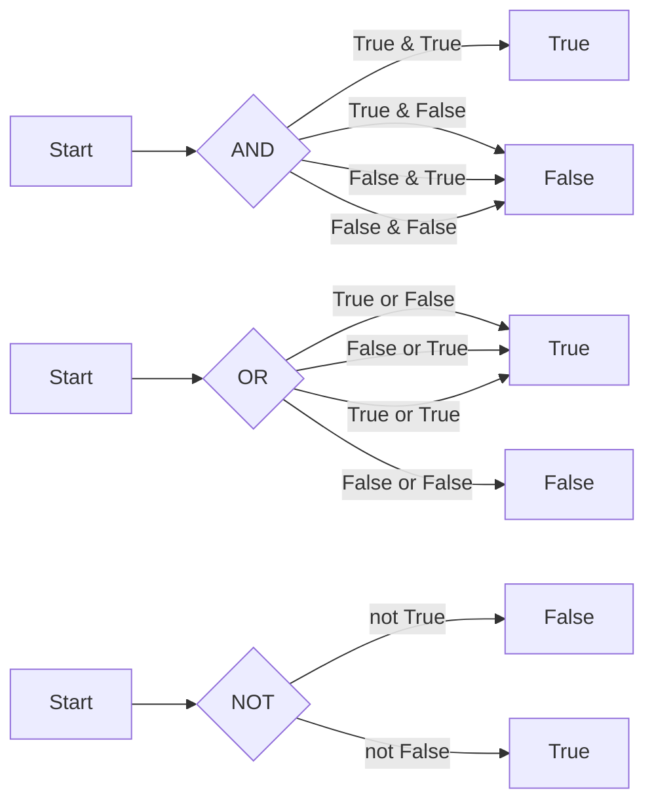

---

title: Logical_Operators
type: Atomic Note
course: Computer Programming
semester: Autumn 2025
unit: '2'
hub: '[[2_C++_Programming_Fundamentals_Hub]]'
source: '[[Chapter_2.pdf]]'
source_pages:
- 47
mode: CS-SOFTWARE
read: false
generated: true
prerequisites:
- '[[C++_Programming_Language]]'
- '[[Main_Function]]'
- '[[Statements_In_C++]]'
- '[[White_Space_In_C++]]'
- '[[Stream_Insertion_Operator]]'

---


# 1. Mental Model

The concept of logical operators can be likened to a decision-making process in a workflow, where the logical operators act as decision nodes that evaluate to true (1) or false (0). Just as a workflow has conditional statements that determine the next steps based on certain conditions, logical operators in programming evaluate conditions and return a boolean value that can be used to control the flow of a program. The structural components of logical operators, such as AND, OR, and NOT, can be mapped to the conditional statements in a workflow, where AND requires all conditions to be true, OR requires at least one condition to be true, and NOT reverses the condition.

# 2. Execution Logic & Data Flow

The execution logic of logical operators in a program involves evaluating one or more conditions and returning a boolean value based on the operator used. [[C++_Programming_Language]] supports logical operators such as AND (&&), OR (||), and NOT (!), which can be used to create complex conditional statements. The [[Main_Function]] in a C++ program often uses logical operators to evaluate conditions and control the flow of the program. [[Statements_In_C++]] can be combined using logical operators to create more complex conditions, and [[White_Space_In_C++]] is ignored when evaluating logical expressions. The [[Stream_Insertion_Operator]] and [[Stream_Extraction_Operator]] can be used to input and output the results of logical operations.

# 3. Edge Cases & Failure States

When using logical operators, edge cases can arise when dealing with boundary conditions such as evaluating to true or false. For example, if a condition is evaluated to true, but the program expects a false value, it can lead to unexpected behavior. Failure states can occur when logical operators are used incorrectly, such as using a single ampersand (&) instead of a double ampersand (&&) for an AND operation. 

| Operator | Description | Example |

| --- | --- | --- |

| && | AND | true && true |

| || | OR | true || false |

| ! | NOT | !true | 

In such cases, the program may not behave as expected, leading to errors or incorrect results.

# 4. Implementation Mechanics

```python

import numpy as np

def logical_and(a, b):
  return a and b

def logical_or(a, b):
  return a or b

def logical_not(a):
  return not a

# Test the functions

print(logical_and(True, True))   # Expected output: True
print(logical_and(True, False))  # Expected output: False
print(logical_or(True, False))   # Expected output: True
print(logical_or(False, False)) # Expected output: False
print(logical_not(True))         # Expected output: False
print(logical_not(False))        # Expected output: True

```



The code block represents the implementation of logical operators (AND, OR, NOT) in Python, demonstrating how these operators evaluate conditions and return boolean values. The Mermaid flowchart illustrates the state changes for each logical operator, showing the possible input combinations and their corresponding output values.

## 5. Walkthrough

Here are the steps to understand the application of logical operators in Epidemiology & Public Health Modeling:

1. **Defining Outbreak Conditions**: In epidemiological modeling, we often need to define conditions for an outbreak to occur. For instance, we might consider an outbreak to be occurring if the number of new cases exceeds a certain threshold (e.g., 10 new cases per day) AND the positivity rate is above a certain percentage (e.g., 5%). This can be represented as `outbreak = (new_cases > 10) and (positivity_rate > 0.05)`.

2. **Evaluating Risk Factors**: When evaluating risk factors for a disease, we might consider multiple factors such as age, smoking status, and pre-existing conditions. For example, we might consider a person to be at high risk if they are over 65 OR have a pre-existing condition. This can be represented as `high_risk = (age > 65) or (pre_existing_condition)`.

3. **Determining Vaccination Status**: In public health modeling, we often need to track vaccination status. A person might be considered fully vaccinated if they have received two doses of a vaccine AND a certain amount of time has passed since the second dose (e.g., 14 days). This can be represented as `fully_vaccinated = (doses_received == 2) and (days_since_second_dose >= 14)`.

4. **Assessing Disease Severity**: When assessing disease severity, we might consider multiple factors such as symptoms, lab results, and medical history. For example, we might consider a case to be severe if the patient has a certain symptom (e.g., difficulty breathing) OR a lab result above a certain threshold. This can be represented as `severe_case = (symptom == "difficulty breathing") or (lab_result > 1000)`.

5. **Identifying High-Risk Areas**: In epidemiological modeling, we often need to identify high-risk areas based on various factors such as case counts, population density, and socioeconomic status. For instance, we might consider an area to be high-risk if the case count is above a certain threshold AND the population density is above a certain level. This can be represented as `high_risk_area = (case_count > 50) and (population_density > 1000)`.

6. **Updating Model Parameters**: In public health modeling, we often need to update model parameters based on changing conditions. For example, we might need to update the transmission rate if the number of cases exceeds a certain threshold OR if a new variant emerges. This can be represented as `update_transmission_rate = (case_count > 100) or (new_variant_emerged)`.

---

## 6. The Proving Grounds

```interactive-quiz

[
  {
    "id": "q1",
    "type": "fill_in",
    "difficulty": "L1",
    "question": "Definition of logical operators",
    "textWithBlanks": "The [[Blank1]] operator returns true if both conditions are true.",
    "answer": ["AND"],
    "explanation": "The AND operator is a fundamental logical operator that returns true only if both conditions it connects are true."
  },
  {
    "id": "q2",
    "type": "true_false",
    "difficulty": "L2",
    "question": "Edge case of logical OR operator",
    "answer": false,
    "explanation": "The logical OR operator returns true if at least one of the conditions is true. Therefore, the statement 'false OR false' returns false, but 'false OR true' returns true. The question likely tests understanding of the operator's behavior with multiple false values."
  },
  {
    "id": "q3",
    "type": "debug",
    "difficulty": "L3",
    "question": "Find the error in the logical condition",
    "content": "if (x > 5 && x < 10) || x == 0 then { ... }",
    "answer": "The bug is incorrect operator precedence. The condition should be: if ((x > 5 && x < 10) || x == 0) then { ... } or equivalently if (x > 5 && (x < 10 || x == 0)) then { ... }",
    "explanation": "The bug arises from incorrect operator precedence. In the given condition, the logical AND (&&) has higher precedence than the logical OR (||), which can lead to unexpected behavior. To fix this, parentheses should be used to ensure the correct order of operations."
  }
]

```