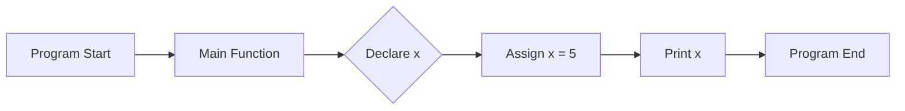

---

title: Main_Function
type: Atomic Note
course: Computer Programming
semester: Autumn 2025
unit: '2'
hub: '[[2_C++_Programming_Fundamentals_Hub]]'
source: '[[Chapter_2.pdf]]'
source_pages:
- 7
mode: CS-SOFTWARE
read: false
generated: true
prerequisites:
- '[[General_Structure_Of_A_C++_Program]]'
- '[[Stream_Insertion_Operator]]'
- '[[Stream_Extraction_Operator]]'
- '[[Return_Statement]]'

---


# 1. Mental Model

The main function in C++ can be thought of as the "conductor" of a train, where the train represents the program's execution. Just as the conductor is responsible for coordinating the movement of the train and ensuring it stays on track, the main function coordinates the execution of the program by calling other functions and managing the flow of control. The main function's role is similar to that of a central hub, where all the different parts of the program come together to start the execution process.

# 2. Execution Logic & Data Flow

The main function is the entry point of a C++ program, where program execution begins. The [[Main_Function]] is defined using the `int main()` syntax, and it is where the program starts to execute its instructions. The [[General_Structure_Of_A_C++_Program]] dictates that the main function should return an integer value indicating the program's exit status. The [[Stream_Insertion_Operator]] and [[Stream_Extraction_Operator]] can be used within the main function to interact with the user and perform input/output operations. The [[Return_Statement]] is used to exit the main function and return control to the operating system. 

# 3. Edge Cases & Failure States

If the main function is not defined correctly, the program may not compile or run as expected. For example, if the main function is defined with an incorrect signature, such as `void main()` instead of `int main()`, the program may not behave as intended. Additionally, if the main function does not return a value, the program's exit status may be undefined. In cases where the main function encounters an error, it can return a non-zero value to indicate failure.

## Implementation Mechanics

```cpp

#include <iostream>

int main() {
    std::cout << "Program started." << std::endl;
    int x = 5;
    std::cout << "Value of x: " << x << std::endl;
    return 0;
}

```



The code block represents the main function in C++, which is the entry point of the program. The Mermaid flowchart illustrates the state changes that occur during the execution of the main function, from program start to program end.

## Walkthrough

1. The program starts execution at the `main` function, which is the entry point of the C++ program, similar to how a train conductor starts their journey at the train station.
2. The `main` function prints "Program started." to the console, indicating that the program has begun execution, much like the conductor checking the train's systems before departure.
3. An integer variable `x` is declared and assigned the value 5, which can be thought of as loading cargo onto the train, where `x` represents a specific type of cargo.
4. The program then prints the value of `x` to the console, which is 5, similar to the conductor checking the cargo manifest to ensure everything is in order.
5. The program reaches the end of the `main` function and returns 0, indicating successful execution, much like the train reaching its final destination and the conductor declaring the journey complete.
6. The program terminates, and the memory allocated for the variable `x` is deallocated, similar to the train unloading its cargo and the conductor shutting down the train's systems.

---

## 6. The Proving Grounds

```interactive-quiz

[
  {
    "id": "q1",
    "type": "fill_in",
    "difficulty": "L1",
    "question": "What is the primary role of the main function in C++?",
    "textWithBlanks": "The main function in C++ is thought of as the [[Blank1]] of a program's execution.",
    "answer": ["conductor"],
    "explanation": "The main function coordinates the execution of the program by calling other functions and managing the flow of control."
  },
  {
    "id": "q2",
    "type": "true_false",
    "difficulty": "L2",
    "question": "Can a C++ program have multiple main functions?",
    "answer": false,
    "explanation": "A C++ program can only have one main function, which serves as the entry point for the program."
  },
  {
    "id": "q3",
    "type": "debug",
    "difficulty": "L3",
    "question": "Find the error.",
    "content": "int main() { int x = 5; if (x = 10) { cout << \"x is 10\"; } return 0; }",
    "answer": "The bug is assignment instead of comparison. The correct code should use '==' for comparison: if (x == 10)",
    "explanation": "The bug is a logic inversion due to the use of the assignment operator (=) instead of the comparison operator (==)."
  }
]

```