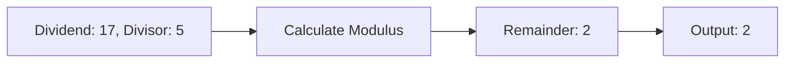

---

title: Modulus_Operator
type: Atomic Note
course: Computer Programming
semester: Autumn 2025
unit: '2'
hub: '[[2_C++_Programming_Fundamentals_Hub]]'
source: '[[Chapter_2.pdf]]'
source_pages:
- 39
mode: CS-SOFTWARE
read: false
generated: true
prerequisites:
- '[[Main_Function]]'
- '[[Arithmetic_Operators]]'
- '[[Compiler_Directives]]'
- '[[Preprocessor_Directives]]'
- '[[Stream_Insertion_Operator]]'

---


# 1. Mental Model

The modulus operator can be thought of as a clock mechanism, where the remainder of a division operation is akin to the hour or minute hand wrapping around after reaching a certain limit. Just as a clock has 12 hours and after 12, it wraps around to 1, the modulus operator returns the remainder of a division operation, wrapping around the dividend to a value less than the divisor. In this analogy, the divisor represents the clock's limit, and the dividend represents the time elapsed.

# 2. Execution Logic & Data Flow

The modulus operator [[Modulus_Operator]] in C++ is used to compute the remainder of a division operation. When the [[Main_Function]] is executed, it can perform various operations, including arithmetic operations like [[Arithmetic_Operators]], and the modulus operator is one of them. The [[Compiler_Directives]] and [[Preprocessor_Directives]] are processed before the code is compiled, and the [[Stream_Insertion_Operator]] is used to output the results. The [[Variables_In_C++]] are declared and assigned values using the [[Assignment_Operator]], and then the modulus operator can be applied to them. The result of the modulus operator is then used in the [[Expression]] and [[Statements]].

# 3. Edge Cases & Failure States

When using the modulus operator, a common edge case is division by zero, which results in undefined behavior. Another edge case is when the dividend is negative, in which case the result of the modulus operation may vary depending on the implementation. For example, -5 % 2 may evaluate to -1 or 1, depending on the compiler. Additionally, if the divisor is zero, the program will terminate abruptly, resulting in a runtime error.

## Implementation Mechanics

```cpp

#include <iostream>

int modulus_operator(int dividend, int divisor) {
    return dividend % divisor;
}

int main() {
    int dividend = 17;
    int divisor = 5;
    int remainder = modulus_operator(dividend, divisor);
    std::cout << "The remainder of " << dividend << " divided by " << divisor << " is: " << remainder << std::endl;
    return 0;
}

```



The code block represents the implementation of the modulus operator in C++, which calculates the remainder of a division operation. The Mermaid flowchart illustrates the state changes during the execution of the code, from the initial dividend and divisor values to the calculation of the remainder and finally to the output of the result.

## Walkthrough

1. In a telecommunications network, a router receives a packet with a sequence number of 17 and needs to determine if it has been received in order; it uses the modulus operator with a divisor of 5 to wrap around the sequence numbers, assuming a maximum sequence number of 5.
2. The router calculates the remainder of 17 divided by 5 using the modulus operator, which results in a remainder of 2.
3. The router then uses this remainder to determine the correct position of the packet in the sequence, which in this case corresponds to the 2nd position.
4. When the next packet is received with a sequence number of 22, the router applies the modulus operator again, resulting in a remainder of 2 (22 % 5 = 2).
5. However, if a packet is received out of order, say with a sequence number of 12, the router calculates the remainder as 2 (12 % 5 = 2), indicating that it should be placed before packets with sequence numbers 17 and 22.
6. By consistently applying the modulus operator, the router can efficiently manage packet sequence numbers and ensure correct ordering, even in cases where sequence numbers exceed the maximum value.

---

## 6. The Proving Grounds

```interactive-quiz

[
  {
    "id": "q1",
    "type": "fill_in",
    "difficulty": "L1",
    "question": "What is the core concept definition of the modulus operator?",
    "textWithBlanks": "The modulus operator returns the [[Remainder]] of a division operation.",
    "answer": ["remainder"],
    "explanation": "The modulus operator gives the remainder when one number is divided by another."
  },
  {
    "id": "q2",
    "type": "true_false",
    "difficulty": "L2",
    "question": "Is the statement '5 % -2 = -1' true?",
    "answer": false,
    "explanation": "In most programming languages, the result of the modulus operation has the same sign as the divisor. Since -2 is negative, 5 % -2 equals 1, not -1."
  },
  {
    "id": "q3",
    "type": "debug",
    "difficulty": "L3",
    "question": "Find the error.",
    "content": "function getOppositeBoolean(bool) {\n  return bool == true;\n}",
    "answer": "The bug is using the '==' operator for boolean comparison which can be misleading; it should use the '===' operator for strict equality. However, the actual bug here is more about the logic inversion: the function is supposed to return the opposite boolean, so it should return !bool.",
    "explanation": "The function intends to return the opposite of the input boolean but currently returns the same boolean value due to a logical error. It should be fixed by changing the line to 'return !bool;'."
  }
]

```