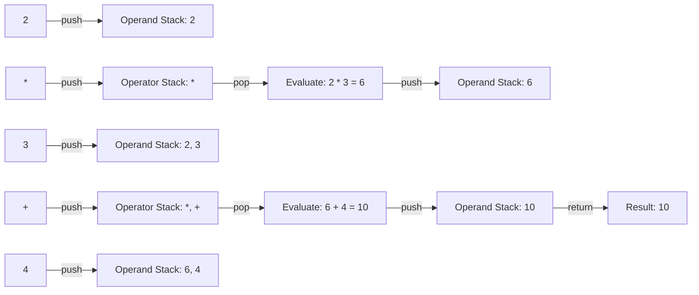

---

title: Operator_Precedence
type: Atomic Note
course: Computer Programming
semester: Autumn 2025
unit: '2'
hub: '[[2_C++_Programming_Fundamentals_Hub]]'
source: '[[Chapter_2.pdf]]'
source_pages:
- 40
mode: CS-SOFTWARE
read: false
generated: true
prerequisites:
- '[[Compiler_Directives]]'
- '[[Preprocessor_Directives]]'
- '[[Main_Function]]'
- '[[Stream_Insertion_Operator]]'
- '[[Stream_Extraction_Operator]]'

---


# 1. Mental Model

The concept of operator precedence can be likened to a hierarchical organizational structure, where operators are ranked based on their level of importance. Just as a company's CEO makes high-level decisions that override those of lower-level managers, operators with higher precedence take priority over those with lower precedence. For example, in the expression `a * b + c`, the `*` operator has higher precedence than the `+` operator, so it is evaluated first, much like a department head's decisions take precedence over those of team leads.

# 2. Execution Logic & Data Flow

When evaluating an expression, the [[Compiler_Directives]] and [[Preprocessor_Directives]] are processed first, but they do not directly impact operator precedence. The [[Main_Function]] contains the program's entry point, where expressions are evaluated according to the [[Operator_Precedence]] rules. The [[Stream_Insertion_Operator]] and [[Stream_Extraction_Operator]] are used for input/output operations, but their precedence is determined by their position in the expression and the [[Precedence_Rules]]. In C++, [[C++_Is_Case_Sensitive]], and the [[White_Space_In_C++]] is ignored, except when it affects the [[Tokens_In_C++]] and [[Identifiers_In_C++]]. The [[Arithmetic_Operators]], such as the [[Modulus_Operator]], [[Increment_Operator]], and [[Decrement_Operator]], have higher precedence than [[Relational_Operators]] and [[Logical_Operators]].

# 3. Edge Cases & Failure States

When two operators have the same precedence, the [[Precedence_Rules]] dictate that the expression is evaluated from left to right. However, if an expression contains nested parentheses, the innermost parentheses are evaluated first, according to the [[General_Structure_Of_A_C++_Program]]. If the expression is too complex or contains too many operators, it may lead to [[Type_Conversion]] issues or unexpected results due to [[Implicit_Type_Casting]] or [[Explicit_Type_Casting]]. In such cases, using [[Static_Cast]] can help ensure the correct data type is used, and [[Comments_In_C++]] can be used to clarify the intended logic.

## Implementation Mechanics

```python

# Define a simple expression evaluator with operator precedence

def evaluate_expression(expression):

    # Define operator precedence

    precedence = {
        '+': 1,
        '-': 1,
        '*': 2,
        '/': 2
    }

    # Split the expression into tokens (operators and operands)

    tokens = expression.replace("(", " ( ").replace(")", " ) ").split()

    # Initialize operator and operand stacks

    operator_stack = []
    operand_stack = []

    # Iterate through tokens

    for token in tokens:
        if token.isdigit():

            # Operand, push to operand stack

            operand_stack.append(int(token))
        elif token in precedence:

            # Operator, pop operators with higher or equal precedence

            while (operator_stack and 
                   operator_stack[-1] in precedence and 
                   precedence[operator_stack[-1]] >= precedence[token]):
                op = operator_stack.pop()
                b = operand_stack.pop()
                a = operand_stack.pop()
                if op == '+':
                    operand_stack.append(a + b)
                elif op == '-':
                    operand_stack.append(a - b)
                elif op == '*':
                    operand_stack.append(a * b)
                elif op == '/':
                    operand_stack.append(a / b)
            operator_stack.append(token)
        elif token == '(':

            # Left parenthesis, push to operator stack

            operator_stack.append(token)
        elif token == ')':

            # Right parenthesis, pop operators until left parenthesis

            while operator_stack[-1] != '(':
                op = operator_stack.pop()
                b = operand_stack.pop()
                a = operand_stack.pop()
                if op == '+':
                    operand_stack.append(a + b)
                elif op == '-':
                    operand_stack.append(a - b)
                elif op == '*':
                    operand_stack.append(a * b)
                elif op == '/':
                    operand_stack.append(a / b)
            operator_stack.pop()  # Remove left parenthesis

    # Pop remaining operators

    while operator_stack:
        op = operator_stack.pop()
        b = operand_stack.pop()
        a = operand_stack.pop()
        if op == '+':
            operand_stack.append(a + b)
        elif op == '-':
            operand_stack.append(a - b)
        elif op == '*':
            operand_stack.append(a * b)
        elif op == '/':
            operand_stack.append(a / b)

    return operand_stack[0]

print(evaluate_expression("2 * 3 + 4"))  # Output: 10

```



The code block represents a simple expression evaluator implemented in Python, which demonstrates operator precedence by evaluating expressions and returning the result. The Mermaid flowchart illustrates the state changes that occur during the evaluation of the expression "2 * 3 + 4", showing how operators and operands are pushed and popped from their respective stacks.

## Walkthrough

1. In the aerospace engineering domain, consider an avionics system that requires evaluating mathematical expressions to compute navigation parameters, such as altitude and velocity. The expression evaluator must handle operator precedence correctly to ensure accurate calculations.
2. The expression "2 * 3 + 4" is tokenized into operands (2, 3, 4) and operators (*, +), which are then processed according to their precedence.
3. The '*' operator has higher precedence than the '+' operator, so it is evaluated first, resulting in 2 * 3 = 6, which is pushed onto the operand stack.
4. The '+' operator is then evaluated, popping the operands 6 and 4 from the stack and pushing the result 10 back onto the stack.
5. As the expression evaluator processes the tokens, it maintains two stacks: an operator stack to store operators and an operand stack to store intermediate results.
6. The final result, 10, is returned by the expression evaluator, representing the computed navigation parameter value.

---

## 6. The Proving Grounds

```interactive-quiz

[
  {
    "id": "q1",
    "type": "fill_in",
    "difficulty": "L1",
    "question": "What is the term for the rules that determine the order in which operators are evaluated in an expression?",
    "textWithBlanks": "The [[Blank1]] determines the order in which operators are evaluated.",
    "answer": ["operator precedence"],
    "explanation": "Operator precedence is a set of rules that dictate the order in which operators are evaluated when there are multiple operators in an expression."
  },
  {
    "id": "q2",
    "type": "true_false",
    "difficulty": "L2",
    "question": "Consider the expression `a + b * c`. Is the value of `c` multiplied by the sum of `a` and `b`?",
    "answer": false,
    "explanation": "Due to operator precedence, `b * c` is evaluated first, and then the result is added to `a`. Therefore, the value of `c` is not multiplied by the sum of `a` and `b`."
  },
  {
    "id": "q3",
    "type": "debug",
    "difficulty": "L3",
    "question": "Find the error.",
    "content": "if (x > 5) || (y < 3) then print(\"true\")",
    "answer": "The bug is incorrect operator precedence. The correct code should be: if (x > 5 || y < 3) then print(\"true\")",
    "explanation": "The bug is due to incorrect operator precedence. The logical OR operator || has higher precedence than the conditional statement, causing a syntax error. The correct fix is to group the conditions correctly using parentheses."
  }
]

```