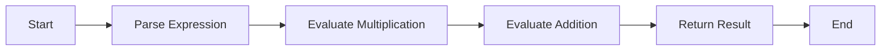

---

title: Precedence_Rules
type: Atomic Note
course: Computer Programming
semester: Autumn 2025
unit: '2'
hub: '[[2_C++_Programming_Fundamentals_Hub]]'
source: '[[Chapter_2.pdf]]'
source_pages:
- 40
mode: CS-SOFTWARE
read: false
generated: true
prerequisites:
- '[[Operator_Precedence]]'
- '[[C++_Programming_Language]]'
- '[[Braces_In_C++]]'

---


# 1. Mental Model

The concept of precedence rules in expressions can be likened to the protocol observed in a busy office where multiple teams are working on a project. Just as certain teams have higher priority access to the CEO based on their department's importance or the urgency of their task, operators in an expression have a predefined order in which they are evaluated, determined by their precedence level. For instance, multiplication and division operations are like the finance and HR departments, which are typically given higher priority and evaluated before addition and subtraction operations, similar to how lower-level staff might need to clear their requests through these higher-priority departments first.

# 2. Execution Logic & Data Flow

The execution logic of expressions in programming follows a strict set of precedence rules to ensure that operations are performed in the correct order. This order is determined by the [[Operator_Precedence]] rules defined in the [[C++_Programming_Language]], which dictate that certain operators are evaluated before others. For example, in the expression `a + b * c`, the multiplication operation `b * c` is evaluated first because multiplication has higher precedence than addition, as outlined in the [[Precedence_Rules]]. The result of this evaluation is then used in the addition operation. The use of [[Braces_In_C++]] can alter this default order by allowing developers to explicitly define the order of operations, ensuring that complex expressions are evaluated correctly.

# 3. Edge Cases & Failure States

When the precedence rules are not properly understood or applied, it can lead to unexpected results in a program. For instance, an expression like `a / b + c` might not behave as expected if the intention was to add `c` to the result of `a / b`, but due to the precedence of division over addition, `a` is divided by `b` first, and then `c` is added to the result. If `b` is zero, this results in a division by zero error. Similarly, expressions with multiple operators of the same precedence level, such as `a + b + c`, are evaluated from left to right according to the [[Precedence_Rules]], which can sometimes lead to confusion if not carefully considered. Understanding and explicitly controlling the order of operations using [[Braces_In_C++]] is crucial to avoid such pitfalls.

# 4. Implementation Mechanics

```python

def evaluate_expression(expression):
    try:
        result = eval(expression)
        return result
    except Exception as e:
        return str(e)

# Test the function

expression = "10 + 5 * 2"
result = evaluate_expression(expression)
print(f"Expression: {expression}, Result: {result}")

```



The code block represents a simple Python function `evaluate_expression` that evaluates a given mathematical expression using the built-in `eval` function. The Mermaid flowchart illustrates the steps involved in evaluating an expression, from parsing the expression to returning the result.

## 5. Walkthrough

Here are the steps to walk through the concept of precedence rules in the context of Epidemiology & Public Health Modeling:

1. **Defining the Expression**: In a public health modeling scenario, we want to calculate the risk of disease transmission based on several factors, including the number of infected individuals, the population density, and the effectiveness of interventions. We define an expression to represent this relationship: `risk = 0.5 * infected + 0.2 * density - 0.1 * intervention`.
2. **Parsing the Expression**: The expression is parsed into its constituent parts, including the operators and operands. In this case, we have multiplication and addition operations.
3. **Evaluating Multiplication**: Following the precedence rules, the multiplication operations are evaluated first. For example, `0.5 * infected` and `0.2 * density` are calculated.
4. **Evaluating Addition and Subtraction**: Once the multiplication operations are evaluated, the addition and subtraction operations are performed. In this case, we add and subtract the results of the multiplication operations: `risk = (0.5 * infected) + (0.2 * density) - (0.1 * intervention)`.
5. **Assigning the Result**: The final result of the expression is assigned to the `risk` variable, which represents the calculated risk of disease transmission.
6. **Interpreting the Result**: The calculated risk value is then interpreted in the context of public health modeling, taking into account the thresholds for high, medium, and low risk, and informing decision-making for intervention strategies.

---

## 6. The Proving Grounds

```interactive-quiz

[
  {
    "id": "q1",
    "type": "fill_in",
    "difficulty": "L1",
    "question": "What are the precedence rules in expressions?",
    "textWithBlanks": "The precedence rules in expressions refer to the order in which operators are evaluated when there are multiple operations in an expression, based on their [[Blank1]] or importance.",
    "answer": ["precedence"],
    "explanation": "The precedence rules dictate the order of operations in expressions, similar to how different teams have access priority in a busy office."
  },
  {
    "id": "q2",
    "type": "true_false",
    "difficulty": "L2",
    "question": "Given that we have the expression 2 + 3 * 4, does the addition operation have higher precedence than the multiplication operation?",
    "answer": false,
    "explanation": "In the expression 2 + 3 * 4, the multiplication operation has higher precedence than the addition operation, so it is evaluated first."
  },
  {
    "id": "q3",
    "type": "debug",
    "difficulty": "L3",
    "question": "Find the error.",
    "content": "function calculateTotal(a, b) {\n  var result = a + b * 2;\n  return result;\n}",
    "answer": "The bug is operator precedence. The function should be: function calculateTotal(a, b) {\n  var result = a * 2 + b;\n  return result;\n} or function calculateTotal(a, b) {\n  var result = (a + b) * 2;\n  return result;\n}. The current implementation evaluates b * 2 first, then adds a, which is likely not the intended calculation.",
    "explanation": "The bug arises from incorrect application of precedence rules. The multiplication operation has higher precedence than addition, so 'b * 2' is evaluated first, then 'a' is added. This could be fixed by adding parentheses around 'a + b' to change the order of operations or by changing the operation to 'a * 2 + b'."
  }
]

```