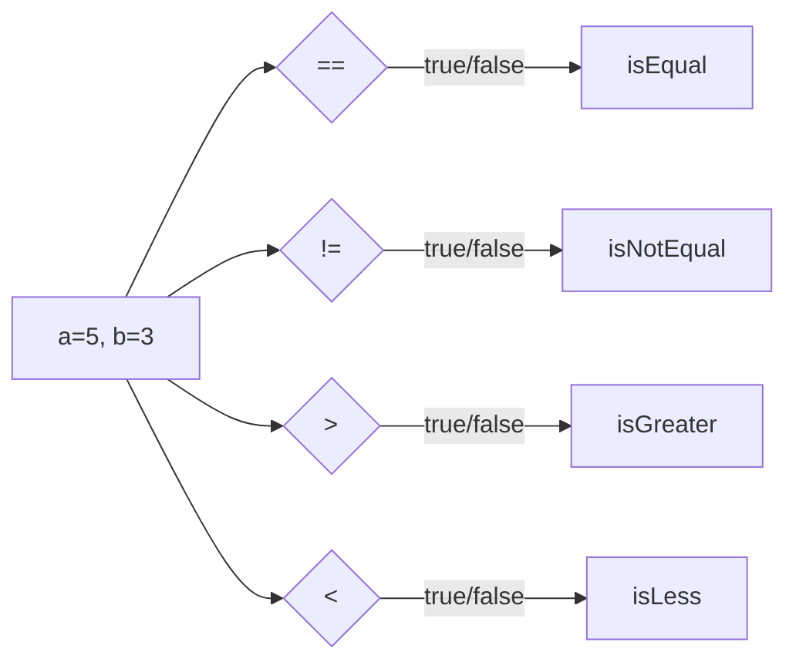

---

title: Relational_Operators
type: Atomic Note
course: Computer Programming
semester: Autumn 2025
unit: '2'
hub: '[[2_C++_Programming_Fundamentals_Hub]]'
source: '[[Chapter_2.pdf]]'
source_pages:
- 46
mode: CS-SOFTWARE
read: false
generated: true
prerequisites:
- '[[Main_Function]]'
- '[[Variable_Declaration]]'
- '[[Assignment_Operator]]'
- '[[Operator_Precedence]]'
- '[[Statements_In_C++]]'

---


# 1. Mental Model

A relational operator can be thought of as a judge in a comparison, evaluating the relationship between two operands. Just as a judge weighs evidence and makes a decision based on certain criteria, a relational operator evaluates the values of two operands and returns a boolean result based on the specific relationship being tested, such as equality or inequality. The operator's decision is based on a set of predefined rules, like a judge applying the law to determine guilt or innocence.

# 2. Execution Logic & Data Flow

The execution of relational operators in C++ involves evaluating the relationship between two operands and returning a boolean value. This process begins with the [[Main_Function]] where variables are declared and assigned values using [[Variable_Declaration]] and [[Assignment_Operator]]. The relational operators, such as `==`, `!=`, `>`, `<`, `>=` , and `<=`, are then used to compare these variables, and the result is determined based on [[Operator_Precedence]] and [[Relational_Operators]]. The result of the comparison is a boolean value, `true` or `false`, which can be used to control the flow of the program using [[Statements_In_C++]] and [[Braces_In_C++]]. The [[Stream_Insertion_Operator]] can be used to output the result.

# 3. Edge Cases & Failure States

When using relational operators, edge cases can arise from the comparison of variables with extreme values or unexpected types. For instance, comparing floating-point numbers for equality can lead to unexpected results due to precision errors. Additionally, attempting to compare variables of incompatible types can result in a compilation error or unexpected behavior due to [[Implicit_Type_Casting]]. It is essential to ensure that the operands are of compatible types and that the comparison is logically sound to avoid incorrect results. Failure to consider these edge cases can lead to flawed logic and incorrect program behavior.

## Implementation Mechanics

```cpp

#include <iostream>

int main() {
    int a = 5;
    int b = 3;

    bool isEqual = (a == b);
    bool isNotEqual = (a != b);
    bool isGreater = (a > b);
    bool isLess = (a < b);

    std::cout << "Is a equal to b? " << std::boolalpha << isEqual << std::endl;
    std::cout << "Is a not equal to b? " << std::boolalpha << isNotEqual << std::endl;
    std::cout << "Is a greater than b? " << std::boolalpha << isGreater << std::endl;
    std::cout << "Is a less than b? " << std::boolalpha << isLess << std::endl;

    return 0;
}

```



The code block demonstrates the usage of relational operators in C++ by comparing two integers `a` and `b` and storing the results in boolean variables. The Mermaid flowchart illustrates the state changes and decision-making process of the relational operators, showing how the initial state of `a` and `b` leads to the evaluation of different relationships and the resulting boolean values.

## Walkthrough

1. In an industrial manufacturing setting, a robotic arm is programmed to compare the current temperature reading (5°C) with a predefined threshold (3°C) to determine if it should activate the cooling system. The comparison is done using the equality operator (`==`).
2. The robotic arm's control system evaluates the relationship between the current temperature (5°C) and the threshold (3°C) using the inequality operator (`!=`) to check if the temperature is not equal to the threshold.
3. The system then uses the greater-than operator (`>`) to determine if the current temperature is greater than the threshold, which would require more intense cooling.
4. Next, it uses the less-than operator (`<`) to check if the current temperature is less than the threshold, in which case no cooling is needed.
5. Based on the results of these comparisons, the robotic arm's control system makes decisions about activating the cooling system, adjusting its operation to maintain a stable temperature.
6. The control system logs the results of these comparisons, allowing for further analysis and optimization of the manufacturing process.

---

## 6. The Proving Grounds

```interactive-quiz

[
  {
    "id": "q1",
    "type": "fill_in",
    "difficulty": "L1",
    "question": "What is the term for an operator that compares two operands and returns a boolean result based on their relationship?",
    "textWithBlanks": "The [[Relational_Operator]] is a judge in a comparison.",
    "answer": ["relational operator"],
    "explanation": "A relational operator is a type of operator that compares two operands and returns a boolean result based on their relationship, similar to a judge making a decision based on certain criteria."
  },
  {
    "id": "q2",
    "type": "true_false",
    "difficulty": "L2",
    "question": "Consider a scenario where two variables, 'a' and 'b', are compared using the '!=' operator. If 'a' is NaN (Not a Number) and 'b' is also NaN, the result of the comparison 'a != b' is false.",
    "answer": true,
    "explanation": "In many programming languages, including JavaScript, NaN is not equal to anything, including itself. Therefore, the comparison 'a != b' when both 'a' and 'b' are NaN returns false, making the statement true."
  },
  {
    "id": "q3",
    "type": "debug",
    "difficulty": "L3",
    "question": "Find the error.",
    "content": "function areEqual(a, b) {\n  return a = b;\n}",
    "answer": "The bug is assignment instead of comparison. The correct operator should be '===' or '==' for comparison, not '=' which is for assignment. The fix is to change 'return a = b;' to 'return a === b;' or 'return a == b;'.",
    "explanation": "The code is using the assignment operator '=' instead of the comparison operator '===' or '=='. This will always return the value of 'b', not a boolean indicating whether 'a' and 'b' are equal."
  }
]

```