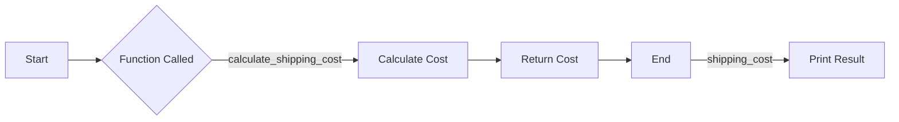

---

title: Return_Statement
type: Atomic Note
course: Computer Programming
semester: Autumn 2025
unit: '2'
hub: '[[2_C++_Programming_Fundamentals_Hub]]'
source: '[[Chapter_2.pdf]]'
source_pages:
- 13
mode: CS-SOFTWARE
read: false
generated: true
prerequisites:
- '[[Main_Function]]'
- '[[Variable_Declaration]]'
- '[[Compiler_Directives]]'
- '[[Preprocessor_Directives]]'
- '[[Type_Conversion]]'

---


# 1. Mental Model

A return statement in a function can be likened to a traffic control system at an airport, where air traffic controllers direct planes to land safely. Just as the air traffic controller ensures a plane lands on the correct runway and exits the runway safely, a return statement directs the program flow to exit the function safely and return control to the calling function. The value returned by the return statement is like the flight number and status report provided to air traffic control, conveying essential information about the function's execution.

# 2. Execution Logic & Data Flow

The [[Return_Statement]] is used to exit a function and return control to the calling function. When a [[Return_Statement]] is encountered, the function immediately terminates and returns the specified value to the caller. In C++, the [[Main_Function]] typically uses a [[Return_Statement]] with a value of 0 to indicate successful program termination. The [[Return_Statement]] can be used with or without a value, depending on the function's return type, which is specified in the [[Variable_Declaration]] of the function. The [[Compiler_Directives]] and [[Preprocessor_Directives]] are processed before the [[Return_Statement]] is executed.

# 3. Edge Cases & Failure States

If a [[Return_Statement]] is omitted from a function that is expected to return a value, the program will exhibit undefined behavior. A [[Return_Statement]] with a value that does not match the function's return type will result in a compilation error due to [[Type_Conversion]] issues. If the [[Main_Function]] returns a non-zero value, it typically indicates that the program terminated abnormally. In functions with a void return type, a [[Return_Statement]] without a value is used to exit the function early.

## Implementation Mechanics

```python

def calculate_shipping_cost(weight, rate):
    cost = weight * rate
    return cost

# Example usage:

weight = 100  # kilograms
rate = 0.05   # dollars per kilogram
shipping_cost = calculate_shipping_cost(weight, rate)
print(f"Shipping cost: ${shipping_cost:.2f}")

```



The code block represents a simple Python function `calculate_shipping_cost` that takes `weight` and `rate` as inputs and returns the calculated shipping cost. The Mermaid flowchart illustrates the state changes during the execution of this function, from the start to the end, showing how the function is called, calculates the cost, returns the cost, and finally prints the result.

## Walkthrough

1. **Initial State**: A shipping company's logistics system needs to calculate the shipping cost for a cargo of 100 kilograms. The rate is set at $0.05 per kilogram.
2. **Function Invocation**: The system calls the `calculate_shipping_cost` function with `weight = 100` and `rate = 0.05` as arguments.
3. **Calculation**: Inside the function, the shipping cost is calculated as `cost = 100 * 0.05 = 5`.
4. **Return Statement**: The function executes the return statement, which directs the program flow to exit the function and return the calculated cost of $5.
5. **Assignment**: The returned cost is assigned to the `shipping_cost` variable in the calling code.
6. **Result Output**: Finally, the system prints the shipping cost to the console, displaying "Shipping cost: $5.00".

---

## 6. The Proving Grounds

```interactive-quiz

[
  {
    "id": "q1",
    "type": "fill_in",
    "difficulty": "L1",
    "question": "What is the primary function of a return statement in a function?",
    "textWithBlanks": "The primary function of a return statement is to [[Blank1]] the function and provide a value to the caller.",
    "answer": ["exit"],
    "explanation": "A return statement directs the program flow to exit the function safely and return control to the calling function."
  },
  {
    "id": "q2",
    "type": "true_false",
    "difficulty": "L2",
    "question": "If a function does not explicitly return a value, it will return undefined in JavaScript.",
    "answer": true,
    "explanation": "In JavaScript, if a function does not explicitly return a value, it will return undefined by default."
  },
  {
    "id": "q3",
    "type": "debug",
    "difficulty": "L3",
    "question": "Find the error.",
    "content": "function calculateSum(a, b) {\n  let sum = a + b;\n  if (sum > 0) {\n    return sum = 10;\n  }\n}",
    "answer": "The bug is assignment instead of return. The correct line should be 'return 10;'. The corrected function should return a fixed value of 10 when sum is greater than 0, but as it stands, it will always return 10 and assign it to sum, not return the actual sum.",
    "explanation": "The bug is a logic inversion where the intention was likely to return the sum when a certain condition is met, but instead, it assigns a new value to sum and returns that."
  }
]

```