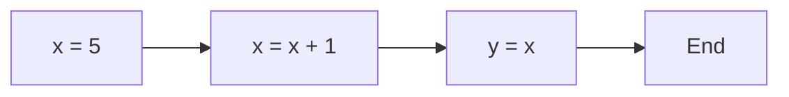

---

title: Statements_In_C++
type: Atomic Note
course: Computer Programming
semester: Autumn 2025
unit: '2'
hub: '[[2_C++_Programming_Fundamentals_Hub]]'
source: '[[Chapter_2.pdf]]'
source_pages:
- 8
mode: CS-SOFTWARE
read: false
generated: true
prerequisites:
- '[[Main_Function]]'
- '[[Compiler_Directives]]'
- '[[Braces_In_C++]]'
- '[[Preprocessor_Directives]]'
- '[[Stream_Insertion_Operator]]'

---


# 1. Mental Model

The concept of statements in C++ can be likened to a recipe in cooking, where each statement is akin to a single instruction in the recipe. Just as a recipe consists of a series of steps, a C++ program consists of a series of statements. The semicolon at the end of each statement can be compared to the period at the end of each sentence in a recipe, indicating the completion of a single instruction.

# 2. Execution Logic & Data Flow

The [[Main_Function]] in a C++ program serves as the entry point where the program starts executing a sequence of [[Statements_In_C++]]. Each statement is processed by the [[Compiler_Directives]] and must be syntactically correct, including the use of [[Braces_In_C++]] for compound statements and [[Semicolon]] at the end. The [[Preprocessor_Directives]] may also influence the compilation of statements by including header files or defining macros. The [[Stream_Insertion_Operator]] and [[Stream_Extraction_Operator]] are used within statements to interact with the input/output streams. The program's control flow is determined by the sequence of statements and the use of [[Keywords_In_C++]] such as if, while, and for.

# 3. Edge Cases & Failure States

A C++ program will fail to compile if a statement is not terminated with a semicolon, unless it is a [[Comments_In_C++]] or a [[Preprocessor_Directives]]. Missing or mismatched [[Braces_In_C++]] can also lead to compilation errors or unexpected behavior. If a statement is too long, it may be split into multiple lines, but it must still be syntactically correct. The misuse of [[Keywords_In_C++]] or incorrect [[Type_Conversion]] within statements can lead to runtime errors or unexpected behavior.

## Implementation Mechanics

```cpp

#include <iostream>

int main() {
    int x = 5;  // Initialization statement
    std::cout << "Initial value of x: " << x << std::endl;

    x = x + 1;  // Assignment statement
    std::cout << "Value of x after increment: " << x << std::endl;

    int y = x;  // Initialization statement
    std::cout << "Value of y: " << y << std::endl;

    return 0;
}

```



The code block represents a simple C++ program that demonstrates the use of statements, including initialization and assignment. The Mermaid flowchart illustrates the sequence of state changes, where each node represents a statement execution, and the arrows represent the flow of execution.

## Walkthrough

1. The program starts executing at the `main` function, where the first statement `int x = 5;` initializes the variable `x` with the value `5`.
2. The next statement `std::cout << "Initial value of x: " << x << std::endl;` outputs the initial value of `x`, which is `5`.
3. The assignment statement `x = x + 1;` increments the value of `x` by `1`, changing its value to `6`.
4. The program then outputs the updated value of `x` using `std::cout << "Value of x after increment: " << x << std::endl;`.
5. The initialization statement `int y = x;` creates a new variable `y` and assigns it the current value of `x`, which is `6`.
6. Finally, the program outputs the value of `y` using `std::cout << "Value of y: " << y << std::endl;`, which is also `6`.

---

## 6. The Proving Grounds

```interactive-quiz

[
  {
    "id": "q1",
    "type": "fill_in",
    "difficulty": "L1",
    "question": "What is the primary function of a semicolon in C++ statements?",
    "textWithBlanks": "The [[Semicolon]] is used to terminate a statement.",
    "answer": [";"],
    "explanation": "In C++, a semicolon is used to end a statement, similar to how a period ends a sentence."
  },
  {
    "id": "q2",
    "type": "true_false",
    "difficulty": "L2",
    "question": "Consider a C++ program with an empty main function. Is it a valid program?",
    "answer": true,
    "explanation": "A C++ program with an empty main function is syntactically valid and will compile and run without errors, although it does not perform any operations."
  },
  {
    "id": "q3",
    "type": "debug",
    "difficulty": "L3",
    "question": "Find the error.",
    "content": "int x = 5; if (x = 10) { cout << \"x is 10\"; }",
    "answer": "The bug is assignment instead of comparison. The correct code should use '==' for comparison: if (x == 10)",
    "explanation": "The bug is a logic inversion due to using the assignment operator (=) instead of the comparison operator (==) in the if statement condition."
  }
]

```