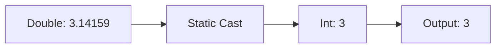

---

title: Static_Cast
type: Atomic Note
course: Computer Programming
semester: Autumn 2025
unit: '2'
hub: '[[2_C++_Programming_Fundamentals_Hub]]'
source: '[[Chapter_2.pdf]]'
source_pages:
- 50
mode: CS-SOFTWARE
read: false
generated: true
prerequisites:
- '[[Type_Conversion]]'
- '[[Compiler_Directives]]'
- '[[Preprocessor_Directives]]'
- '[[Main_Function]]'
- '[[Braces_In_C++]]'

---


# 1. Mental Model

The concept of a [[Static_Cast]] can be likened to a linguistic translation process, where the type of a value is being reinterpreted. Just as a text can be translated from one language to another, a [[Static_Cast]] translates a value from one data type to another, ensuring that the new type is compatible with the original value. In this analogy, the compiler acts as the translator, verifying that the cast is valid and performing the necessary conversions.

# 2. Execution Logic & Data Flow

The [[Static_Cast]] operation is performed at compile-time, allowing the compiler to verify the validity of the cast and generate the necessary machine code. When a [[Static_Cast]] is encountered, the compiler checks the [[Type_Conversion]] rules to ensure that the cast is valid and can be performed implicitly or explicitly. The [[Static_Cast]] syntax, `static_cast<Type>(value)`, is used to specify the target type and the value to be cast. The [[Compiler_Directives]] and [[Preprocessor_Directives]] are not directly involved in the [[Static_Cast]] process, but they may influence the compilation process. The [[Main_Function]] and [[Braces_In_C++]] are not directly related to [[Static_Cast]], but proper use of [[Statements_In_C++]] and [[Variables_In_C++]] is crucial for correct casting.

# 3. Edge Cases & Failure States

A [[Static_Cast]] can fail if the target type is not compatible with the original value, leading to a loss of data or incorrect results. For example, casting a large integer value to a smaller type may result in truncation or overflow. Additionally, casting a pointer to a unrelated type may result in undefined behavior. In such cases, the compiler may issue warnings or errors, but it is the programmer's responsibility to ensure that the [[Static_Cast]] is used judiciously and with a thorough understanding of the [[Type_Conversion]] rules.

## Implementation Mechanics

```c

#include <stdio.h>

int main() {
    double pi = 3.14159;
    int integer_pi = (int)pi; // Static Cast
    printf("Original value: %f\n", pi);
    printf("Casted value: %d\n", integer_pi);
    return 0;
}

```



The code block demonstrates a static cast in C, where a double value is cast to an integer. The Mermaid flowchart illustrates the state change from a double value to an integer value through a static cast, resulting in the output of the casted integer value.

## Walkthrough

1. In the global supply chain and maritime logistics domain, a shipping company's system tracks cargo weights in kilograms as decimal values. The weight of a container is recorded as 10.5 kg.
2. When processing the cargo data, the system requires the weight to be represented as an integer for inventory calculations, effectively truncating the decimal part.
3. A static cast is applied to the decimal weight value, converting it to an integer. This is akin to the static cast operation in the provided C code.
4. The original weight value of 10.5 kg is stored in a double data type variable `weight_kg`.
5. The static cast operation is performed: `(int)weight_kg`, resulting in an integer value of 10.
6. The system now uses the casted integer value of 10 for inventory calculations, ensuring compatibility with the required data type.

---

## 6. The Proving Grounds

```interactive-quiz

[
  {
    "id": "q1",
    "type": "fill_in",
    "difficulty": "L1",
    "question": "What is the primary purpose of a static cast in C++?",
    "textWithBlanks": "The [[Static_Cast]] is a compile-time cast that ensures the new type is [[Blank1]] with the original value.",
    "answer": ["compatible"],
    "explanation": "A static cast is used to translate a value from one data type to another, ensuring that the new type is compatible with the original value."
  },
  {
    "id": "q2",
    "type": "true_false",
    "difficulty": "L2",
    "question": "A static cast can be used to cast a pointer to a base class to a pointer to a derived class.",
    "answer": false,
    "explanation": "A static cast cannot be used to cast a pointer to a base class to a pointer to a derived class. This would require a dynamic cast to ensure type safety at runtime."
  },
  {
    "id": "q3",
    "type": "debug",
    "difficulty": "L3",
    "question": "Find the error.",
    "content": "int x = 5; double y = static_cast<double>(x); if (y > 10) { cout << \"y is greater than 10\"; }",
    "answer": "The bug is incorrect comparison. The fix is to change the comparison to y > 5 or another correct value.",
    "explanation": "The code will always print \"y is greater than 10\" because y will be 5.0 after the cast, which is not greater than 10 but greater than 5. The condition should compare y to a value that it can actually exceed, given its initialization."
  }
]

```