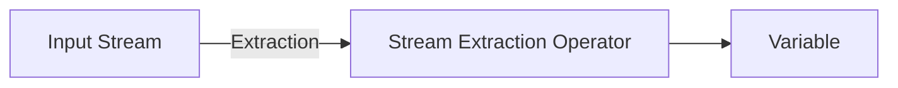

---

title: Stream_Extraction_Operator
type: Atomic Note
course: Computer Programming
semester: Autumn 2025
unit: '2'
hub: '[[2_C++_Programming_Fundamentals_Hub]]'
source: '[[Chapter_2.pdf]]'
source_pages:
- 12
mode: CS-SOFTWARE
read: false
generated: true
prerequisites:
- '[[Main_Function]]'
- '[[Statements_In_C++]]'
- '[[Compiler_Directives]]'
- '[[Preprocessor_Directives]]'
- '[[Variables_In_C++]]'

---


# 1. Mental Model

The Stream Extraction Operator can be thought of as a mechanism similar to a vacuum cleaner, where it sucks in or extracts data from an input stream. Just as a vacuum cleaner has a nozzle that directs the suction power to pick up debris, the Stream Extraction Operator uses the `>>` symbol to extract data from a stream and direct it into a variable. The input stream acts as the source of data, much like the floor acts as the source of debris for the vacuum cleaner.

# 2. Execution Logic & Data Flow

The Stream Extraction Operator [[Stream_Extraction_Operator]] is used to extract data from an input stream in C++. When the [[Stream_Extraction_Operator]] is applied to an input stream, it reads data from the stream and stores it in a variable. The [[Main_Function]] typically sets up the input stream, and the [[Stream_Extraction_Operator]] is used within a [[Statements_In_C++]] sequence to control data flow. The [[Compiler_Directives]] and [[Preprocessor_Directives]] may influence how the input stream is prepared, and the [[Variables_In_C++]] are used to store the extracted data. The [[C++_Programming_Language]] syntax dictates that the [[Stream_Extraction_Operator]] must be used correctly to avoid errors.

# 3. Edge Cases & Failure States

If the input stream is empty or contains data of the wrong type, the Stream Extraction Operator may fail or produce unexpected results. When the input stream reaches its end, the operator will set the [[Stream_Insertion_Operator]]'s failbit, indicating an error. If the variable used to store the extracted data has not been properly [[Variable_Declaration]], it may lead to undefined behavior. Furthermore, incorrect use of the [[Stream_Extraction_Operator]] can lead to infinite loops if not checked against the stream's end or error states.

## Implementation Mechanics

```cpp

#include <iostream>
#include <string>

int main() {
    std::string input = "Hello, World!";
    std::string extracted;

    // Using the Stream Extraction Operator
    std::istringstream iss(input);
    iss >> extracted;

    std::cout << "Extracted: " << extracted << std::endl;

    return 0;
}

```



The code block demonstrates the use of the Stream Extraction Operator in C++ to extract data from an input stream into a variable. The Mermaid flowchart illustrates the state change from the input stream to the variable through the Stream Extraction Operator.

## Walkthrough

1. In the context of Epidemiology & Public Health Modeling, assume we have a dataset of disease outbreaks stored in a string, and we want to extract the disease name from it. The string "Influenza,100,2022" represents the disease name, number of cases, and year, respectively.
2. We create an `std::istringstream` object named `iss` with the input string "Influenza,100,2022" to simulate an input stream.
3. We declare an `std::string` variable named `disease` to store the extracted disease name.
4. We apply the Stream Extraction Operator `>>` to `iss` and `disease`, which extracts the first token (disease name) from the input stream and stores it in the `disease` variable.
5. After extraction, the `disease` variable holds the value "Influenza", and the input stream `iss` still contains the remaining data ",100,2022".
6. Finally, we verify the extracted disease name by printing the value of the `disease` variable, which outputs "Influenza".

---

## 6. The Proving Grounds

```interactive-quiz

[
  {
    "id": "q1",
    "type": "fill_in",
    "difficulty": "L1",
    "question": "What is the primary function of the Stream Extraction Operator?",
    "textWithBlanks": "The Stream Extraction Operator is used to [[Blank1]] data from an input stream.",
    "answer": ["extract"],
    "explanation": "The Stream Extraction Operator is used to extract data from an input stream, similar to how a vacuum cleaner extracts debris from a floor."
  },
  {
    "id": "q2",
    "type": "true_false",
    "difficulty": "L2",
    "question": "The Stream Extraction Operator can be used to extract data from a stream and direct it into multiple variables simultaneously.",
    "answer": false,
    "explanation": "The Stream Extraction Operator can only extract data into one variable at a time. To extract data into multiple variables, multiple extraction operators must be used."
  },
  {
    "id": "q3",
    "type": "debug",
    "difficulty": "L3",
    "question": "Find the error.",
    "content": "int x; std::cin >> x << std::endl;",
    "answer": "The bug is incorrect operator usage. The correct code should be 'std::cin >> x; std::cout << x << std::endl;', or simply 'std::cout << std::cin >> x << std::endl;'. However, most likely the intention was to use std::cout instead of std::cin for output.",
    "explanation": "The given code attempts to use the extraction operator and then immediately use the insertion operator on the result of the extraction, which is not the intended use. The corrected code depends on the actual intention, but likely it should output the extracted value."
  }
]

```