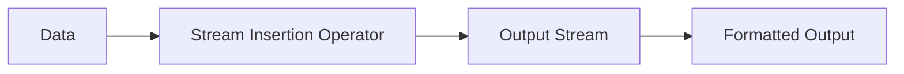

---

title: Stream_Insertion_Operator
type: Atomic Note
course: Computer Programming
semester: Autumn 2025
unit: '2'
hub: '[[2_C++_Programming_Fundamentals_Hub]]'
source: '[[Chapter_2.pdf]]'
source_pages:
- 12
mode: CS-SOFTWARE
read: false
generated: true
prerequisites:
- '[[C++_Programming_Language]]'
- '[[Main_Function]]'
- '[[Statements_In_C++]]'
- '[[Braces_In_C++]]'
- '[[Preprocessor_Directives]]'

---


# 1. Mental Model

The stream insertion operator can be thought of as a conveyor belt in a factory, where data is the product being manufactured and the output stream is the packaging line. Just as the conveyor belt moves products to the packaging line, the stream insertion operator moves data into the output stream. The operator acts as a mediator, ensuring that the data is properly formatted and inserted into the stream.

# 2. Execution Logic & Data Flow

The stream insertion operator [[Stream_Insertion_Operator]] is used in conjunction with the [[C++_Programming_Language]] to send data into the output stream. When the operator is used, it invokes the [[Stream_Insertion_Operator]] function, which then interacts with the [[Main_Function]] to produce the desired output. The [[Stream_Insertion_Operator]] works in tandem with [[Statements_In_C++]] and [[Braces_In_C++]] to ensure that the output is properly formatted. The [[Preprocessor_Directives]] and [[Compiler_Directives]] also play a role in the compilation process, but they do not directly interact with the stream insertion operator. The [[Return_Statement]] is used to exit the function and return control to the operating system.

# 3. Edge Cases & Failure States

When using the stream insertion operator, a common edge case is attempting to insert a non-string data type into the output stream without proper type conversion, which can result in unexpected output or compilation errors. For example, if a programmer tries to insert an integer into a string stream without using [[Static_Cast]], the program may not compile or may produce incorrect results. Additionally, if the output stream is not properly initialized or is closed prematurely, the stream insertion operator may fail or produce unexpected behavior. In such cases, the programmer must ensure that the output stream is properly configured and that the data being inserted is of the correct type.

## Implementation Mechanics

```cpp

#include <iostream>
#include <string>

std::ostream& operator<<(std::ostream& os, const std::string& str) {
    os << str;
    return os;
}

int main() {
    std::string data = "ATCG";
    std::cout << data << std::endl;
    return 0;
}

```



The code block demonstrates the use of the stream insertion operator in C++ to insert a string into the output stream. The Mermaid flowchart illustrates the state changes, where data is moved through the stream insertion operator and into the output stream, resulting in formatted output.

The code block represents the implementation of the stream insertion operator, which takes in data and inserts it into the output stream. The Mermaid flowchart represents the data flow, showing how data is transformed and moved through the operator to produce the final output.

## Walkthrough

1. In the field of bioinformatics, a common task is to process genomic sequencing data, which often involves manipulating strings of nucleotides (A, C, G, and T). 
2. The code begins with the inclusion of necessary libraries, `iostream` and `string`, which enable input/output operations and string manipulation, respectively.
3. A custom string variable `data` is created and assigned the value "ATCG", representing a short DNA sequence.
4. The stream insertion operator `<<` is used to insert the `data` string into the output stream `std::cout`.
5. As the stream insertion operator executes, it moves the data into the output stream, which is then formatted and displayed on the console.
6. The final output, "ATCG", is displayed on the console, demonstrating the successful insertion of the data into the output stream using the stream insertion operator.

---

## 6. The Proving Grounds

```interactive-quiz

[
  {
    "id": "q1",
    "type": "fill_in",
    "difficulty": "L1",
    "question": "What is the primary function of the stream insertion operator?",
    "textWithBlanks": "The stream insertion operator [[Blank1]] data into the output stream.",
    "answer": ["inserts"],
    "explanation": "The stream insertion operator is responsible for inserting data into the output stream, ensuring it is properly formatted."
  },
  {
    "id": "q2",
    "type": "true_false",
    "difficulty": "L2",
    "question": "Can the stream insertion operator be used with a file stream that is not writable?",
    "answer": false,
    "explanation": "The stream insertion operator requires a writable stream to function correctly. If the stream is not writable, the operator will fail."
  },
  {
    "id": "q3",
    "type": "debug",
    "difficulty": "L3",
    "question": "Find the error.",
    "content": "int x = 5;\nstd::cout << x;\nstd::cout << x << std::cout;",
    "answer": "The bug is incorrect usage of the stream insertion operator; it should be 'std::cout << x << std::endl;' or another valid output stream, not 'std::cout' itself.",
    "explanation": "The stream insertion operator is being used incorrectly by trying to insert 'std::cout' into itself, which is not a valid operation."
  }
]

```