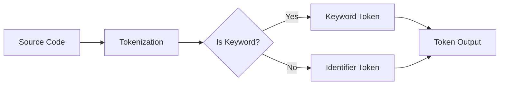

---

title: Tokens_In_C++
type: Atomic Note
course: Computer Programming
semester: Autumn 2025
unit: '2'
hub: '[[2_C++_Programming_Fundamentals_Hub]]'
source: '[[Chapter_2.pdf]]'
source_pages:
- 14
mode: CS-SOFTWARE
read: false
generated: true
prerequisites:
- '[[General_Structure_Of_A_C++_Program]]'
- '[[Main_Function]]'
- '[[Stream_Insertion_Operator]]'
- '[[Stream_Extraction_Operator]]'
- '[[Preprocessor_Directives]]'

---


# 1. Mental Model

The concept of tokens in C++ can be likened to the components of a musical composition, where the source code is the sheet music. Just as sheet music consists of notes, rests, dynamics, and other musical symbols, C++ source code is composed of tokens, which are the basic building blocks of the language, such as keywords, identifiers, literals, operators, and comments. These tokens, like musical symbols, are arranged in a specific order to create a cohesive and functional program.

# 2. Execution Logic & Data Flow

The C++ compiler reads the source code and breaks it down into tokens, which are then analyzed and processed according to the language's syntax rules, as defined in the [[General_Structure_Of_A_C++_Program]]. The [[Main_Function]] serves as the entry point for the program, where the [[Stream_Insertion_Operator]] and [[Stream_Extraction_Operator]] are used to interact with the user. The compiler uses [[Preprocessor_Directives]] to perform preliminary operations, such as including header files and expanding macros. The program's execution flow is controlled by [[Statements_In_C++]], which are composed of [[Expressions]] that involve [[Operators]] and [[Variables]]. The [[Compiler_Directives]] and [[Braces_In_C++]] also play crucial roles in defining the program's structure and behavior.

# 3. Edge Cases & Failure States

When dealing with tokens in C++, edge cases arise when the compiler encounters invalid or ambiguous token sequences, such as mismatched [[Braces_In_C++]] or [[Comments]] that are not properly terminated. Failure states can occur when the program attempts to execute [[Statements]] that are syntactically incorrect or when [[Variables]] are used without being properly declared. In such cases, the compiler will typically report errors and terminate the compilation process. Additionally, [[Keywords_In_C++]] and [[Identifiers_In_C++]] must be used correctly to avoid conflicts and ensure that the program compiles and runs as expected.

## Implementation Mechanics

```cpp

#include <iostream>
#include <string>

// Token types
const std::string KEYWORD = "keyword";
const std::string IDENTIFIER = "identifier";
const std::string LITERAL = "literal";

// Token structure
struct Token {
    std::string type;
    std::string value;
};

// Function to tokenize a simple C++ statement
Token tokenize(const std::string& statement) {
    Token token;

    // Simplified example: checking if the statement starts with a keyword
    if (statement.find("if") == 0) {
        token.type = KEYWORD;
        token.value = "if";
    } else {
        // Assuming it's an identifier for simplicity
        token.type = IDENTIFIER;
        token.value = statement;
    }

    return token;
}

int main() {
    std::string statement = "if";
    Token token = tokenize(statement);

    std::cout << "Token Type: " << token.type << std::endl;
    std::cout << "Token Value: " << token.value << std::endl;

    return 0;
}

```



The code block represents a simplified C++ program that demonstrates the basic concept of tokenization, where the source code is broken down into tokens. The Mermaid flowchart illustrates the state changes during the tokenization process, from the source code to the identification of a keyword or identifier token.

## Walkthrough

1. **Initialization of Aerospace Avionics System**: In an aerospace engineering context, consider the development of an avionics system that relies on precise C++ programming for its control systems. The system requires a tokenization process to analyze and execute C++ source code efficiently.

2. **Source Code Input**: The process begins with the input of C++ source code into the system. For example, a simple statement like `if (condition) { action; }` is fed into the tokenization module.

3. **Tokenization Process**: The tokenization module, akin to a lexer in a compiler, breaks down the source code into its basic tokens. This involves identifying keywords, identifiers, literals, and other elements.

4. **Token Type Identification**: Each token is then identified by type. In our example, the token "if" is recognized as a keyword.

5. **Token Output**: The identified tokens are then outputted for further processing. This could involve parsing the tokens to ensure syntactical correctness or executing them as part of the avionics control system.

6. **Execution in Avionics System**: Finally, the tokenized and parsed C++ code is executed within the avionics system, controlling various aspects of the aircraft, such as navigation, communication systems, or flight control surfaces, based on the logic programmed into the tokens.

---

## 6. The Proving Grounds

```interactive-quiz

[
  {
    "id": "q1",
    "type": "fill_in",
    "difficulty": "L1",
    "question": "What are tokens in C++?",
    "textWithBlanks": "The basic building blocks of the C++ language are called [[Blank1]].",
    "answer": ["tokens"],
    "explanation": "Tokens in C++ refer to the basic building blocks of the language, including keywords, identifiers, literals, operators, and comments."
  },
  {
    "id": "q2",
    "type": "true_false",
    "difficulty": "L2",
    "question": "Is a C++ comment considered a token?",
    "answer": true,
    "explanation": "Yes, in C++, a comment is indeed considered a token. It is one of the types of tokens that make up the source code."
  },
  {
    "id": "q3",
    "type": "debug",
    "difficulty": "L3",
    "question": "Find the error.",
    "content": "int x = 5;\nif (x = 10) {\n  cout << \"x is 10\";\n}",
    "answer": "The bug is assignment instead of comparison. The correct operator should be '==' for comparison.",
    "explanation": "The bug in the code snippet is in the if statement condition. The single equals sign '=' is an assignment operator, whereas the double equals sign '==' is the comparison operator. The correct code should use '==' for comparing the value of x to 10."
  }
]

```