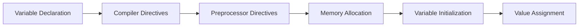

---

title: Variable_Declaration
type: Atomic Note
course: Computer Programming
semester: Autumn 2025
unit: '2'
hub: '[[2_C++_Programming_Fundamentals_Hub]]'
source: '[[Chapter_2.pdf]]'
source_pages:
- 23
mode: CS-SOFTWARE
read: false
generated: true
prerequisites:
- '[[Compiler_Directives]]'
- '[[Preprocessor_Directives]]'
- '[[Variables_In_C++]]'
- '[[Main_Function]]'
- '[[C++_Programming_Language]]'

---


# 1. Mental Model

A variable declaration can be thought of as labeling a specific shelf in a library, where the label represents the variable name and the shelf's designated storage capacity represents the data type. Just as a labeled shelf can hold books of a certain size and type, a declared variable can store values of a specific data type. The variable name serves as a unique identifier for the memory location, much like the label on the shelf.

# 2. Execution Logic & Data Flow

The process of variable declaration involves the [[Compiler_Directives]] and [[Preprocessor_Directives]] that define the [[Variables_In_C++]] and their characteristics. When a variable is declared, the [[Main_Function]] allocates memory for it, and the [[Variable_Declaration]] statement consists of a [[Data_Type]] and a [[Variable_Name]]. The [[C++_Programming_Language]] requires that the [[Variable_Name]] be a unique [[Identifier_In_C++]] that follows specific [[Keywords_In_C++]] and [[Tokens_In_C++]] rules. The [[Data_Type]] determines the type of value that can be stored in the variable, and it is checked during [[Type_Conversion]]. The [[Stream_Insertion_Operator]] and [[Stream_Extraction_Operator]] are then used to input or output values to the variable.

# 3. Edge Cases & Failure States

If a variable is declared with a [[Data_Type]] that is not compatible with the assigned value, the [[Compiler_Directives]] will throw an error during compilation. Additionally, if a variable is declared with a [[Variable_Name]] that is not a valid [[Identifier_In_C++]], the compiler will also throw an error. When a variable is declared but not initialized, it contains a [[Literals_In_C++|garbage_Value]], which can lead to unexpected behavior if used in a computation. Furthermore, re-declaring a variable with the same [[Variable_Name]] in the same scope will result in a compiler error due to [[Identifiers_In_C++]] being required to be unique.

## Implementation Mechanics

```python

# Variable Declaration and Initialization

def declare_variable():

    # Declare a variable with a specific data type

    variable_name = "stock_price"
    data_type = "float"
    value = 100.50

    # Store the variable declaration details in a dictionary

    variable_declaration = {
        "variable_name": variable_name,
        "data_type": data_type,
        "value": value
    }

    return variable_declaration

# Execute the function

variable_declared = declare_variable()
print(variable_declared)

```



The code block represents the process of declaring a variable in Python, where a function `declare_variable()` is used to declare a variable with a specific name, data type, and value. The Mermaid flowchart illustrates the steps involved in variable declaration, from compiler directives to value assignment, showing how the variable declaration is processed.

## Walkthrough

1. In the context of Quantitative Finance & High-Frequency Trading, a developer declares a variable `stock_price` to store the current price of a stock, which is a floating-point number.
2. The variable `stock_price` is declared with a data type of `float`, indicating that it can store decimal values, such as 100.50.
3. The compiler directives and preprocessor directives are processed, allocating memory for the variable `stock_price` based on its data type.
4. The variable `stock_price` is initialized with a value of 100.50, representing the current stock price.
5. The variable declaration details, including the variable name, data type, and value, are stored in a dictionary called `variable_declaration`.
6. The function `declare_variable()` returns the `variable_declaration` dictionary, which can be used to verify the variable declaration and its properties.

---

## 6. The Proving Grounds

```interactive-quiz

[
  {
    "id": "q1",
    "type": "fill_in",
    "difficulty": "L1",
    "question": "What is the primary purpose of a variable declaration?",
    "textWithBlanks": "The primary purpose of a variable declaration is to [[Blank1]] a memory location with a specific [[Blank2]].",
    "answer": ["label", "data type"],
    "explanation": "Variable declaration is like labeling a shelf in a library, where the label is the variable name and the shelf's capacity represents the data type."
  },
  {
    "id": "q2",
    "type": "true_false",
    "difficulty": "L2",
    "question": "Can a variable be redeclared with a different data type in the same scope?",
    "answer": false,
    "explanation": "In most programming languages, a variable cannot be redeclared with a different data type in the same scope."
  },
  {
    "id": "q3",
    "type": "debug",
    "difficulty": "L3",
    "question": "Find the error.",
    "content": "var x = 5; var y = 'hello'; x = y;",
    "answer": "The bug is type coercion. The variable x is initially declared as a number, but then reassigned a string value.",
    "explanation": "The code attempts to assign a string value to a variable initially declared as a number, which may cause unexpected behavior or errors."
  }
]

```