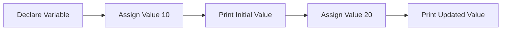

---

title: Variables_In_C++
type: Atomic Note
course: Computer Programming
semester: Autumn 2025
unit: '2'
hub: '[[2_C++_Programming_Fundamentals_Hub]]'
source: '[[Chapter_2.pdf]]'
source_pages:
- 22
mode: CS-SOFTWARE
read: false
generated: true
prerequisites:
- '[[Compiler_Directives]]'
- '[[Preprocessor_Directives]]'
- '[[Main_Function]]'
- '[[Stream_Insertion_Operator]]'
- '[[Stream_Extraction_Operator]]'

---


# 1. Mental Model

The concept of variables in C++ can be likened to labeled storage compartments in a warehouse. Just as each compartment has a specific label and a fixed capacity for storing items, a variable in C++ has a declared type that determines its storage capacity and a name that serves as its unique identifier. When a value is assigned to a variable, it's like placing a specific item into the labeled compartment, and the variable's value can be changed by replacing the item with a new one.

# 2. Execution Logic & Data Flow

In C++, when a variable is declared, the [[Compiler_Directives]] and [[Preprocessor_Directives]] work together to allocate memory for it. The [[Main_Function]] can then use the [[Stream_Insertion_Operator]] or [[Stream_Extraction_Operator]] to assign a value to the variable. The [[Variable_Declaration]] syntax requires specifying the variable's type, which determines its storage requirements, and its name, which must follow the rules for [[Identifiers_In_C++]]. The [[C++_Programming_Language]] ensures that the variable's type cannot be changed once it's declared, but its value can be modified using the [[Assignment_Operator]]. The [[General_Structure_Of_A_C++_Program]] dictates that variables must be declared within a scope, such as within [[Braces_In_C++]].

# 3. Edge Cases & Failure States

When a variable is declared with an invalid or undeclared type, the [[Compiler_Directives]] will typically generate an error, preventing the program from compiling. If a variable is used without being initialized, its value will be indeterminate, leading to unpredictable behavior when the program is run. Additionally, attempting to assign a value of the wrong type to a variable will result in a type mismatch error, which can be caught by the [[C++_Is_Case_Sensitive]] compiler. Furthermore, if a variable is declared with a name that conflicts with a [[Keywords_In_C++]], the compiler will flag the error and prevent the program from compiling.

## Implementation Mechanics

```cpp

#include <iostream>

int main() {
    int warehouseCompartment; // Declare a variable
    warehouseCompartment = 10; // Assign a value
    std::cout << "Initial value: " << warehouseCompartment << std::endl;

    warehouseCompartment = 20; // Change the value
    std::cout << "Updated value: " << warehouseCompartment << std::endl;

    return 0;
}

```



The code block demonstrates the basic concept of variables in C++ by declaring a variable, assigning it a value, and then changing that value. The Mermaid flowchart illustrates the sequence of state changes, from declaring the variable to printing its updated value.

## Walkthrough

1. In a high-frequency trading application, a quantitative analyst wants to track the current price of a stock. They declare an integer variable `currentPrice` to store this value.
2. Initially, `currentPrice` is assigned a value of 100.50, but since it's an integer, the fractional part is truncated, and it becomes 100.
3. The analyst then uses a data feed to update `currentPrice` to 120. The variable's value is changed to reflect the new stock price.
4. Next, the analyst wants to calculate a trading signal based on the current price. They use `currentPrice` in a calculation to determine whether to buy or sell the stock.
5. As the market fluctuates, the analyst updates `currentPrice` again to 110, reflecting the changing market conditions.
6. Finally, the trading application uses the updated `currentPrice` to execute a trade, illustrating how variables are used to store and update critical data in quantitative finance.

---

## 6. The Proving Grounds

```interactive-quiz

[
  {
    "id": "q1",
    "type": "fill_in",
    "difficulty": "L1",
    "question": "What is the primary function of declaring a variable's type in C++?",
    "textWithBlanks": "The [[Blank1]] is determined by the declared type of the variable.",
    "answer": ["storage capacity"],
    "explanation": "In C++, the declared type of a variable determines its storage capacity, which is a fundamental aspect of how variables are used in the language."
  },
  {
    "id": "q2",
    "type": "true_false",
    "difficulty": "L2",
    "question": "Can a variable of type int be assigned a value of type double without explicit casting?",
    "answer": false,
    "explanation": "In C++, assigning a value of type double to a variable of type int without explicit casting will result in a compilation error or a warning, depending on the compiler settings."
  },
  {
    "id": "q3",
    "type": "debug",
    "difficulty": "L3",
    "question": "Find the error.",
    "content": "int x = 5; int y = 0; int result = x / y;",
    "answer": "The bug is division by zero. The fix is to ensure the divisor is not zero before performing the division.",
    "explanation": "The code snippet contains a division by zero error, which will result in undefined behavior at runtime. To fix this, a check should be added to ensure that the divisor is not zero before performing the division."
  }
]

```