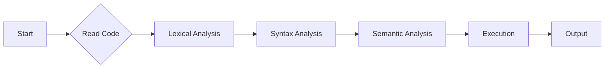

---

title: White_Space_In_C++
type: Atomic Note
course: Computer Programming
semester: Autumn 2025
unit: '2'
hub: '[[2_C++_Programming_Fundamentals_Hub]]'
source: '[[Chapter_2.pdf]]'
source_pages:
- 9
mode: CS-SOFTWARE
read: false
generated: true
prerequisites:
- '[[Tokens_In_C++]]'
- '[[Precedence_Rules]]'
- '[[Compiler_Directives]]'
- '[[Preprocessor_Directives]]'
- '[[Stream_Insertion_Operator]]'

---


# 1. Mental Model

The concept of White Space In C++ can be likened to the use of pauses and breathing in spoken language, where commas and periods help to clarify the rhythm and meaning of a sentence. Just as pauses between words and sentences make speech more readable and understandable, white space characters in C++ make the code more readable by separating tokens, such as keywords, identifiers, and literals. The compiler ignores these white space characters, much like how listeners ignore pauses in speech, allowing the program to interpret the code's meaning based on its structure and syntax.

# 2. Execution Logic & Data Flow

The C++ compiler reads the source code and interprets the [[Tokens_In_C++]] based on the [[Precedence_Rules]], ignoring any [[White_Space_In_C++]] characters, including spaces, tabs, and newline characters. The [[Compiler_Directives]] and [[Preprocessor_Directives]] are processed before the actual compilation of the code, and they do not affect how white space is handled. During the compilation process, the [[Stream_Insertion_Operator]] and [[Stream_Extraction_Operator]] are used for input/output operations, and their functionality is not impacted by white space characters. The [[Main_Function]] serves as the entry point of the program, and its syntax and structure must adhere to the rules defined in [[General_Structure_Of_A_C++_Program]], including the use of [[Braces_In_C++]] to denote code blocks. The program's execution flow is determined by the [[Statements_In_C++]] and their order, which can be influenced by [[White_Space_In_C++]] only in terms of readability.

# 3. Edge Cases & Failure States

When there are consecutive white space characters in a line of code, the compiler treats them as a single separator, and the code still compiles successfully. However, if a line of code is extremely long and contains many white space characters, it may cause issues with some text editors or code review tools, not due to compilation issues, but due to display or formatting limitations. In cases where white space characters are used inconsistently, such as mixing spaces and tabs, it can lead to formatting issues in code that is meant to be visually aligned, but it does not affect the program's execution. If a programmer mistakenly uses a non-ASCII white space character, it may lead to a compilation error or unexpected behavior, because the compiler may not recognize it as a valid white space character.

# 4. Implementation Mechanics

```cpp

#include <iostream>

int main() {
    int x = 5;
    int y = x + 10;

    std::cout << "The value of y is: " << y << std::endl;

    return 0;
}

```



The code block represents a simple C++ program that demonstrates the use of white space characters to separate tokens, such as keywords, identifiers, and literals. The Mermaid flowchart illustrates the state changes that occur during the compilation and execution of the program, from lexical analysis to output.

## 5. Walkthrough

1. In the field of bioinformatics, a researcher wants to analyze a genomic sequence using a C++ program, starting with reading the DNA sequence data from a file, where white spaces are used to separate tokens such as gene identifiers and sequence values.
2. The program performs lexical analysis on the input data, breaking it into individual tokens, such as keywords, identifiers, and literals, using white space characters as delimiters to facilitate syntax analysis.
3. The program then performs syntax analysis on the tokens, checking for syntax errors and building an abstract syntax tree (AST) that represents the program's structure, taking into account the use of white spaces to improve code readability.
4. Next, the program performs semantic analysis on the AST, checking for semantic errors and generating machine code that can be executed by the computer, where white spaces are ignored by the compiler.
5. The program executes the machine code, performing the desired analysis on the genomic sequence data, such as identifying gene patterns or predicting protein structures, where the use of white spaces in the code improves maintainability and understandability.
6. Finally, the program outputs the results of the analysis, such as a list of gene identifiers or a visualization of the protein structure, demonstrating the importance of white space characters in making the code readable and maintainable.

---

## 6. The Proving Grounds

```interactive-quiz

[
  {
    "id": "q1",
    "type": "fill_in",
    "difficulty": "L1",
    "question": "What is the primary function of white space in C++?",
    "textWithBlanks": "The primary function of white space in C++ is to [[Blank1]] the code.",
    "answer": ["make more readable"],
    "explanation": "White space characters in C++ make the code more readable by separating tokens, such as keywords, identifiers, and literals."
  },
  {
    "id": "q2",
    "type": "true_false",
    "difficulty": "L2",
    "question": "Is it true that the C++ compiler considers a single-line comment as white space?",
    "answer": false,
    "explanation": "The C++ compiler does not consider a single-line comment as white space; it ignores the comment entirely."
  },
  {
    "id": "q3",
    "type": "debug",
    "difficulty": "L3",
    "question": "Find the error.",
    "content": "int x = 5;\nif (x = 10) {\n  cout << \"x is 10\";\n}",
    "answer": "The bug is assignment instead of comparison; it should be 'if (x == 10)'.",
    "explanation": "The bug is a logic inversion due to the use of the assignment operator (=) instead of the comparison operator (==) in the if statement condition."
  }
]

```