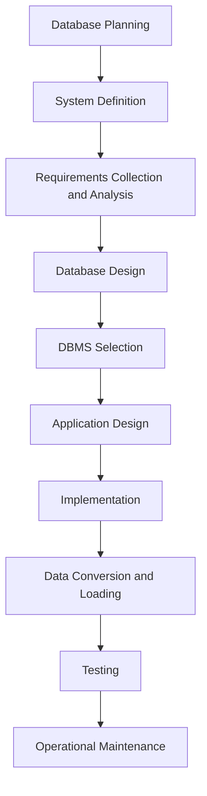

# Definition
Database Development Methodology (DDLC) refers to a structured approach or framework used for designing, developing, and maintaining databases within an organization. It encompasses a set of procedures, techniques, and tools that help in the effective creation and management of databases.

# The Mental Model
Imagine an organization as a complex ecosystem where data flows through various departments and functions. A robust database development methodology acts as a blueprint or roadmap, ensuring that data collection, storage, retrieval, and dissemination are handled systematically and efficiently.


```text
The output shows the various phases involved in the Database System Development Lifecycle, which is a crucial part of the Database Development Methodology. These phases include database planning, system definition, requirements collection and analysis, database design, DBMS selection, application design, prototyping, implementation, data conversion and loading, testing, and operational maintenance.
```
**Bridge:** The Database Development Methodology is essential for aligning database systems with organizational goals and ensuring that databases are developed and maintained in a way that supports business operations effectively.

# The Deep Dive: A Perspective
The Database Development Methodology typically involves several key phases:
1. **Database Planning**: This phase involves identifying the need for a database and defining the scope of the project.
2. **System Definition**: The system's boundaries and interfaces are defined in this phase.
3. **Requirements Collection and Analysis**: Gathering and analyzing the requirements from users and stakeholders.
4. **Database Design**: This phase is critical and involves conceptual, logical, and physical design.
5. **DBMS Selection**: Choosing an appropriate Database Management System.
6. **Application Design**: Designing the applications that will interact with the database.
7. **Implementation**: The actual creation of the database and applications.
8. **Data Conversion and Loading**: Converting data from old systems and loading it into the new database.
9. **Testing**: Ensuring the database and applications work as expected.
10. **Operational Maintenance**: Ongoing support and maintenance of the database system.

# Key Takeaways
- A structured approach to database development ensures alignment with organizational goals.
- The methodology includes phases from planning to maintenance.
- Effective database development requires understanding user requirements and organizational needs.

# The Proving Ground
### Level 1: Sanity Check
**Question:** What is the primary purpose of Database Development Methodology?
> **Solution:** The primary purpose is to provide a structured approach for designing, developing, and maintaining databases within an organization.

### Level 2: The Crucible
**Scenario:** An organization is planning to develop a new database system to manage its customer relationships. Describe how the Database Development Methodology would guide this process.
> **Solution:** The methodology would guide the process by first defining the project scope and objectives (database planning). Then, it would involve understanding the system boundaries and interfaces (system definition). Next, requirements would be gathered from stakeholders (requirements collection and analysis). The database would then be designed conceptually, logically, and physically. After selecting a suitable DBMS, applications would be designed, implemented, and tested. Finally, data would be converted and loaded, and ongoing maintenance would ensure the system's continued effectiveness.
