# Part I: Concept Interrogation

## [[Database_Development_Methodology]]
### L1: Identify
A logistics company is developing a new database to track shipments. They have identified the need to collect requirements from various stakeholders. Which phase of the database development lifecycle does this activity belong to?
> **Q:** Which phase of the database development lifecycle involves collecting requirements from stakeholders?
> **A:** This activity belongs to the **Requirements Collection and Analysis** phase.

### L2: Construct
A telecom company wants to design a database to store customer information. They have identified the need to store customer details, such as name, address, and phone number. Construct a high-level outline of the database development methodology for this project.
> **Q:** Construct a high-level outline of the database development methodology for the telecom company's project.
> **A:** 
1. Database Planning
2. System Definition
3. Requirements Collection and Analysis
4. Database Design
5. DBMS Selection (optional)
6. Application Design
7. Prototyping (optional)
8. Implementation
9. Data Conversion and Loading
10. Testing
11. Operational Maintenance

### L3: Debug
A database designer has provided the following incorrect database development lifecycle:
1. Database Planning
2. System Definition
3. Database Design
4. Implementation
5. Operational Maintenance
> **Q:** Identify the missing and incorrect phases in the provided database development lifecycle.
> **A:** 
The correct database development lifecycle should include:
1. Database Planning
2. System Definition
3. Requirements Collection and Analysis
4. Database Design
5. DBMS Selection (optional)
6. Application Design
7. Prototyping (optional)
8. Implementation
9. Data Conversion and Loading
10. Testing
11. Operational Maintenance

## [[Phases_Of_Database_Design]]
### L1: Identify
A biomedical research team wants to design a database to store patient information. They have identified the need to store patient demographics, medical history, and test results. Which phase of database design involves constructing a model of the data used in the enterprise, independent of all physical considerations?
> **Q:** Which phase of database design involves constructing a model of the data used in the enterprise, independent of all physical considerations?
> **A:** This activity belongs to the **Conceptual Database Design** phase.

### L2: Construct
An aerospace company wants to design a database to store aircraft information. They have identified the need to store aircraft details, such as tail number, model, and manufacture year. Construct a high-level outline of the logical database design for this project.
> **Q:** Construct a high-level outline of the logical database design for the aerospace company's project.
> **A:** 
1. Define the data model (e.g., relational)
2. Define the entities, attributes, and relationships
3. Define the primary keys and foreign keys
4. Normalize the relations

### L3: Debug
A database designer has provided the following incorrect phases of database design:
1. Conceptual Design
2. Physical Design
3. Implementation
> **Q:** Identify the missing phase in the provided phases of database design.
> **A:** 
The correct phases of database design should include:
1. Conceptual Design
2. Logical Design
3. Physical Design

## [[Entity–Relationship_Modelling]]
### L1: Identify
A film production company wants to design a database to store movie information. They have identified the need to store movie titles, directors, and actors. Classify the following as entities, attributes, or relationships: movie title, director, actor, and "acted in".
> **Q:** Classify the following as entities, attributes, or relationships: movie title, director, actor, and "acted in".
> **A:** 
* Movie title: **Attribute**
* Director: **Entity**
* Actor: **Entity**
* "Acted in": **Relationship**

### L2: Construct
An agricultural company wants to design a database to store crop information. They have identified the need to store crop details, such as crop type, yield, and price. Construct an ER diagram for this project.
> **Q:** Construct an ER diagram for the agricultural company's project.
> **A:** 
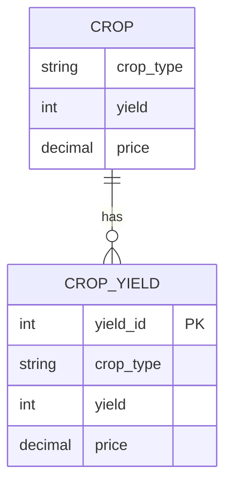

### L3: Debug
A database designer has provided the following incorrect ER diagram:
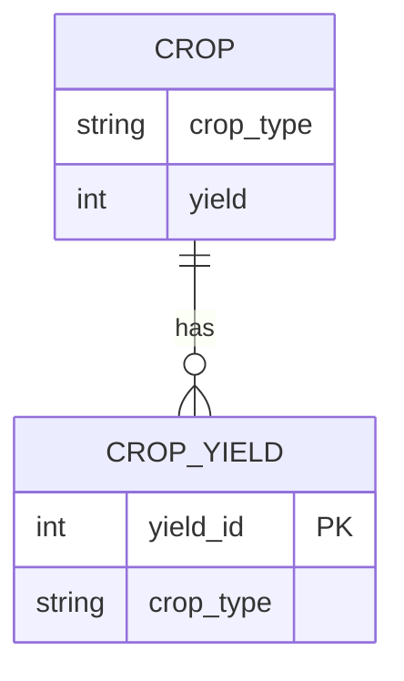
> **Q:** Identify the error in the provided ER diagram and fix it.
> **A:** 
The error is that the `CROP_YIELD` entity does not have a `price` attribute. The corrected ER diagram should include the `price` attribute:


## [[Entity_Types]]
### L1: Identify
A university wants to design a database to store student information. They have identified the need to store student details, such as student ID, name, and address. Classify the following as strong or weak entity types: student, course, and enrollment.
> **Q:** Classify the following as strong or weak entity types: student, course, and enrollment.
> **A:** 
* Student: **Strong Entity Type**
* Course: **Strong Entity Type**
* Enrollment: **Weak Entity Type**

### L2: Construct
A logistics company wants to design a database to store shipment information. They have identified the need to store shipment details, such as shipment ID, tracking number, and status. Construct an ER diagram for this project.
> **Q:** Construct an ER diagram for the logistics company's project.
> **A:** 
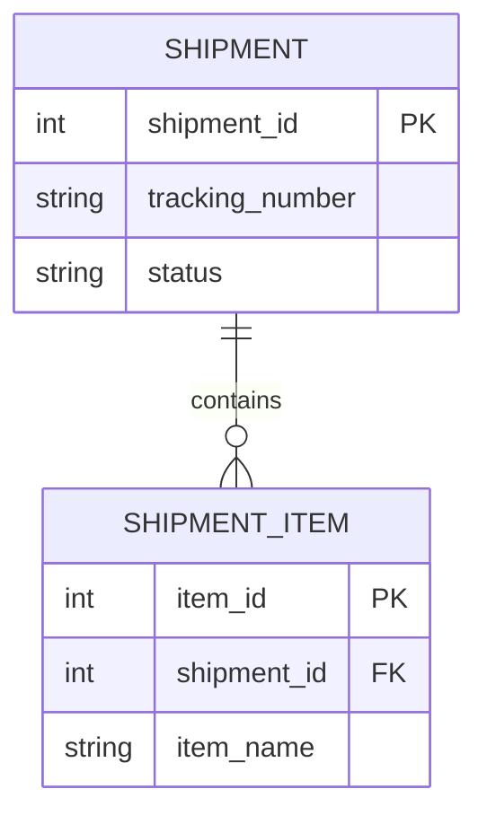

### L3: Debug
A database designer has provided the following incorrect ER diagram:
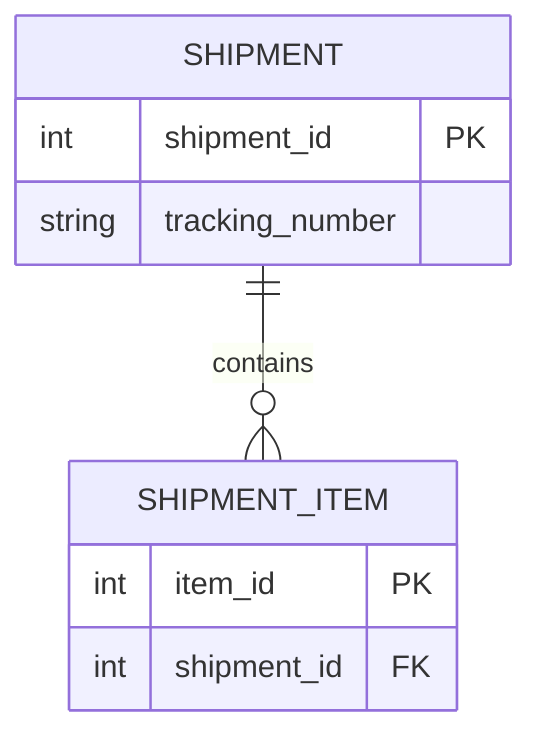
> **Q:** Identify the error in the provided ER diagram and fix it.
> **A:** 
The error is that the `SHIPMENT_ITEM` entity does not have a `item_name` attribute. The corrected ER diagram should include the `item_name` attribute:


## [[Strong_Entity_Type]]
### L1: Identify
A biomedical research team wants to design a database to store patient information. They have identified the need to store patient demographics, medical history, and test results. Classify the patient entity type as strong or weak.
> **Q:** Classify the patient entity type as strong or weak.
> **A:** 
The patient entity type is a **Strong Entity Type**.

### L2: Construct
A university wants to design a database to store course information. They have identified the need to store course details, such as course ID, name, and credits. Construct an ER diagram for this project.
> **Q:** Construct an ER diagram for the university's project.
> **A:** 
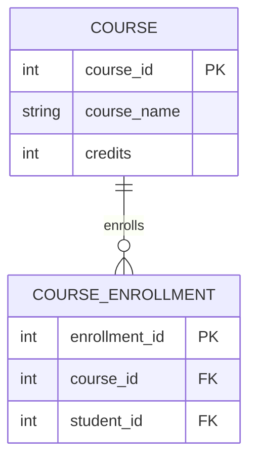

### L3: Debug
A database designer has provided the following incorrect ER diagram:
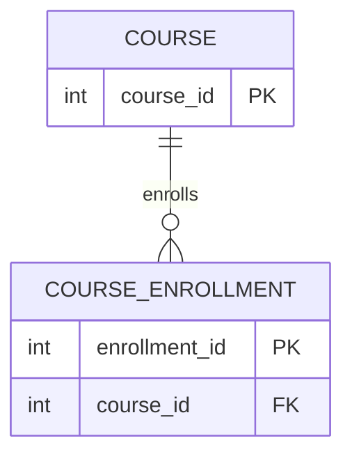
> **Q:** Identify the error in the provided ER diagram and fix it.
> **A:** 
The error is that the `COURSE` entity does not have `course_name` and `credits` attributes. The corrected ER diagram should include these attributes:


## [[Weak_Entity_Type]]
### L1: Identify
A logistics company wants to design a database to store shipment information. They have identified the need to store shipment details, such as shipment ID, tracking number, and status. Classify the shipment item entity type as strong or weak.
> **Q:** Classify the shipment item entity type as strong or weak.
> **A:** 
The shipment item entity type is a **Weak Entity Type**.

### L2: Construct
A university wants to design a database to store course information. They have identified the need to store course details, such as course ID, name, and credits. Construct an ER diagram for this project, including a weak entity type for course enrollment.
> **Q:** Construct an ER diagram for the university's project, including a weak entity type for course enrollment.
> **A:** 


### L3: Debug
A database designer has provided the following incorrect ER diagram:
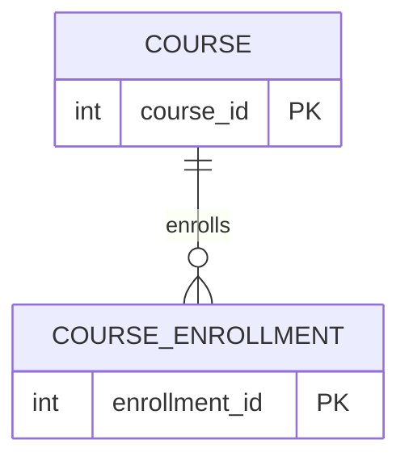
> **Q:** Identify the error in the provided ER diagram and fix it.
> **A:** 
The error is that the `COURSE_ENROLLMENT` entity is not a weak entity type, and it does not have foreign keys to `COURSE` and `STUDENT`. The corrected ER diagram should include these attributes:
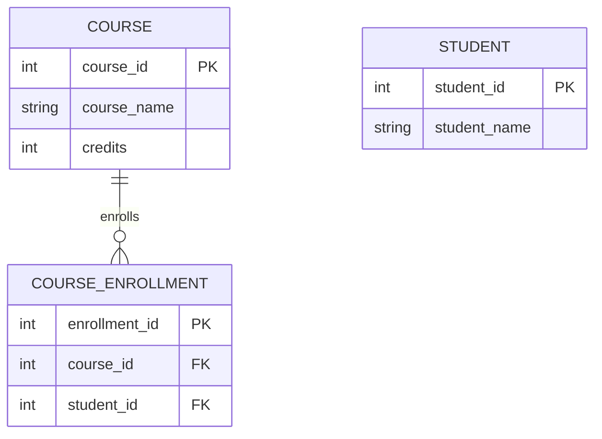

## [[Relationship_Types]]
### L1: Identify
A film production company wants to design a database to store movie information. They have identified the need to store movie titles, directors, and actors. Classify the "acted in" relationship type as unary, binary, or ternary.
> **Q:** Classify the "acted in" relationship type as unary, binary, or ternary.
> **A:** 
The "acted in" relationship type is a **Binary Relationship Type**.

### L2: Construct
An agricultural company wants to design a database to store crop information. They have identified the need to store crop details, such as crop type, yield, and price. Construct an ER diagram for this project, including a binary relationship type between crop and farmer.
> **Q:** Construct an ER diagram for the agricultural company's project, including a binary relationship type between crop and farmer.
> **A:** 
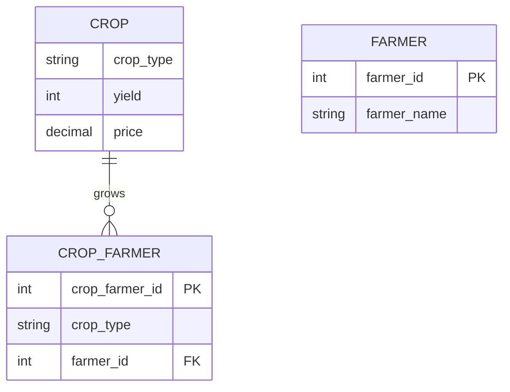

### L3: Debug
A database designer has provided the following incorrect ER diagram:
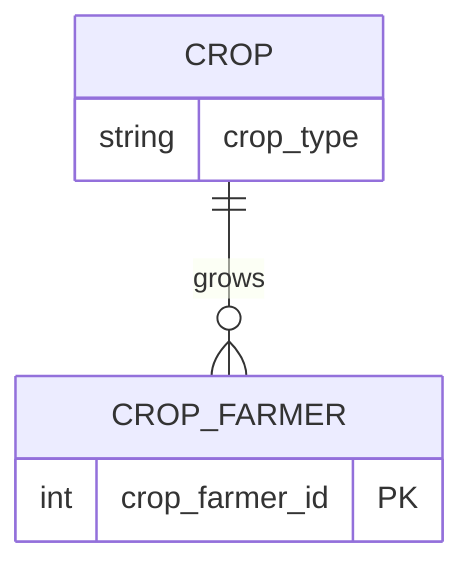
> **Q:** Identify the error in the provided ER diagram and fix it.
> **A:** 
The error is that the `CROP_FARMER` entity does not have foreign keys to `CROP` and `FARMER`. The corrected ER diagram should include these attributes:


## [[Degree_Of_Relationship]]
### L1: Identify
A university wants to design a database to store course information. They have identified the need to store course details, such as course ID, name, and credits. Classify the relationship type between course and student as unary, binary, or ternary.
> **Q:** Classify the relationship type between course and student as unary, binary, or ternary.
> **A:** 
The relationship type between course and student is a **Binary Relationship Type**.

### L2: Construct
A logistics company wants to design a database to store shipment information. They have identified the need to store shipment details, such as shipment ID, tracking number, and status. Construct an ER diagram for this project, including a ternary relationship type between shipment, item, and warehouse.
> **Q:** Construct an ER diagram for the logistics company's project, including a ternary relationship type between shipment, item, and warehouse.
> **A:** 
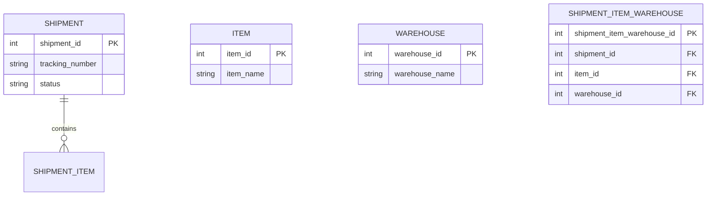

### L3: Debug
A database designer has provided the following incorrect ER diagram:
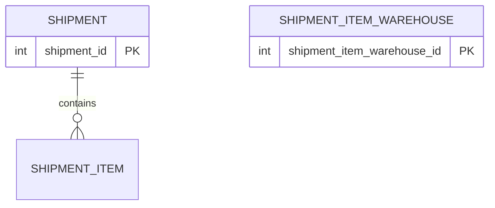
> **Q:** Identify the error in the provided ER diagram and fix it.
> **A:** 
The error is that the `SHIPMENT_ITEM_WAREHOUSE` entity does not have foreign keys to `SHIPMENT`, `ITEM`, and `WAREHOUSE`. The corrected ER diagram should include these attributes:


## [[Recursive_Relationship]]
### L1: Identify
A company wants to design a database to store employee information. They have identified the need to store employee details, such as employee ID, name, and manager ID. Classify the relationship type between employee and manager as unary or binary.
> **Q:** Classify the relationship type between employee and manager as unary or binary.
> **A:** 
The relationship type between employee and manager is a **Unary Relationship Type (Recursive Relationship)**.

### L2: Construct
A university wants to design a database to store course information. They have identified the need to store course details, such as course ID, name, and credits. Construct an ER diagram for this project, including a recursive relationship type between course and prerequisite.
> **Q:** Construct an ER diagram for the university's project, including a recursive relationship type between course and prerequisite.
> **A:** 
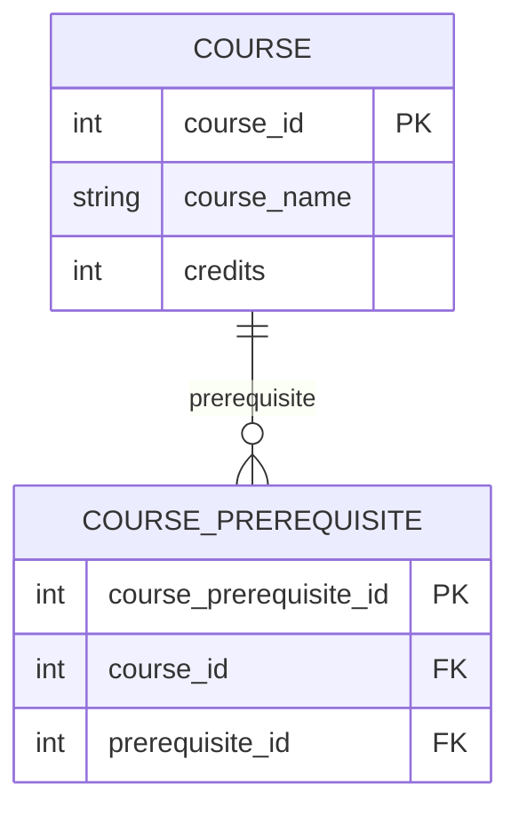

### L3: Debug
A database designer has provided the following incorrect ER diagram:
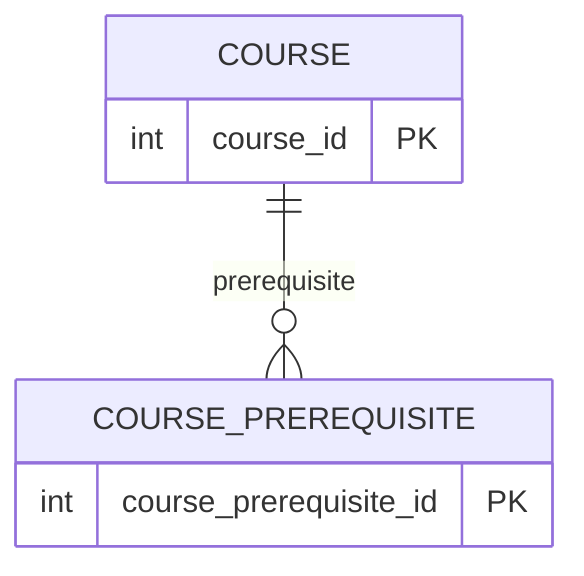
> **Q:** Identify the error in the provided ER diagram and fix it.
> **A:** 
The error is that the `COURSE_PREREQUISITE` entity does not have foreign keys to `COURSE`. The corrected ER diagram should include these attributes:
```mermaid
erDiagram
    COURSE ||--o{ COURSE_PREREQUISITE : "prerequisite"
    COURSE {
        int course_id PK
        string course_name
        int credits
    }
    COURSE_PREREQUISITE {
        int course_prerequisite_id PK
        int course_id FK
        int prerequisite_id FK
    }
```

## [[Role_Names_In_Relationships]]
### L1: Identify
A company wants to design a database to store employee information. They have identified the need to store employee details, such as employee ID, name, and manager ID. Identify the role names in the relationship between employee and manager.