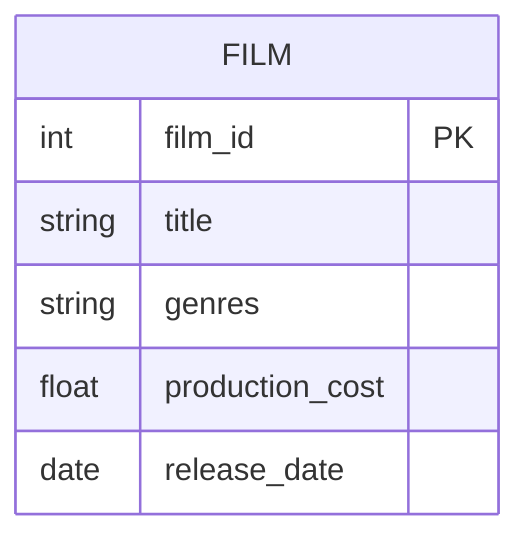

# Definition & Mechanics
An **attribute** is a property of an entity or a relationship type. It describes a characteristic of the entity or relationship.

* **Types of Attributes:**
  + **Simple Attribute**: composed of a single component with an independent existence.
  + **Composite Attribute**: composed of multiple components, each with an independent existence.
  + **Single-Valued Attribute**: holds a single value for each occurrence of an entity type.
  + **Multi-Valued Attribute**: holds multiple values for each occurrence of an entity type.
  + **Derived Attribute**: represents a value that is derivable from another attribute or set of attributes.

# Worked Example
Domain: Film production

Consider a film entity with attributes:
| Attribute Name | Type | Description |
| --- | --- | --- |
| film_id | Simple, Single-Valued | Unique film identifier |
| title | Simple, Single-Valued | Film title |
| genres | Multi-Valued | List of genres (e.g., action, comedy) |
| production_cost | Simple, Single-Valued | Total production cost |
| release_date | Simple, Single-Valued | Release date |

# Edge Case
> **Q:** A university course entity has an attribute called `assessment_breakdown` which stores the percentage allocation for each assessment component (e.g., 30% for midterm, 70% for final exam). Is `assessment_breakdown` a simple or composite attribute?
> **A:** Composite. Although `assessment_breakdown` seems to be a single attribute, it can be broken down further into multiple components (e.g., midterm percentage, final exam percentage). Therefore, it is a composite attribute.

# Connections
- **Depends on:** [[Entity_Types]] — Attributes are properties of entities or relationships.
- **Enables:** [[Composite_Attribute]], [[Multi_Valued_Attribute]], [[Derived_Attribute]] — Understanding attributes enables understanding of more specific attribute types.