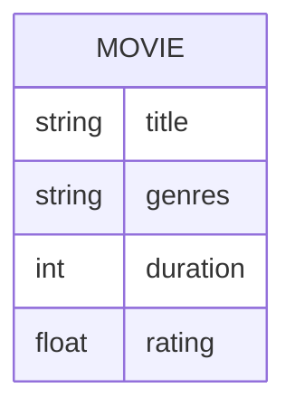

# Definition & Mechanics
An **attribute** is a property of an entity or a relationship type. It has a **name** and a **domain**, which defines the set of allowable values.

* **Types of Attributes:**
  + **Simple Attribute**: composed of a single component with an independent existence.
  + **Composite Attribute**: composed of multiple components, each with an independent existence.
* **Attribute Characteristics:**
  + **Single-valued Attribute**: holds a single value for each occurrence of an entity type.
  + **Multi-valued Attribute**: holds multiple values for each occurrence of an entity type.
  + **Derived Attribute**: represents a value that is derivable from another attribute or set of attributes.

# Worked Example
Domain: Film production

Consider a `Movie` entity with attributes:

| Attribute Name | Type | Description |
| --- | --- | --- |
| title | Simple, Single-valued | Movie title |
| genres | Multi-valued | List of genres (e.g., Action, Comedy) |
| duration | Simple, Single-valued | Movie duration in minutes |
| rating | Derived | Average user rating (derived from user reviews) |

# Edge Case
> **Q:** A university course has attributes `course_id`, `name`, and `credits`. The `credits` attribute can be either 3 or 4. Is `credits` single-valued or multi-valued?
> **A:** Single-valued. Although `credits` has only two possible values, it still holds a single value for each course occurrence. The fact that it has a limited set of values does not make it multi-valued.

# Connections
- **Depends on:** [[Entity_Types]] — Attributes are properties of entities or relationships.
- **Enables:** [[Keys]] — Attributes are used to form candidate keys and primary keys.