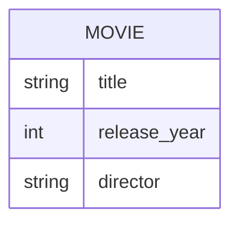

# Definition & Mechanics
A **candidate key** is a minimal set of attributes that uniquely identifies each occurrence of an entity type. 
* **Minimality**: no subset of the attributes can uniquely identify the entity.
* **Uniqueness**: no two occurrences of the entity can have the same values for all attributes in the key.
* **Candidate keys are used to**: identify entities, prevent duplicates, and enable relationships.

# Worked Example
Domain: Film production

Suppose we have an entity type `Movie` with attributes `title`, `release_year`, and `director`. We want to identify a candidate key.

| Attribute | Description |
| --- | --- |
| title | The title of the movie |
| release_year | The year the movie was released |
| director | The director of the movie |

A possible candidate key for `Movie` could be `(title, release_year)`, assuming that there are no duplicate titles in the same year.

# Edge Case
> **Q:** Consider an entity type `Employee` with attributes `employee_id`, `name`, and `email`. The company guarantees that `employee_id` is unique, but `email` might not be (e.g., if an employee changes their email). Is `email` a candidate key?
> **A:** No, `email` is not a candidate key. Although it might seem unique in practice, the problem statement explicitly states that it might not be unique. A candidate key must be guaranteed to be unique. Therefore, only `employee_id` qualifies as a candidate key.

# Connections
- **Depends on:** [[Entity_Types]] — Candidate keys are a property of entity types.
- **Enables:** [[Primary_Key]] — A primary key is selected from the candidate keys.