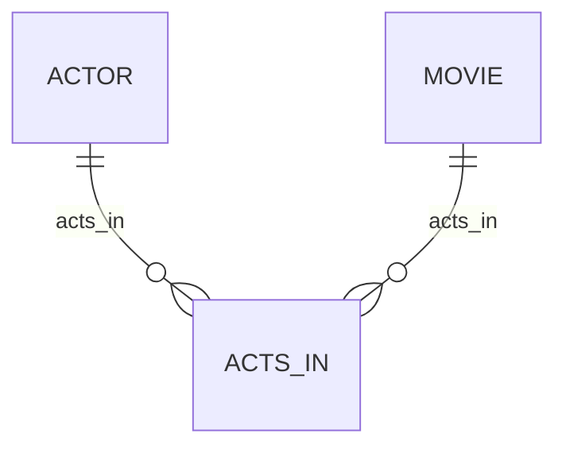

# Definition & Mechanics
**Cardinality** describes the maximum number of possible relationship occurrences for an entity participating in a given relationship type. It is a crucial aspect of **Structural Constraints** in database design.

* **Definition**: Cardinality specifies the maximum number of entities that can be associated with another entity through a relationship.
* **Types of Cardinality**:
	+ **One-to-One (1:1)**: One entity occurrence relates to at most one other entity occurrence.
	+ **One-to-Many (1:N)**: One entity occurrence relates to multiple other entity occurrences.
	+ **Many-to-Many (M:N)**: Multiple entity occurrences relate to multiple other entity occurrences.

# Worked Example
Domain: Film production

Suppose we have two entity types: `Actor` and `Movie`. The relationship between them is `Acts_In`. We want to specify the cardinality of this relationship.

| Actor | Movie | Acts_In |
| --- | --- | --- |
| John | Movie A | (John, Movie A) |
| John | Movie B | (John, Movie B) |
| Jane | Movie A | (Jane, Movie A) |
| Jane | Movie C | (Jane, Movie C) |

In this example, an actor can act in multiple movies (one-to-many), and a movie can have multiple actors (many-to-many). The cardinality of `Acts_In` is **many-to-many**.

# Edge Case
> **Q:** A university has a relationship between `Student` and `Course` called `Enrolls_In`. A student can enroll in at most one course, but a course can have multiple students. What is the cardinality of `Enrolls_In`?
> **A:** The cardinality of `Enrolls_In` is **one-to-many (1:N)**. This is because one student can enroll in at most one course (participation constraint), but one course can have multiple students (cardinality constraint).

# Connections
- **Depends on:** [[Structural_Constraints]] — Cardinality is a component of structural constraints.
- **Enables:** [[Multiplicity]] — Understanding cardinality is essential for defining multiplicity constraints in relationships.