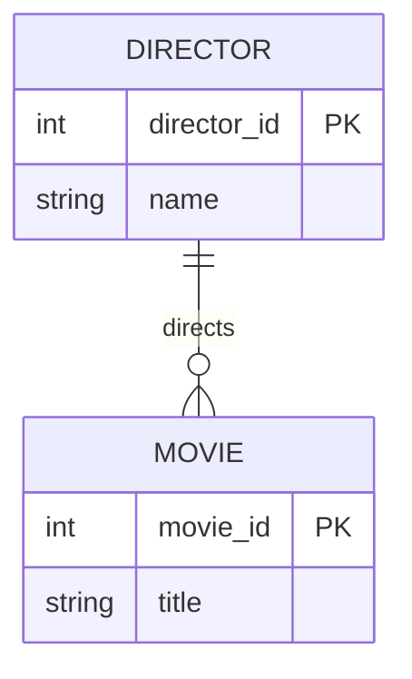

# Definition & Mechanics
**Cardinality** describes the maximum number of possible relationship occurrences for an entity participating in a given relationship type. It is a crucial aspect of **Structural Constraints** in the Entity-Relationship model.

* **Definition**: Cardinality specifies the maximum number of entities that can be associated with a particular entity through a relationship.
* **Types of Cardinality**:
	+ **One-to-One (1:1)**: One entity occurrence relates to at most one other entity occurrence.
	+ **One-to-Many (1:N)**: One entity occurrence relates to multiple other entity occurrences.
	+ **Many-to-Many (M:N)**: Multiple entity occurrences relate to multiple other entity occurrences.

# Worked Example
Domain: Film Production

Consider a film production company that wants to model the relationships between **Directors** and **Movies**.

| Director | Movies Directed |
| --- | --- |
| Steven Spielberg | Jaws, E.T., Jurassic Park |
| Martin Scorsese | Taxi Driver, Raging Bull, Goodfellas |

In this example, the cardinality of the relationship between **Director** and **Movie** is **One-to-Many (1:N)**, as one director can direct multiple movies, but each movie is directed by only one director.

# Edge Case
> **Q:** A university wants to model the relationship between **Professors** and **Courses**. A professor can teach multiple courses, and a course can be taught by multiple professors. What is the cardinality of this relationship?
> **A:** The cardinality of this relationship is **Many-to-Many (M:N)**, as a professor can teach multiple courses, and a course can be taught by multiple professors. This requires a junction table to resolve the relationship.

# Connections
- **Depends on:** [[Structural_Constraints]] — Cardinality is a component of structural constraints in the Entity-Relationship model.
- **Enables:** [[Multiplicity]] — Understanding cardinality is essential for defining multiplicity constraints in relationships.