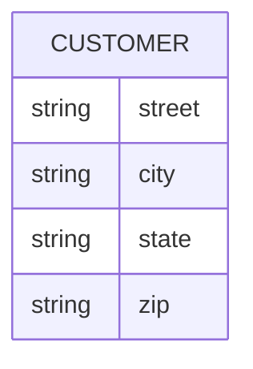

# Definition & Mechanics
A **composite attribute** is an attribute that contains multiple components, each with its own independent existence. 
* **Components**: Each component can be simple or composite.
* **Representation**: Indicated by indentation in ER diagrams or extension ellipses of an attribute ellipse.

# Worked Example
Domain: Online shopping platform

Consider a customer's address, which can be broken down into:
| Attribute | Components |
| --- | --- |
| Address | Street, City, State, Zip |



Alternatively, a composite attribute `Address` can be represented as:
```mermaid
erDiagram
    CUSTOMER {
        composite Address {
            string street
            string city
            string state
            string zip
        }
    }
```

# Edge Case
> **Q:** An employee's name is represented as a single attribute `Full_Name`. Is this a composite attribute?
> **A:** No. A composite attribute must have multiple components with independent existence. `Full_Name` could be a simple attribute if it's not further broken down. However, if `Full_Name` is composed of `First_Name`, `Middle_Name`, and `Last_Name`, then it is composite.

# Connections
- **Depends on:** [[Attributes]] — Composite attributes are a type of attribute.
- **Enables:** [[Entity_Types]] — Understanding composite attributes helps in accurately modeling entity types with complex attributes.