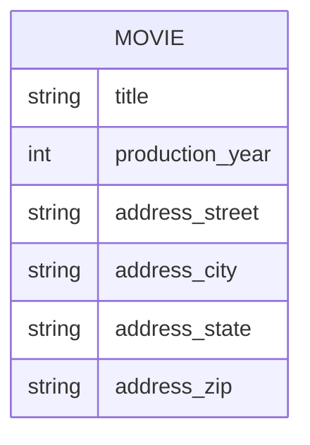

# Definition & Mechanics
A **composite attribute** is an attribute that contains multiple components, each with its own independent existence. 
* **Components**: Each component can be simple or composite.
* **Representation**: Indicated by indentation in ER diagrams or extension ellipses of an attribute ellipse.

# Worked Example
Domain: Film production

| Entity Type | Attributes | 
| --- | --- |
| Movie | title, production_year, address_street, address_city, address_state, address_zip | 

In this example, `address` is a composite attribute with components:
* **address_street**
* **address_city**
* **address_state**
* **address_zip**

# Edge Case
> **Q:** A university models `Student` with attributes `name`, `date_of_birth`, and `address`. The `address` is further divided into `street`, `city`, and `state`. Is `address` a composite attribute?
> **A:** Yes, `address` is a composite attribute because it consists of multiple components (`street`, `city`, `state`), each with its own meaning. This requires applying the definition of a composite attribute.

# Connections
- **Depends on:** [[Attributes]] — Composite attributes are a type of attribute.
- **Enables:** [[Entity_Types]] — Understanding composite attributes helps in accurately modeling entity types.