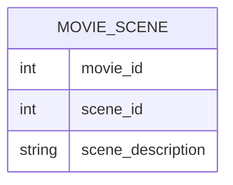

# Definition & Mechanics
A **composite key** is a candidate key that consists of two or more attributes. 
* **Definition**: A minimal set of attributes that uniquely identifies each occurrence of an entity type.
* **Characteristics**:
  + Composed of multiple attributes.
  + Uniquely identifies entity occurrences.
  + No subset of attributes is a candidate key.

# Worked Example
Domain: Film production

Suppose we have an entity type `Movie_Scene` with attributes:
| Attribute | Description |
| --- | --- |
| movie_id | Unique movie identifier |
| scene_id | Unique scene identifier within a movie |
| scene_description | Description of the scene |

A composite key for `Movie_Scene` could be `(movie_id, scene_id)`.

# Edge Case
> **Q:** Consider an entity type `Order_Item` with attributes `order_id`, `product_id`, and `quantity`. Is `(order_id, product_id)` a composite key?
> **A:** Yes, assuming that each combination of `order_id` and `product_id` uniquely identifies an `Order_Item` occurrence. This composite key ensures that we can distinguish between different products within the same order.

# Connections
- **Depends on:** [[Candidate_Key]] — A composite key is a specific type of candidate key.
- **Enables:** [[Entity_Types]] — Composite keys help define entity types with no natural primary key.