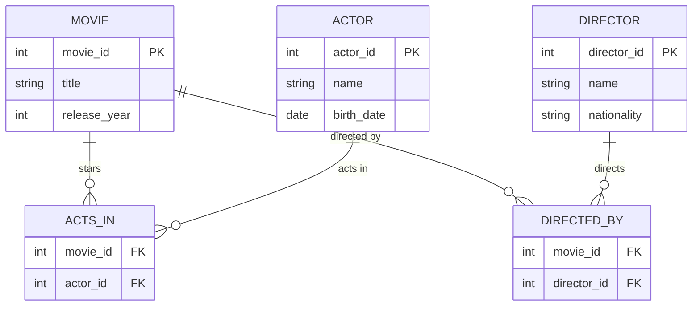

# Definition & Mechanics
**Conceptual Database Design** is the process of constructing a model of the data used in an enterprise, independent of all physical considerations. It focuses on identifying the **entities**, **attributes**, **relationships**, and **constraints** that are relevant to the database.

* **Key activities**:
	+ Identifying entities and their relationships
	+ Defining attributes and their domains
	+ Specifying constraints and business rules
* **Output**: a conceptual model, typically represented using an **Entity-Relationship (ER) diagram** and a descriptive text.

# Worked Example
Domain: Film production company

The company wants to design a database to manage information about **movies**, **actors**, and **directors**.

| Entity Type | Attributes |
| --- | --- |
| Movie | movie_id, title, release_year |
| Actor | actor_id, name, birth_date |
| Director | director_id, name, nationality |

# Edge Case
> **Q:** A university wants to model **courses**, **students**, and **instructors**. A course can have multiple students and one instructor. A student can enroll in multiple courses. Is this a **ternary relationship**?
> **A:** No, this is a **binary relationship** with **multiplicity** constraints. We have two binary relationships: `Course` → `Student` (many-to-many) and `Course` → `Instructor` (one-to-many). A ternary relationship would involve a third entity type directly related to the others in a more complex way.

# Connections
- **Depends on:** [[Database_Development_Methodology]] — Conceptual database design is a phase within the database development methodology.
- **Enables:** [[Entity_Types]] — Understanding conceptual database design enables the identification and definition of entity types.