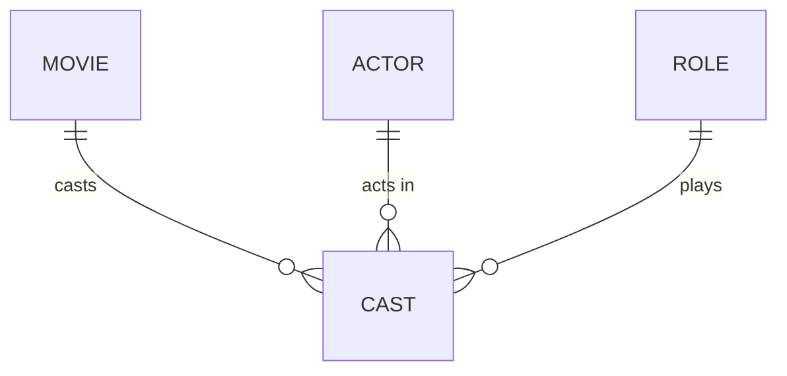

# Definition & Mechanics
The **degree of a relationship** refers to the number of entity types that participate in a relationship. 
* **Unary relationship**: degree 1 (one entity type participates)
* **Binary relationship**: degree 2 (two entity types participate)
* **Ternary relationship**: degree 3 (three entity types participate)
* **Quaternary relationship**: degree 4 (four entity types participate)
* **N-ary relationship**: degree N (N entity types participate)

# Worked Example
Domain: Film production

Suppose we have a relationship `Cast` involving three entity types: `Movie`, `Actor`, and `Role`.

| Entity Type | Description |
| --- | --- |
| Movie | Film being cast |
| Actor | Person being cast |
| Role | Character being played |

This relationship is **ternary** (degree 3) because it involves three entity types.

# Edge Case
> **Q:** A university has a relationship `Teaches` involving `Professor` and `Course`. However, a professor can also teach the same course in multiple sections. Is `Teaches` a binary or unary relationship?
> **A:** Binary. Although a professor may teach multiple sections of the same course, the relationship `Teaches` fundamentally involves two distinct entity types: `Professor` and `Course`. The fact that multiple professors can teach the same course or a professor can teach multiple courses does not change the degree of the relationship.

# Connections
- **Depends on:** [[Relationship_Types]] — Understanding relationship types is essential to grasping degree of relationship.
- **Enables:** [[Structural_Constraints]] — Knowing the degree of a relationship helps in defining multiplicity and other structural constraints.