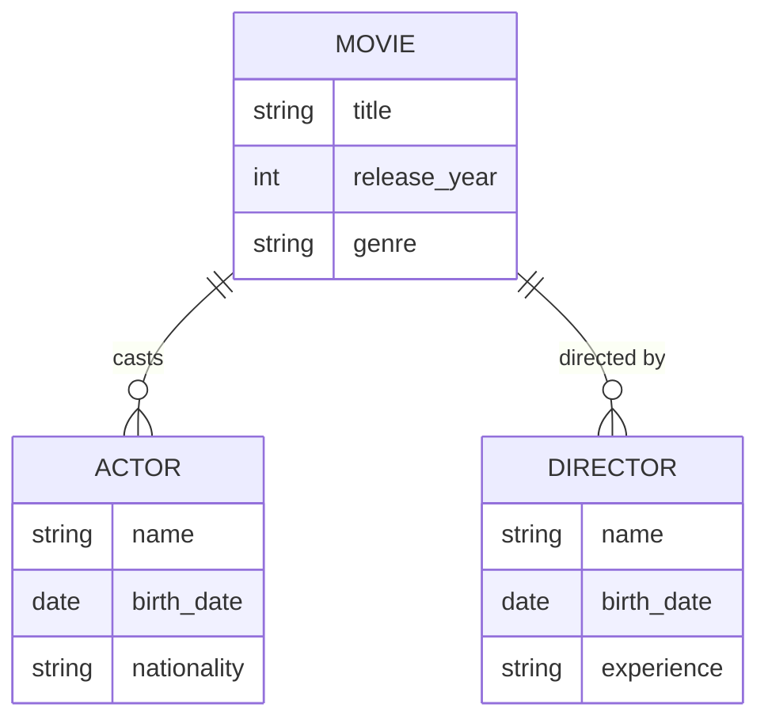

# Definition & Mechanics
Entity–Relationship (ER) modelling is a technique used to construct a conceptual model of the data used in an enterprise, focusing on entities, attributes, relationships, and constraints. The goal is to create a **conceptual schema** that represents the data requirements of an organization.

* **Key components**: 
  + **Entities**: objects with independent existence, e.g., customers, orders
  + **Attributes**: properties of entities or relationships, e.g., customer name, order date
  + **Relationships**: associations between entities, e.g., customer places order
  + **Constraints**: rules governing the data, e.g., a customer must have a unique ID

# Worked Example
Domain: Film production

Suppose we are designing a database for a film production company. The company wants to track information about **movies**, **actors**, and **directors**.

* **Entities**: Movie, Actor, Director
* **Attributes**: 
  + Movie: title, release_year, genre
  + Actor: name, birth_date, nationality
  + Director: name, birth_date, experience

# Edge Case
> **Q:** Suppose we have an entity **Order** and an entity **Product**. An order can have multiple products, and a product can be part of multiple orders. How would you model this relationship?
> **A:** This is a **many-to-many** relationship, denoted as *:* . We would create a relationship **Order_Product** with foreign keys to **Order** and **Product**, and possibly additional attributes like **quantity**.

# Connections
- **Depends on:** [[Entity_Types]], [[Relationship_Types]], [[Attributes]] — ER modelling relies on these fundamental concepts.
- **Enables:** [[Conceptual_Database_Design]], [[Logical_Database_Design]] — ER modelling is a crucial step in database design.