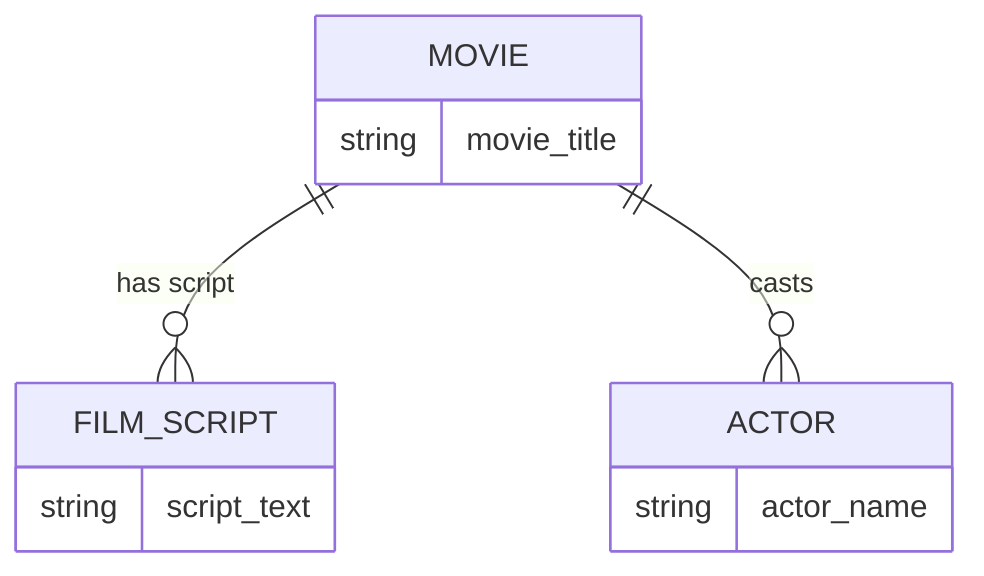

# Definition & Mechanics
An **entity type** represents a group of objects with shared properties that an enterprise identifies as having an independent existence. 
* **Key characteristics:**
  + **Entity occurrence**: a uniquely identifiable object of an entity type.
  + **Represents real-world objects**: e.g., customers, products, or orders.

# Worked Example
Domain: Film production

| Entity Type | Description | Example Occurrences |
| --- | --- | --- |
| Movie | Film with a unique title | The Shawshank Redemption, The Godfather |
| Actor | Person acting in a movie | Tom Hanks, Meryl Streep |
| Film_Script | Written script for a movie | Script for The Dark Knight, Script for Inception |

# Edge Case
> **Q:** A university models `Course` (course_id, name) and `Course_Enrollment` (course_id, student_id). Is `Course_Enrollment` an entity type or a relationship?
> **A:** `Course_Enrollment` represents a relationship between `Course` and `Student` (not shown directly). It doesn't have independent existence without both; hence, it's a relationship. If it had attributes like enrollment_date, it could be argued as an entity but with a strong relationship to Course and Student.

# Connections
- **Depends on:** 
- **Enables:** [[Relationship_Types]], [[Attributes]]