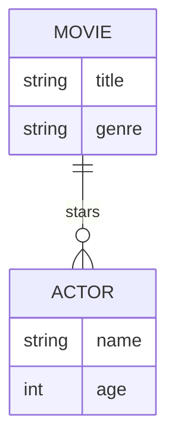

# Definition & Mechanics
An **entity type** represents a group of objects with the same properties, identified by an enterprise as having an independent existence. An **entity occurrence** is a uniquely identifiable object of an entity type.

* **Key characteristics**: 
  + **Represents a real-world object**: e.g., customer, order, product.
  + **Has independent existence**: recognized by the enterprise as a distinct entity.
  + **Can have multiple occurrences**: multiple customers, orders, etc.

# Worked Example
Domain: Film production

Suppose a film production company wants to track information about **Movie** and **Actor**. 

| Entity Type | Description | Example Occurrences |
| --- | --- | --- |
| Movie | Film with a unique title | The Shawshank Redemption, The Godfather |
| Actor | Person acting in a movie | Tom Hanks, Leonardo DiCaprio |

# Edge Case
> **Q:** A university wants to model `Course` and `Student`. A course can have multiple students, and a student can enroll in multiple courses. Is `Course` an entity type?
> **A:** Yes, `Course` is an entity type. It represents a real-world object (a course offered by the university) and has independent existence. Although it has a relationship with `Student`, this does not affect its status as an entity type.

# Connections
- **Depends on:** 
- **Enables:** [[Relationship_Types]], [[Attributes]] — Understanding entity types is fundamental to defining relationships and attributes in the ER model.