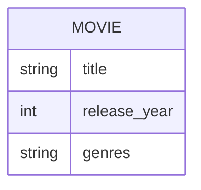

# Definition & Mechanics
A **multi-valued attribute** is an attribute that holds multiple values for each occurrence of an entity type. 
* **Key characteristics:**
  + Holds multiple values for each entity occurrence.
  + Represented by a double line ellipse in the traditional E-R model.
  + Indicated by a [Min..Max] boundary in UML.

# Worked Example
Domain: Film production

| Entity Type | Attributes | 
| --- | --- |
| Movie | title, release_year, genres |
| genres is a multi-valued attribute |

Example data:
| title | release_year | genres |
| --- | --- | --- |
| Inception | 2010 | Action, Sci-Fi, Thriller |
| The Shawshank Redemption | 1994 | Drama |

# Edge Case
> **Q:** A university course has multiple lecturers. Should `lecturers` be a multi-valued attribute of `Course` or a separate entity type `Lecturer` with a relationship to `Course`?
> **A:** It depends on the context. If the lecturers are frequently updated and have no independent existence, `lecturers` could be a multi-valued attribute. However, if lecturers have their own attributes (e.g., `lecturer_id`, `name`) or relationships with other entities, it's better to model `Lecturer` as a separate entity type with a relationship to `Course`.

# Connections
- **Depends on:** [[Attributes]] — Multi-valued attributes are a type of attribute.
- **Enables:** [[Entity_Types]] — Understanding multi-valued attributes helps in designing entity types with complex attributes.