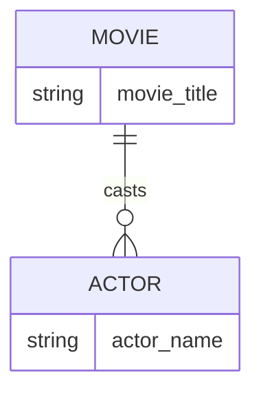

# Definition & Mechanics
**Multiplicity** represents the number (or range) of possible occurrences of an entity type that may relate to a single occurrence of an associated entity type through a particular relationship. It is a crucial aspect of **Structural Constraints** in database design.

* **Types of Multiplicity Constraints:**
  * **Cardinality**: describes the maximum number of possible relationship occurrences for an entity participating in a given relationship type.
  * **Participation**: determines whether all or only some entity occurrences participate in a relationship.

# Worked Example
Domain: Film production

Consider a relationship between `Movie` and `Actor`. A movie can have multiple actors, and an actor can act in multiple movies.

| Movie Title | Actor Name |
| --- | --- |
| Inception | Leonardo DiCaprio |
| Inception | Joseph Gordon-Levitt |
| The Dark Knight | Christian Bale |
| The Dark Knight | Heath Ledger |

In this example, the multiplicity of `Movie` to `Actor` is **one-to-many (1:N)**, indicating that one movie can have multiple actors.

# Edge Case
> **Q:** A university has a `Course` entity and a `Student` entity. A course can have multiple students, but a student can only enroll in one course. What is the multiplicity of `Course` to `Student`?
> **A:** The multiplicity is **one-to-many (1:N)**. This is because one course can have multiple students (e.g., 30 students in a class), but each student can only be enrolled in one course at a time. The participation of `Student` in this relationship is **total**, as every student must be enrolled in at least one course.

# Connections
- **Depends on:** [[Structural_Constraints]] — Multiplicity is a type of structural constraint.
- **Enables:** [[Relationship_Types]] — Understanding multiplicity helps in defining relationship types accurately.