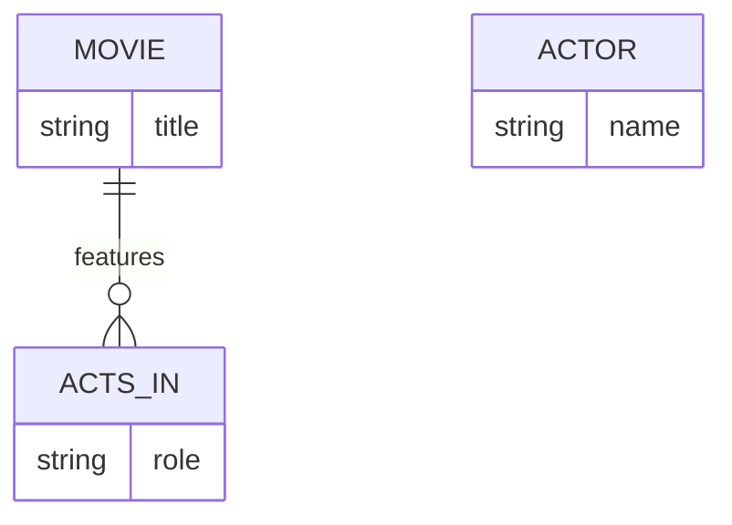

# Definition & Mechanics
**Multiplicity** represents the number (or range) of possible occurrences of an entity type that may relate to a single occurrence of an associated entity type through a particular relationship. It is a crucial aspect of **Structural Constraints** in ER modeling.

* **Types of Multiplicity Constraints:**
  * **Cardinality**: maximum number of possible relationship occurrences for an entity participating in a given relationship type.
  * **Participation**: determines whether all or only some entity occurrences participate in a relationship.

# Worked Example
Domain: Film production

Suppose we have two entity types: `Movie` and `Actor`. A movie can have multiple actors, and an actor can act in multiple movies. We want to model the relationship `Acts_In` between `Movie` and `Actor`.

| Movie Title | Actor Name |
| --- | --- |
| Inception | Leonardo DiCaprio |
| Inception | Joseph Gordon-Levitt |
| The Dark Knight | Christian Bale |
| The Dark Knight | Heath Ledger |

In this example, the multiplicity of `Movie` to `Acts_In` is 1:N, indicating that a movie can have multiple actors (one-to-many). The multiplicity of `Actor` to `Acts_In` is also 1:N, indicating that an actor can act in multiple movies.

# Edge Case
> **Q:** A university has a `Course` entity and a `Student` entity. A course can have multiple students, but a student can only enroll in one course. What is the multiplicity of the `Enrolls_In` relationship from `Student` to `Course`?
> **A:** The multiplicity is 1:1 from `Student` to `Course`, but N:1 from `Course` to `Student`. This is because each student can only enroll in one course (participation constraint), but each course can have multiple students (cardinality). The correct representation is a many-to-one relationship with a participation constraint on the `Student` side.

# Connections
- **Depends on:** [[Structural_Constraints]] — Multiplicity is a type of structural constraint.
- **Enables:** [[Relationship_Types]] — Understanding multiplicity enables the creation of more accurate relationship types in ER diagrams.