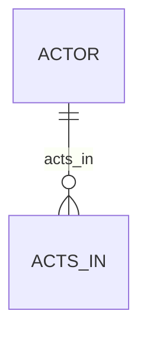
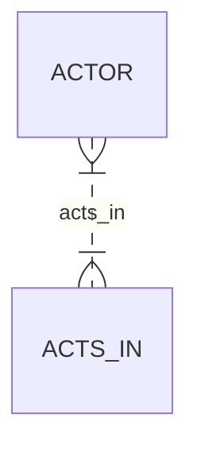

# Definition & Mechanics
**Participation** determines whether all or only some entity occurrences participate in a relationship. It is a crucial aspect of **structural constraints** in ER modeling.

* **Total Participation**: every entity occurrence in the entity type must participate in the relationship.
* **Partial Participation**: only some entity occurrences are required to participate in the relationship.
* **Denoted by**: a line with a double circle (total) or a single circle (partial) at the entity type's end.

# Worked Example
Domain: Film Production

Suppose we have an entity type `Actor` and a relationship `Acts_In` with entity type `Movie`. 

| Actor ID | Name | Movie Title | Release Year |
|----------|------|-------------|---------------|
| 1        | John | Movie A     | 2020          |
| 2        | Jane | Movie B     | 2021          |
| 3        | Bob  | null        | null          |

To represent total participation of `Actor` in `Acts_In`, we ensure every actor acts in at least one movie.

However, if an actor may or may not act in a movie, we show partial participation.

# Edge Case
> **Q:** A university has entity types `Student` and `Course`. A student may enroll in zero or more courses, but a course must have at least one student enrolled. What are the participation constraints?
> **A:** 
> - `Student` has **partial participation** in `Enrolls_In` because a student may or may not enroll in a course.
> - `Course` has **total participation** in `Enrolls_In` because every course must have at least one student enrolled.

# Connections
- **Depends on:** [[Structural_Constraints]] — Participation is a type of structural constraint.
- **Enables:** [[Multiplicity]] — Understanding participation helps in defining the multiplicity of relationships.