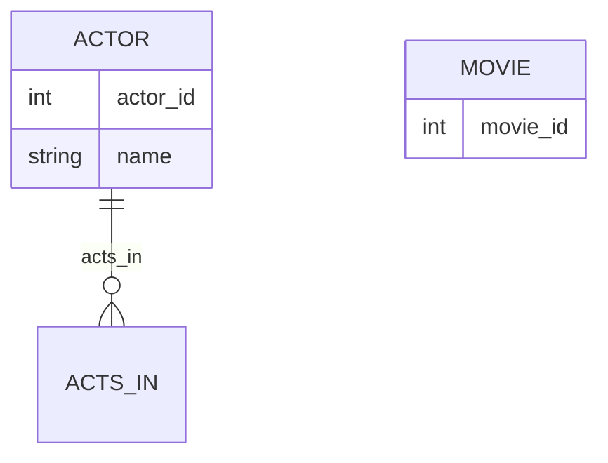

# Definition & Mechanics
**Participation** determines whether all or only some entity occurrences participate in a relationship. It is a crucial aspect of **structural constraints**.

* **Total Participation**: every entity occurrence in the entity type must participate in the relationship.
* **Partial Participation**: only some entity occurrences are required to participate in the relationship.
* **Denoted as**: a line with a **double arrowhead** (total) or a **single arrowhead** (partial) in ER diagrams.

# Worked Example
Domain: Film Production

Suppose we have an entity type `Actor` and a relationship `Acts_In` with entity type `Movie`. 

| Actor ID | Name | Acts In Movie ID |
|----------|------|------------------|
| 1        | John | 101              |
| 2        | Jane | 102              |
| 3        | Bob  |                  |

In this scenario, we want to model that all actors may act in movies, but it's not required for an actor to be in a movie (part-time actors). However, for a movie to be released, it must have at least one actor.

Here, the participation of `Actor` in `Acts_In` is **partial** because an actor may or may not act in a movie.

# Edge Case
> **Q:** Consider a relationship `Teaches` between `Professor` and `Course`. A professor must teach at least one course, but a course can be taught by multiple professors or none at all (e.g., a course with no assigned professor). What is the participation of `Professor` and `Course` in `Teaches`?
> **A:** 
> - **Professor** has **total participation** in `Teaches` because every professor must teach at least one course.
> - **Course** has **partial participation** in `Teaches` because a course may or may not have a professor assigned.

# Connections
- **Depends on:** [[Structural_Constraints]] — Participation is a component of structural constraints.
- **Enables:** [[Multiplicity]] — Understanding participation helps in defining the multiplicity of relationships.